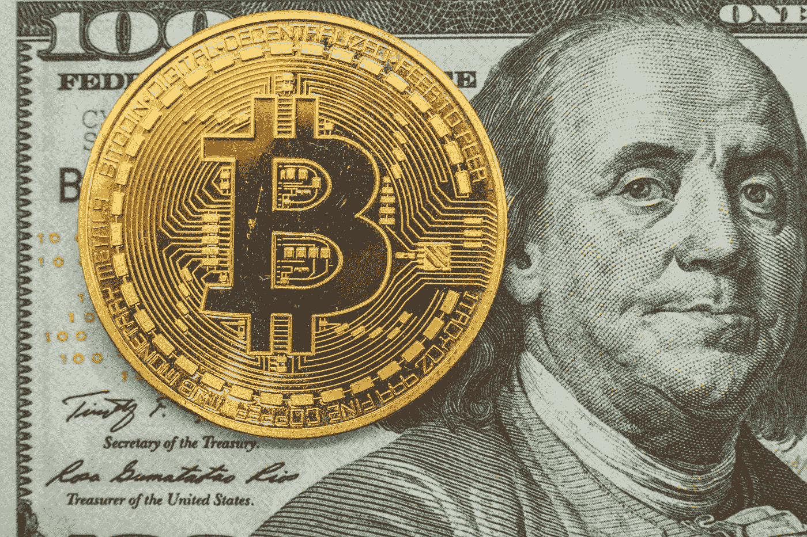

# 中央银行数字货币(CBDC)—汉密尔顿项目报告

> 原文：<https://medium.com/coinmonks/central-bank-digital-currency-febd806a437e?source=collection_archive---------26----------------------->

波士顿联邦储备银行和麻省理工学院汉密尔顿项目简介

Photo by [Bermix Studio](https://unsplash.com/@bermixstudio?utm_source=medium&utm_medium=referral) on [Unsplash](https://unsplash.com?utm_source=medium&utm_medium=referral)

## 背景:

波士顿联邦储备银行和麻省理工学院的数字货币计划(麻省理工学院 DCI 分校)正在合作开展一项为期多年的研究项目——汉密尔顿项目，以了解美国中央银行数字货币(CBDC)的挑战和机遇。

> 这项名为“汉密尔顿计划”的合作项目集中于技术实验，并不旨在为美国创造一个可用的 CBDC。

他们关注的主要用例是作为一种支付工具，与中央银行的直接负债美钞没有什么不同，当然，数字除外。

该项目还处于早期阶段，但最近发布了一份关于第一阶段发现和(更有趣的是)交易处理系统(TPS)设计的白皮书，该系统将由*中央信任的*运营商(即中央银行)运行。

虽然该系统在许多方面受到区块链技术的启发，但正如我们稍后将看到的那样，正是这种中央可信参与者的存在，使其明显不同于公共区块链(比特币、以太坊)，后者基于去中心化的分布式共识驱动的区块链。

*如果你想从概念上了解什么是 CBDC，以及它与实物货币有何不同，请阅读此文—* [*美联储的数字美元与实物货币:相同还是不同？直观解释*](/@uditg/feds-digital-dollar-vs-physical-currency-same-or-different-an-intuitive-explanation-c9551f1f88b7) *。*

## TPS 的关键(非技术)设计要素:

## **1。UTXO 与用户平衡**

使用 UTXO(未用交易输出)跟踪用户资金，这与比特币协议设计相同。本质上，这就像跟踪你收到和花费的不同美元钞票。为了确定用户的总余额，系统简单地将用户收到但从未花费的所有美元钞票相加。

另一种方法是直接跟踪用户余额，这更符合我们在传统金融中对银行存款余额的看法。这也是以太坊使用的模式。

当然，当涉及到用户界面时，不管该技术如何跟踪用户资金，它仍然可以显示总体用户平衡。

## 2.允许的主要操作

TPS 支持 3 种主要操作:

*   铸造
*   补偿的
*   转移

“铸造”指的是创造新的数字美元钞票(UTXOs)，而“兑换”将删除数字美元钞票——要么兑换成实物美元钞票*(或者可能实施负利率政策，如果那一天到来的话！).*自然，这两个操作只能由发行方(即央行)触发。用户只能触发“转账”请求，将资金从汇款人转移到收款人。

除了支持零售支付之外，有趣的是，仅通过这三项基本操作，即使从央行和政府的角度来看，也可以实现很多目标——例如，直接影响经济中的利率*、*发布直接的财政刺激——这两者都存在现有传统金融结构中的重大漏洞。

## 3.原子数

这与公共区块链协议的工作方式相同，本质上是一种将事务的多个分支捆绑在一起的机制，这样，要么执行所有分支，要么不执行任何分支。在一个简单的支付场景中，这个特性可能没有那么有价值，但是在很多重要的情况下，这个特性是有益的。

## 4.安全性

系统设计采取了基本的预防措施，以提供针对诸如“双重花费”、“重放攻击”等攻击的安全性。本质上，打个比方，这是通过在系统中保持所有美钞的运行跟踪器来实现的，重要的是，每次美钞从人 A 转移到人 b 时，改变印在每张美钞上的“序列号”。(*对于好奇的人，我建议看一看他们的论文，这篇论文对此有更详细的解释。)*

请记住，这些攻击不是理论上的抽象，事实上已经在设计有缺陷的公共区块链协议中实施过。

## 结论:

TPS 的早期结果令人鼓舞，团队已经实现了高吞吐量(和低延迟。然而，这只是一个开始，在未来的阶段，该团队将探索更多的设计元素来考虑——用户隐私，离线支付，互操作性，DoS 攻击，量子抵抗*(量子计算将使我们当前的许多加密系统变得脆弱，但不用担心，量子抵抗加密算法也在这里)，*智能合同，等等。

*免责声明:我与汉密尔顿项目无关。*

## 参考资料，好奇的人:

*   [为什么央行数字货币？—自由街经济(newyorkfed.org)](https://libertystreeteconomics.newyorkfed.org/2021/12/why-central-bank-digital-currencies/)
*   [波士顿美联储银行和麻省理工学院发布央行数字货币——波士顿(bostonfed.org)美联储银行的技术研究](https://www.bostonfed.org/news-and-events/press-releases/2022/frbb-and-mit-open-cbdc-phase-one.aspx)

> 加入 Coinmonks [电报频道](https://t.me/coincodecap)和 [Youtube 频道](https://www.youtube.com/c/coinmonks/videos)了解加密交易和投资

# 另外，阅读

*   [比特币基地僵尸程序](/coinmonks/coinbase-bots-ac6359e897f3) | [AscendEX 审查](/coinmonks/ascendex-review-53e829cf75fa) | [OKEx 交易僵尸程序](/coinmonks/okex-trading-bots-234920f61e60)
*   [如何在印度购买比特币？](/coinmonks/buy-bitcoin-in-india-feb50ddfef94) | [WazirX 评论](/coinmonks/wazirx-review-5c811b074f5b)
*   [CryptoHopper 替代品](/coinmonks/cryptohopper-alternatives-d67287b16d27) | [HitBTC 审查](/coinmonks/hitbtc-review-c5143c5d53c2)
*   [CBET 评论](https://coincodecap.com/cbet-casino-review) | [库科恩 vs 比特币基地](https://coincodecap.com/kucoin-vs-coinbase)
*   [折叠 App 审核](https://coincodecap.com/fold-app-review) | [Kucoin 交易机器人](/coinmonks/kucoin-trading-bot-automate-your-trades-8cf0ca2138e0) | [Probit 审核](https://coincodecap.com/probit-review)