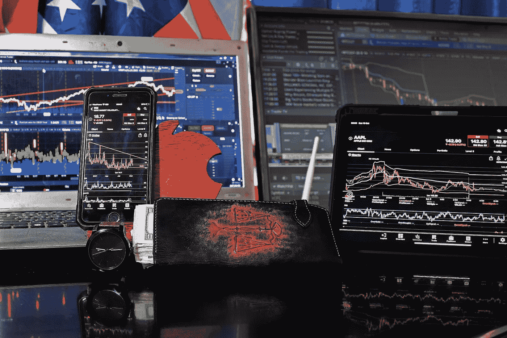

# 集中式加密货币交易所。

> 原文：<https://medium.com/coinmonks/centralized-cryptocurrency-exchanges-4a4db4aa66ca?source=collection_archive---------76----------------------->

对于大多数数字货币投资者来说，集中式加密货币交易所是最重要的交易工具之一。术语“集中式加密货币交易所”是指用于买卖加密货币的在线平台。它们是大多数投资者买卖加密货币的最受欢迎的方法之一。

一些投资者认为，鉴于数字货币被宣传为去中心化，集中交易的概念有些误导。那么，加密货币交易所集中化意味着什么，为什么这些交易所对加密货币的成功至关重要？当你被中心化的时候，意味着你已经把你的钱交到别人手里了。例如，客户可以选择将他们的钱交给银行，由银行代为保管。该机构现在将完全控制客户的资金。从很多方面来说，这比自己想办法管理它们要安全得多。银行有更好的安全措施和团队来保证资金的安全，因为他们有大量的资金，他们可以提供各种服务，如贷款，因此与客户建立了信任关系。

集中式加密货币交易所的相似之处在于，用户可以在他们的交易所存款，他们的资产现在将在交易所的手中，中间人信任将使用户在忘记密码时更容易恢复密码。这减轻了消费者必须完全控制其资产的负担。投资者此前在丢失密码并因此无法使用钱包后损失了大笔资金。然而，如果这些投资者将他们的资产存放在一个集中的交易所，他们就不会全部损失，因为找回密码会容易得多。恢复过程只需要验证加密货币兑换账户的身份和所有权。

中央交易所允许您使用传统货币购买不同的加密资产，并从多个区块链交换加密资产。这一点至关重要，因为各种加密资产存储在不同的区块链上，它们不知道如何相互连接。所以你不能把比特币换成以太坊，因为如果你拥有比特币，你就拥有了比特币区块链，如果你拥有以太坊，你就拥有了以太坊区块链，集中交易可以帮助解决这个问题。好消息是，这一切都发生在幕后，因为你只需按下平台上的前进按钮。

但是集中交易所安全吗？不存在防黑客的集中式交换。但是，有些交换比其他交换更安全。加密货币领域已经发生多起盗窃事件，但在大多数情况下，交易所会尽力补偿用户被盗的钱。

随着新交易所的定期出现，确定关键标准以使其中一些交易所蓬勃发展而其他交易所失败是非常重要的。一个重要因素是交易所的交易量。交易量水平越高，某个交易所最有可能出现的波动性和市场操纵就越低。由于执行每笔交易都需要时间，因此波动性是一个重要的问题。的值

特定的货币或代币可能会在交易开始和完成之间波动。原则上，交易量越大，处理交易的速度就越快，波动性成为问题的可能性就越小。

另一个重要的考虑因素是安全性。尽管没有一个交易所在黑客攻击面前是完全安全的，但有些交易所比其他交易所更安全，衡量交易所安全性的最佳方式是看它在加密领域存在了多长时间。

有了上面的所有信息，你现在已经很好地理解了什么是集中交换，并可以做出明智的决定。如果你是加密领域的新手，集中交易所是一个很好的起点，因为它们允许你用常规货币购买加密。

> 加入 Coinmonks [电报频道](https://t.me/coincodecap)和 [Youtube 频道](https://www.youtube.com/c/coinmonks/videos)了解加密交易和投资

# 另外，阅读

*   [密码本交易平台](/coinmonks/top-10-crypto-copy-trading-platforms-for-beginners-d0c37c7d698c) | [Coinmama 审核](/coinmonks/coinmama-review-ace5641bde6e)
*   [印度的加密交易所](/coinmonks/bitcoin-exchange-in-india-7f1fe79715c9) | [比特币储蓄账户](/coinmonks/bitcoin-savings-account-e65b13f92451)
*   [OKEx vs KuCoin](https://coincodecap.com/okex-kucoin) | [摄氏替代品](https://coincodecap.com/celsius-alternatives) | [如何购买 VeChain](https://coincodecap.com/buy-vechain)
*   [币安期货交易](https://coincodecap.com/binance-futures-trading)|[3 comas vs Mudrex vs eToro](https://coincodecap.com/mudrex-3commas-etoro)
*   [如何购买 Monero](https://coincodecap.com/buy-monero) | [IDEX 评论](https://coincodecap.com/idex-review) | [BitKan 交易机器人](https://coincodecap.com/bitkan-trading-bot)