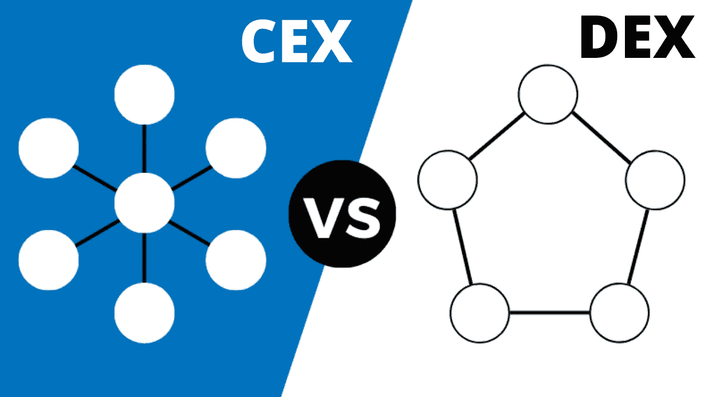

# 集中式交易所正在摧毁分散式交易所[第二部分]

> 原文：<https://medium.com/coinmonks/centralized-exchanges-are-crushing-decentralized-exchanges-part-2-f6de06cca18a?source=collection_archive---------38----------------------->

[来源](https://blockgeeks.com/guides/centralized-vs-decentralized-storage-redefining-storage-solutions-with-blockchain-tech/)

我再说一遍，当然不是最后一次；分散交流非常精彩”。在[之前的一篇文章](https://cryptoscripts.medium.com/stay-safe-use-a-dex-bc057abbeeac)中，我敦促使用分散式交易所作为更受欢迎的集中式交易所的更安全、更快捷的替代方案。随着政府监管越来越严格，分散交易所的匿名功能也会派上用场。除此之外，分散式交易所还有很长的路要走。

在本文的第一部分，我只提到了其中的几个。但从收到的反馈来看，这些只是集中式交易所相对于分散式交易所的众多优势中的一小部分。再讨论几个吧。

## 非永久性损失

加密货币的价格波动非常大。代币价值的这种原始且不可预测的变化导致流动性提供者向流动性池提供的代币数量的变化；这种现象被称为[非永久性损失](https://cryptoscripts.medium.com/staking-rewards-and-liquidity-farming-is-defi-free-money-111128eb527a)。嗯；损失是无常的，但等待这种抵消有时是不可能的。流动性提供者将不得不接受这种损失，尤其是当他们向资金池提供有形资产的时候。有时，他们会回避这种风险，尤其是当资产确实不稳定的时候。这可能会导致一个相当集中的流动性池。

流动性不足甚至是最大的集中交易所都面临的问题。分散的交易所呈现出坦率的流动性；至少在那个特定的时间。但当参与者不愿供应和维持流动性时，这就成了一个巨大的问题。短暂的损失是一个巨大的恐惧，也是这种不情愿的主要原因之一。

## 集中式流动性池

对于要适当分散的流动性池，池中的代币必须由众多独立实体提供。就像一个工作证明网络；参与者越多，网络就越分散，越强大。分散的流动性池确保流动性不会被一个实体从池中取出他们的代币而轻易抹去。不幸的是，这在分散的交易所中很难实现。只有非常受欢迎和成熟的项目才能拥有相对分散的流动性池。投资者很容易被集中流动性池的项目吓跑。这不利于项目和交易所的发展。

## 分散式交换是“特定于链的”

如果你想交换以太坊和它的代币，那么 Uniswap 是你最好的选择。1inch 具有跨链功能，但您只需切换到新的链，即可交换该链的传统令牌。SpiritSwap 和 SpookySwap 是 Fantom opera 链上最突出的分散交易所；其他智能合约平台为希望交换资产的持有者提供了特定的指数。相比之下，集中式交易所对几个链提供快速支持，这些链中的令牌可以相互交易，而无需桥接您的令牌或切换链。这是简单的，用户友好的和安全的。桥接令牌是一项复杂的智能合约操作，可能会有风险且耗时。持有人在分散的交易所受到严重限制。它只是不适合人们从不同的链交易各种资产。

## 分散的交易所完全缺乏“范围”

分散的交易所很酷…直到你需要选择和品种。这在当代指数中是没有的。你可能得去别处看看；集中交易是你的最佳选择；不幸的是。由于是“特定链”，新兴且未被广泛采用；如果你在寻找品种和广泛的选择，分散的交易所可能不会给你想要的东西。你对所有事情的选择都非常有限；可用的代币、支持的链、金融活动…就可用的选项而言，即使是最受欢迎和最先进的分散式交易所也无法接近平均的集中式交易所。这令人沮丧，可能会扼杀兴趣。

我明白，分散交易所是非常年轻的前景，即使是集中交易所在早期也有无数的缺点。然而，这些问题很难被忽视。这篇文章简单地阐述了如果分散交易所必须成为交换加密货币的主要方式，它们必须解决的问题。解决其中一些问题可能需要 DEXes 更加集中，这是一个两难的选择。不管怎样，分散式交易所的前景是光明的。随着时间的推移，解决这些问题的绝妙办法将会出现。其中一些已经在进化了。

[将我们的下一期出版物发送到您的邮箱](https://cryptoscripts.medium.com/subscribe)

> 加入 Coinmonks [电报频道](https://t.me/coincodecap)和 [Youtube 频道](https://www.youtube.com/c/coinmonks/videos)了解加密交易和投资

# 另外，阅读

*   [从 WazirX 切换到 CoinDCX 的 5 个理由](https://coincodecap.com/reasons-to-switch-from-wazirx-to-coindcx)
*   [Unocoin 评论](https://coincodecap.com/unocoin-review) | [最佳加密赌注硬币](https://coincodecap.com/best-crypto-staking-coins)
*   [如何使用 MetaMask Wallet 获取 KCC 地址？](https://coincodecap.com/kcc-address-metamask)
*   [如何获得自己的。XYZ 领域？](https://coincodecap.com/xyz-domain)
*   [最佳加密交换平台](https://coincodecap.com/best-crypto-swap-platforms) | [最佳加密交易所](https://coincodecap.com/crypto-exchange)