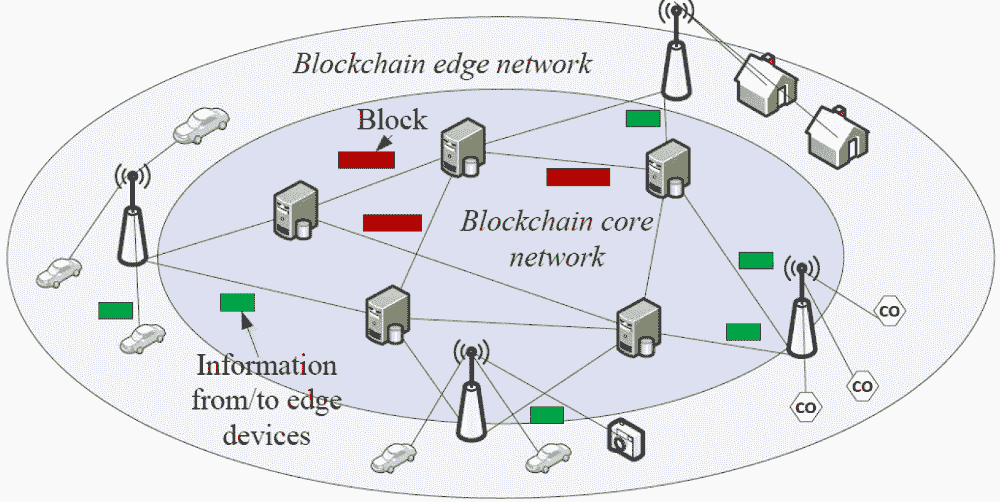

# 加密货币和分散网络

> 原文：<https://medium.com/coinmonks/centralized-versus-decentralized-blockchain-networks-an-introduction-history-and-a-db986be645bc?source=collection_archive---------62----------------------->

加密货币本质上旨在通过去中心化的网络解决信任问题，降低系统延迟。集中式网络存在于当今绝大多数组织中，它们以某种中央结构为基础。在这些系统中，控制权掌握在一小部分人或技术手中，并且访问权限有限。这必然会导致许多问题:主观性、单点失败(例如，一个工程师与外部合作者一起从银行偷窃)、不平衡的决策和意识、缺乏个人激励(进行改变)等等。此外，集中式系统往往缺乏透明度、效率、安全性和可跟踪性。通过节点(网络上的计算机)的分布式网络运行的分散式网络提供了所有这些东西:没有单点故障的增强的安全性，通过自动化和消除各种集中瓶颈的卓越效率，通过公共记录系统的完全透明和可跟踪性，决策对网络中的各方开放，等等。这并不是说集中式和分散式系统和组织的问题有一个完全正确的答案:两者都有优点和缺点。例如，公平地说，战争时期的集中控制是一种好得多的制度；一个老练的将军胜过十几个人。然而，同样是在这一点上，是否开战的决定最好是以分散的方式，通过许多不同意见的综合输出来做出。

medium.com

在过去，集中的系统占主导地位，人类系统通常倾向于集中:许多农民到一个城市，许多政党到两个，电影院到几个大型流媒体服务，等等。特定类型的分散式和分布式网络以及由这种网络产生的益处仅在过去十年左右通过新技术的发现和实施才变得可行，并且由于这个原因，分散式系统正在全世界和世界所有地区被实施以产生巨大影响。导致这种增长的特定类型的技术是区块链——区块链网络本质上是一种新型的数据库，一种交易和存储价值和协议的新方式。他们通过连接到共享系统的分散式计算机网络来做到这一点——例如，比特币网络在成千上万个单独的节点上运行。数据通过散列过程(实质上是打乱文本)进行加密，并由网络上的节点进行验证。这样，即使单个节点被破坏，攻击者也无法破坏系统，因为许多其他未被破坏的节点只是检查并使被破坏方传递给系统的信息无效。

[https://blockchain.ieee.org/](https://blockchain.ieee.org/)

当在区块链上处理信息时(例如，当甲方向乙汇款时)，通过使用私钥和公钥来利用信息不对称——即使攻击者知道系统和处理数据(数据意味着加密传输)的方式，攻击者也无法破解系统，因为甲和乙通过区块链上的代码利用他们的私钥(结合散列算法)来成功传输数据。区块链网络不需要任何信任，因为系统的代码是不可更改的，记录是完全公开的，可以通过公共账本查看。不需要中间人，开销、交易成本和错误都减少了，而且系统比集中的替代方案更有效率。这些应用使得区块链在供应链、数据管理、验证、数字身份、IP、dApps 和许多其他领域得到了广泛应用。

那么，下一步是什么？区块链将继续在所有形式的技术和社区中快速实现自己。加密货币将继续增加、减少和分化，直到某种过滤事件(至少是自然选择)识别出罕见的赢家和众多的输家。作为一种理念，去中心化将会继续发展，但是去中心化的凭证将会面临来自统一的中心化组织的阻力，并且会失去一切。创新者将继续创新，开发者将继续开发，用户将继续使用。

> 交易新手？试试[加密交易机器人](/coinmonks/crypto-trading-bot-c2ffce8acb2a)或者[复制交易](/coinmonks/top-10-crypto-copy-trading-platforms-for-beginners-d0c37c7d698c)