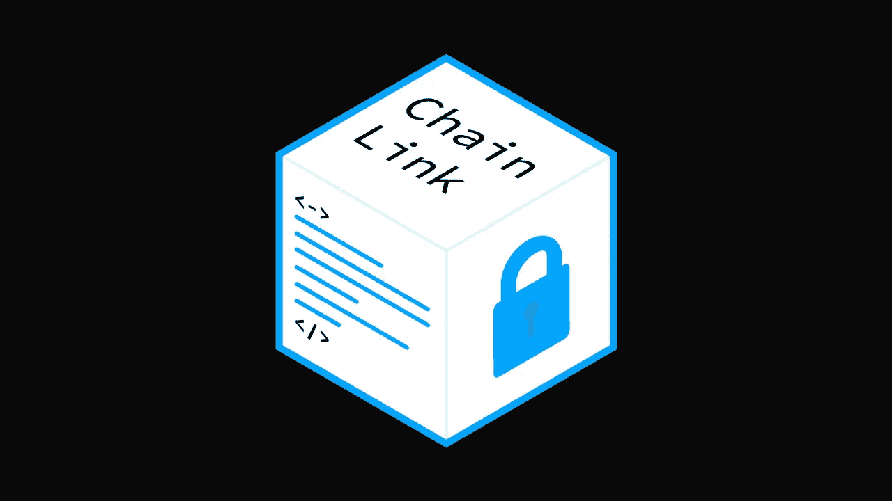

# 60 秒内解释完链环(link)

> 原文：<https://medium.com/coinmonks/chainlink-link-explained-in-60-seconds-dcf74ae9309c?source=collection_archive---------60----------------------->

Chainlink 是将智能合约连接到外部数据源的区块链转换层。它是由 SmartContract.com 的 Sergey Nazarov 和他的团队为了解决甲骨文的问题而开发的。

oracle 问题是区块链开发中的一个常见挑战。甲骨文问题的主要思想是，我们的物理世界的某些方面不容易转化为数字信息，例如，天气、空气质量和其他环境因素。

为了向智能合约提供这些数据，我们需要一个称为“oracle”的中介，它将负责从物理世界获取这些数据，并将其转换为智能合约可以读取的数字信息。

链式网络由称为“神谕”的节点组成，这些节点作为物理世界和智能契约之间的中介。Chainlink 使智能合约能够安全地访问位于区块链之外的真实信息。

通俗地说，这允许区块链(或智能合约)与现实世界的事件进行交流。

 [## 你准备好迎接加密经济了吗？加密派

### 每次你打开新闻，阅读报纸，或者浏览你的推特，你很可能会看到一些故事…

www.thecryptopie.com](https://www.thecryptopie.com/) 

> 加入 Coinmonks [电报频道](https://t.me/coincodecap)和 [Youtube 频道](https://www.youtube.com/c/coinmonks/videos)了解加密交易和投资

# 另外，阅读

*   [交易信号是什么？](https://coincodecap.com/trading-signal) | [Bitstamp vs 比特币基地](https://coincodecap.com/bitstamp-coinbase) | [买索拉纳](https://coincodecap.com/buy-solana)
*   [ProfitFarmers 回顾](https://coincodecap.com/profitfarmers-review) | [如何使用 Cornix Trading Bot](https://coincodecap.com/cornix-trading-bot)
*   [十大最佳加密货币博客](https://coincodecap.com/best-cryptocurrency-blogs) | [YouHodler 评论](https://coincodecap.com/youhodler-review)
*   [my constant Review](https://coincodecap.com/myconstant-review)|[8 款最佳摇摆交易机器人](https://coincodecap.com/best-swing-trading-bots)
*   [MXC 交易所评论](/coinmonks/mxc-exchange-review-3af0ec1cba8c) | [Pionex vs 币安](https://coincodecap.com/pionex-vs-binance) | [Pionex 套利机器人](https://coincodecap.com/pionex-arbitrage-bot)