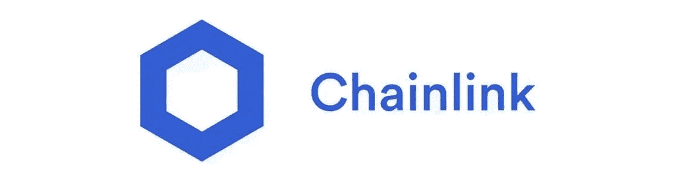
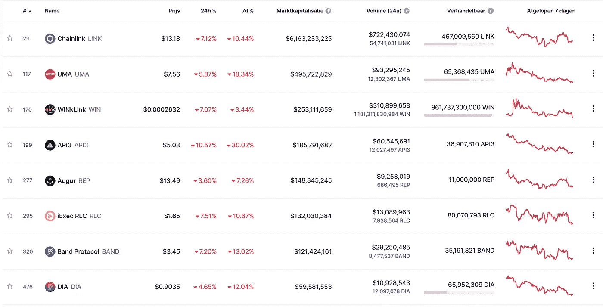
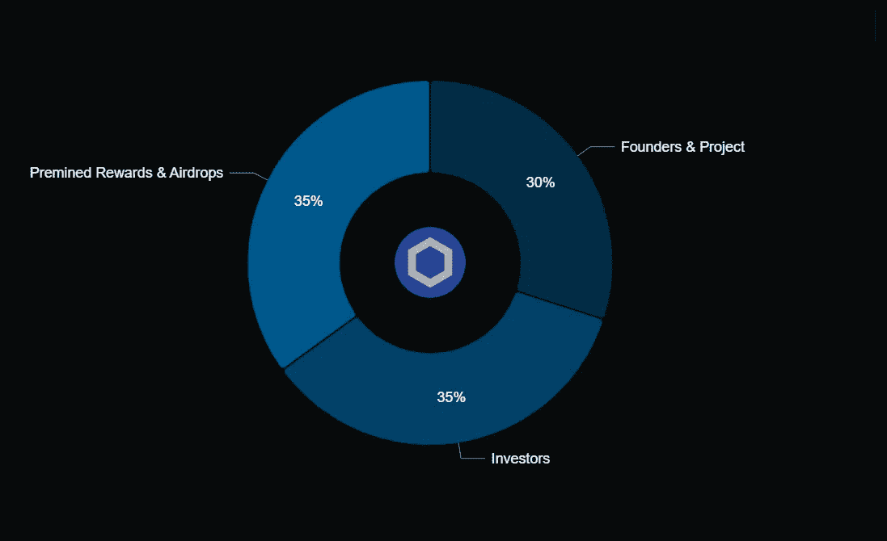
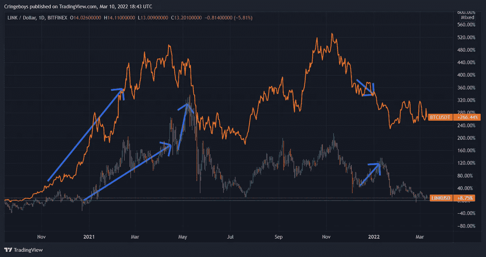

# 链环(link)应该买吗？

> 原文：<https://medium.com/coinmonks/chainlink-link-should-you-buy-it-6211affb9e04?source=collection_archive---------58----------------------->

昨天我谈到了神谕，以及为什么它们对 Defi 的工作如此重要，所以今天我将回顾一下我最喜欢的神谕。

# 这是什么？

正如我已经提到的，Chainlink 是一个神谕。简而言之，oracle 为智能合约提供真实世界的信息。

如果这对你来说是中文，那么一定要看看这篇文章，在这篇文章中我解释了神谕是什么:

 [## 神谕是什么，它们重要吗？

### 虽然它们可能不像另一个 P2E 游戏或 NFT 项目那样“性感”，但神谕是 Blockhain 中为数不多的东西之一…

medium.com](/coinmonks/what-are-oracles-and-are-they-important-6e1a89a3312b) 

# 竞争

评估一个项目价值的一个非常重要的部分是检查它的竞争性。因为一个项目可能一开始看起来不错，但最终会被对手完全超越。

正如你所看到的，Oracles 是 Crypto 的一个很小的子部分，但是 Chainlink 已经成功地脱颖而出。

老实说，所有其他的神谕可能看起来不错，但他们只是没有像 Chainlink 一样被广泛采用。

# 令牌组学

可悲的是，这是一个环节，Chainlink 并不像我希望的那样好。

通货膨胀率为 13.5%，这远不是我听说过的最糟糕的，但理想情况下也应该低一点，低于 10%就好了。

模糊的措辞有点令人遗憾，尤其是关于创始人和项目的部分。

我假设这部分代币供应将用于支付员工工资和整体生态系统健康，但我更喜欢他们是否包括员工的确切收入，因为这是一个相当重要的数字。

# 图表

Chainlink 的一个额外有趣的事情是，当整体市场下跌时，它有一个迷你牛市的趋势。

大多数时候，Chainlink 和比特币以及几乎所有其他替代货币都是相关的。但在熊市中，它会随机地突然脱钩，开始一波小牛市，却没有任何解释。

抱歉，图表有点乱。

所以你可能会注意到，这两者在很大程度上遵循相同的模式。

在 2021 年初的第一轮牛市中，我们可以看到比特币在开始时有一个更抛物线的运行，然后稳定在 60K 大关附近。然而，Chainlink 需要更多一点的时间来上升，然后在夏季 21 熊市之前进行了最后一次短暂但高的运行。

我想展示的第二件事是它在 2021 年 12 月的 50%牛市，即使所有其他替代硬币都在下跌。

它们仍然明显高度相关，但这是一个很好的额外因素，有助于在熊市中提供一些道德支持。很高兴知道至少有东西涨价了。

# 结论

老实说，Chainlink 只是做了它应该做的事情，它证明了它有真实世界的用例，因为它被 Defi 项目大量使用。

对我来说，这是最大和最好的甲骨文，除了一些小的象征性问题，它真的没有太多的负面影响。

我现在把它放在我的投资组合里，并打算继续保存它，因为我相信每个人的投资组合里都应该有一个先知。