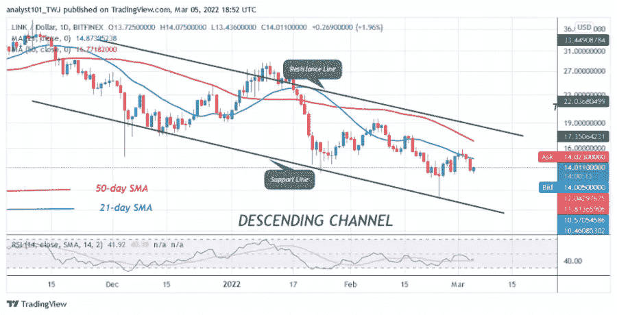
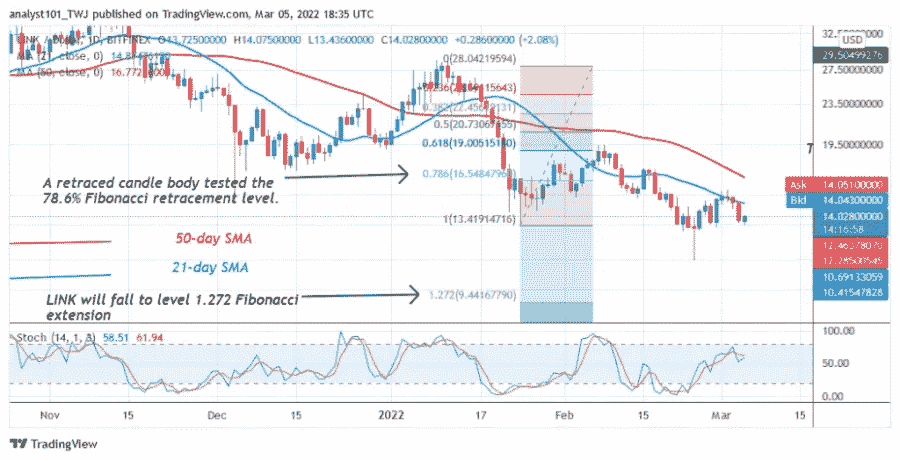

# Chainlink 保持在 13 美元以上，略有上升

> 原文：<https://medium.com/coinmonks/chainlink-maintains-its-hold-above-13-and-advances-slightly-9e5aac3e4b2e?source=collection_archive---------55----------------------->

**Visit our website:-** [**https://bitcoinsupports.com/**](https://bitcoinsupports.com/)

Chainlink 的(link)价格今天跌至 13 美元的低点。这是自 1 月 24 日以来的最低价。

**Chainlink(链接)价格长期分析:看跌**

自 1 月 24 日以来，加密货币市场一直处于下跌状态，在 13 美元至 19 美元价格水平之间波动。买家一直在积极努力将替代硬币推至移动平均线以上。

多头已突破 21 日均线，但仍维持在 50 日均线下方。2 月 28 日，多头突破了 21 日线的移动平均线，但在 16 美元的高点被断然拒绝。Chainlink 暴跌至 13 美元的低点。突破移动平均线将使加密货币飙升至 28 美元的高位。买家在预期上涨的情况下，重新回到现有的支撑之上。

**指标 chainlink (LINK)读数**

Chainlink 在 14 天期间的相对强度指数水平为 41。加密货币正在下跌，并在 50 天移动平均线下方交易。LINK 的价格低于其移动平均线，这意味着可能会下跌。替代硬币的交易价格低于日线随机指标的 60%区间。市场目前处于熊市趋势。

**Visit our website:-** [**https://bitcoinsupports.com/**](https://bitcoinsupports.com/)

**指标技术:**

——55 美元和 60 美元是关键阻力位。

—重要支撑位——

**20 美元和 15 美元【Chainlink】下一步该怎么走？**

Chainlink 处于下跌趋势，因为价格已经跌破均线。与此同时，替代硬币的价格保持在 13 美元的支撑位上方。如果目前的支撑位被突破，市场将下跌。与此同时，测试 78.6%斐波纳契回撤水平的蜡烛体已经出现在 1 月 24 日以来的下降趋势中。根据回撤，LINK 可能会跌至 1.272 斐波纳契扩展水平，或 9.44 美元。

**访问我们的网站:-**[**https://bitcoinsupports.com/**](https://bitcoinsupports.com/)

**免责声明:以上为作者观点，不应视为投资建议。读者应该自己做研究。**