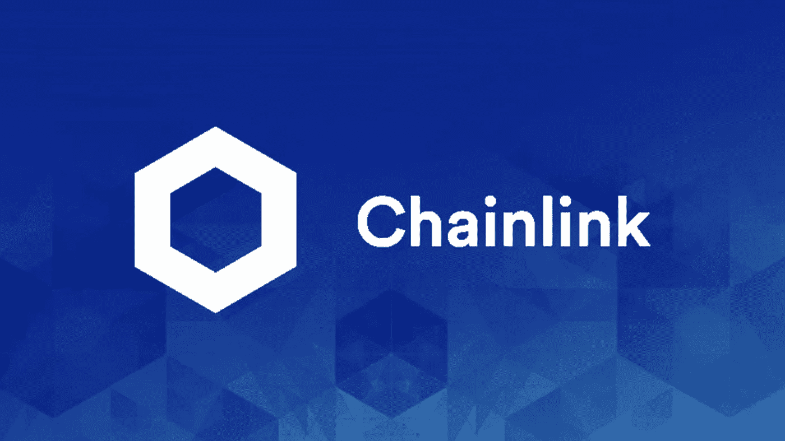

# 2022-2026 年链环价格预测

> 原文：<https://medium.com/coinmonks/chainlink-price-prediction-2022-2026-cf55e39d49d4?source=collection_archive---------21----------------------->

Source photo [chainlink — Bing images](https://www.bing.com/images/search?view=detailV2&ccid=88G0ETA6&id=0253D1F27FDCA3869CD7538C9080DE2A5052F5F4&thid=OIP.88G0ETA6G8ZX-0F_1FczgAHaEK&mediaurl=https%3a%2f%2fmedia.coin.guru%2fimages%2fcoinguru_chainlink_explained.jpeg&cdnurl=https%3a%2f%2fth.bing.com%2fth%2fid%2fR.f3c1b411303a1bc657fb417fd4573380%3frik%3d9PVSUCregJCMUw%26pid%3dImgRaw%26r%3d0&exph=1080&expw=1922&q=chainlink&simid=608007854288950604&FORM=IRPRST&ck=C43EAD4831895BE38EF50BB410504793&selectedIndex=7&ajaxhist=0&ajaxserp=0)

链式网络的本地令牌是 link。Chainlink 是首批将外链数据纳入智能合约的网络之一。Chainlink 是数据处理领域的市场领导者，因为它拥有广泛的值得信赖的合作伙伴网络。Chainlink 作为一个分散式网络，使用户能够成为节点运营商，并通过运营区块链运营所必需的重要数据基础设施来赚取现金。