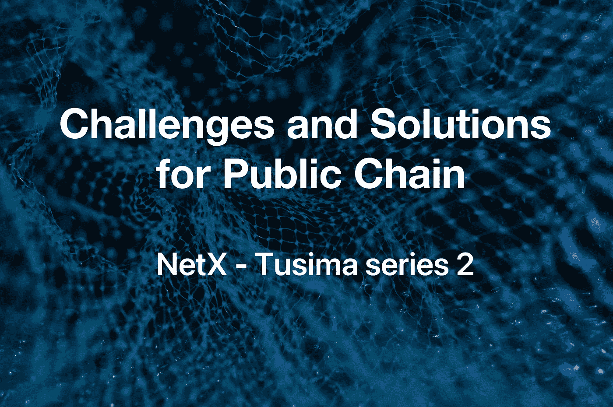

# 公共链面临的挑战和解决方案

> 原文：<https://medium.com/coinmonks/challenges-and-solutions-for-public-chain-36c183eb608e?source=collection_archive---------11----------------------->

## 潜水前:

*   以太坊为特色的公链市场遇到了哪些问题？
*   有什么有效的解决办法吗？
*   隐私重要吗？怎么保护？

thereum 代表了一个典型的公共链，沉迷于聚光灯下。一个微小的变化可能会引起整个行业的蝴蝶效应。拥塞、跨链通信、隐私威胁等。然而，以太坊的突出挫折。就像杀毒软件随着病毒越来越强而更新迭代一样，ETH 的对手已经浮出水面。虽然许多灾难已经通过经典项目逐渐得到缓解，但尚未达成统一的完美解决方案。但我相信答案就在前方等待我们去寻找。

随着竞争对手蚕食其市场份额，多链必将到来。随着竞争对手的兴衰，以太坊不知何故得到了升级，智能合约的核心规则得以建立。

# 快速但便宜的交易

以太坊总是因为高昂的燃气费将新用户拒之门外。以太坊的创始人 Vitalik Buterin 曾经说过“*互联网的货币成本不应该超过 5 美分”*。因此，只有优秀但成本效益高的项目(甚至是它们的克隆)才能起飞。雪崩(AVAX)可以视为以太坊的精神继承者。币安智能链(BSC)是 EVM 兼容的区块链，其产品具有低成本和高质量。索拉纳(Sol)是另一个独特的区块链。就性能而言，它可以排除其他一切，非常便宜，非常快。它依赖于摩尔定律进行缩放(随着计算机变得更快，Sol 也变得更快)。

这些项目都显示出丰富的优点，同时疏通以太坊。它们在新用户中很受欢迎，但由于缺乏稳定性而受到挑战。一些人担心，当他们达到类似以太坊的规模和体积时，他们是否会面临同样的困境。与此同时，以太坊正试图找到自己的救赎之路，因为未来仍然模糊不清。

现在，以太坊被低扩展性所困扰。最严谨有效的出路在于以太坊 2.0 (ETH2.0)。ETH 2.0 更新需要从工作证明(PoW)转变为利益证明(PoS)，使节点能够持有利益并促进更快的交易。这样，普通用户可以体验他们想要的以太坊，并且许多其他功能都得到了改进。交易激增，流量减少，成本下降。然而，ETH2.0 的上线还有很长的路要走。根据官方预测，ETH2.0 将在未来 3 到 5 年内分几个阶段推出。一个主要障碍是原始链上未解决的核心问题，如链存储、块大小、事务吞吐量、状态大小和网络性能。平稳和成功的过渡需要升级两个链。

反正 ETH2.0 和以太坊是完全不同的系统，他们会并行运行很多年。但这一旅程的不确定性可能会使 ETH2.0 很难重新获得用户的欢迎。

# 快速稳定的跨链相互作用

如上所述，未来可能是多链的。为了将资产从一个链转移到另一个链，我们需要跨链桥来连接链。但更令人激动的是区块链间通信协议(IBC)的概念。一个设计缺陷是所有的应用程序都使用大型机方法，但是运行在共享的状态机上。我们希望不同的区块链独立工作，但可以沟通和合作。IBC 做到了这一点。

IBC 和布里奇斯不同。桥梁是区块链之间的直接通道，而 IBC 更像是一条通往全区块链的高速公路。不同的桥消耗时间和资源。IBC 允许在没有网桥的情况下连接到第 1 层区块链。哪个更有价值？这取决于你的需求。IBC 带来了通用解决方案，而桥梁创造了快速通道。

在梅萨里的《2022 年加密论文》报告中，预测就像最受欢迎的 L1 <> L2 / L1 <> L1 / L2 <> L2 桥协议在五年内的日交易量将超过最受欢迎的中央交易所。每个生态系统最终都将发展和壮大自己的优势，包括更高的安全性、更快的吞吐量、更便宜的交易、更好的隐私、独特的资源分配(例如存储、计算、带宽)，以及区域开发者和用户社区。桥梁很重要，因为它为用户创造了对新平台和协议的可访问性、互操作性，以及通过开发者的共同努力开发新产品的可用性。具体来说，它们使现有的加密资产变得高效和实用，为现有协议挖掘新的功能，为用户和开发人员解锁新的功能和测试用例，等等。

虽然理想的状态应该是一个适用于所有情况的同质桥，但很可能不存在单一的“最佳”桥设计，不同类型的桥将最适合特定的应用(例如，资产转移、合同调用、铸造代币)。

此外，最好的桥梁将是最安全、最互联、最快速、最节省资金、最具成本效益和最抗审查的。如果我们想要实现“区块链互联网”的愿景，这些都是需要最大化的属性。桥梁建设面临着与区块链类似的三难困境(可扩展性、分散性、安全性)。你不能总是权衡利弊。一个实现可能是以另一个的牺牲为代价的。

# 安全透明的隐私网络

Web 3.0 时代，用户拥有链上的数据，数据公开、透明、可追溯。我们似乎找到了自由平等的乌托邦，另一边，如何保护隐私将是另一个圣杯。区块链的隐私设计从银行发展到了比特币网络。我们假设 Web 3.0 的底层网络将是像比特币一样的区块链网络。那么我们讨论的隐私将建立在交易公开、数据开源、去中心化的前提下。

在性能、可用性和隐私的区块链三重困境中，隐私保护需要融入全球底层逻辑。Vitalik 说，*“只有全局匿名集合才是真正鲁棒安全的。”*这意味着也许只有区块链网络上的全球隐私保护才是最有效的。在实践中，比特币和以太坊都妥协了一些隐私保护，以实现去中心化和计算成本。在这个三元悖论中，普通用户和开发者首先要解决的是性能，其次是可用性，最后是隐私。在 Web3.0 时代，也许黎明前最后的黑暗将是隐私问题。

最完整但也是最臃肿的解决方案之一是做一个专用的隐私链(如 Monero)，然后用各种跨链工具和各种钱包进行适配。但这是非常糟糕的用户体验。这就好比你想在社交媒体上发布自己纹身的照片，又不想让长辈看到，那么你就需要一个个屏蔽掉，甚至去一个新的社交媒体，只加同龄人为好友。这在 Web 2.0 和 Web 3.0 场景中都是一个棘手的问题。

没有人知道 Web 3.0 会发生什么，大多数 Web 3.0 用户也不知道他们想要什么，就像 Web 2.0 用户花了很长时间才意识到他们的隐私被如此肆无忌惮地侵犯一样。最近对隐私项目的大量资助实际上将隐私的需求推到了前台，并让更多人意识到，在 Web 3.0 时代，我们需要数据自治、数据隐私、数据计算隐私和现实世界的身份隐私。

## 必读:

[图西玛系列 1](/coinmonks/public-chain-market-outlook-823eaec076cb) | [NetX 系列 1](/triaslab/rethinking-the-it-industry-d101384e801) | [NetX 系列 2](/coinmonks/a-letter-from-satoshi-nakamoto-345a45d012bb) | [NetX 系列 3](/coinmonks/out-of-control-the-post-it-evolution-dd64e05ff5bc)

***NetX，面向数字生活的可信、可靠的智能自治系统链原生互联网(***[***Trias***](https://www.trias.one/)***)***

[***铁人三项***](https://www.triathon.space/#/)***|***[***Ethanim***](https://www.ethanim.network/)***|***[***tu Sima***](https://www.tusima.network/#/)***| behemotius | Leviatom | Divina***

> 加入 Coinmonks [电报频道](https://t.me/coincodecap)和 [Youtube 频道](https://www.youtube.com/c/coinmonks/videos)了解加密交易和投资

# 另外，阅读

*   [Bookmap 评论](https://coincodecap.com/bookmap-review-2021-best-trading-software) | [美国 5 大最佳加密交易所](https://coincodecap.com/crypto-exchange-usa)
*   [如何在 FTX 交易所交易期货](https://coincodecap.com/ftx-futures-trading) | [OKEx vs 币安](https://coincodecap.com/okex-vs-binance)
*   [CoinLoan 评论](https://coincodecap.com/coinloan-review) | [YouHodler 评论](/coinmonks/youhodler-4-easy-ways-to-make-money-98969b9689f2) | [BlockFi 评论](https://coincodecap.com/blockfi-review)
*   [XT.COM 评论](https://coincodecap.com/profittradingapp-for-binance)币安评论 |
*   [SmithBot 评论](https://coincodecap.com/smithbot-review) | [4 款最佳免费开源交易机器人](https://coincodecap.com/free-open-source-trading-bots)
*   [比特币基地僵尸程序](/coinmonks/coinbase-bots-ac6359e897f3) | [AscendEX 审查](/coinmonks/ascendex-review-53e829cf75fa) | [OKEx 交易僵尸程序](/coinmonks/okex-trading-bots-234920f61e60)