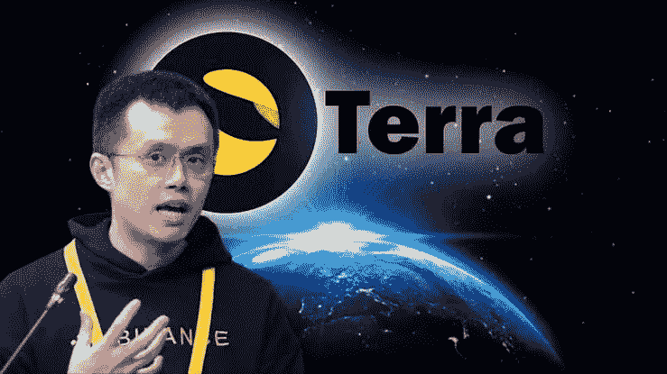

# 币安的赵昌鹏(CZ)解释道:如何避免地球的崩溃

> 原文：<https://medium.com/coinmonks/changpeng-zhao-of-binance-cz-explains-how-the-collapse-of-terra-would-have-been-avoided-54b358d65129?source=collection_archive---------43----------------------->

一家名为“Terra”的强大巨头在加密领域的倒下引起了很大的波动，并在过去两周内使交易者和投资者损失了大量资金。

在项目的第一轮融资中，币安已经向 Terra 投资了 300 万美元。

CZ 提到，币安获得了 1500 万卢纳(最高价值 16 亿美元)作为初始投资(300 万美元)的一部分。560 倍回报创历史新高。它仍然在我们收到它的地址。从未移动或出售。

币安在 LUNA 和 UST 分别持有约 16 亿美元和 1200 万美元。然而，在崩溃之后，卢娜价值现在是 1904 美元，UST 价值是 799122 美元。

Crypto 是真正的无人区。即使是钻石手也会遭殃。

# 泰拉瀑布

上周，Terraform Labs 的算法稳定币 UST 失去了它的挂钩，此前从其锚协议中撤出了 5 亿美元，导致流动性较低的 Curve 上出现了大量销售。

这次出售让 UST 失去了联系汇率制，并引发了银行挤兑。由于 UST 背后的算法系统，当稳定的硬币的价值持续下降时，数万亿的硬币被印了出来。

它的崩溃震动了整个加密市场。

# Terra 坠毁是可以避免的

昨天，CZ 通过他的推文在推特上说，虽然 Terra 生态系统

是一个微不足道的理论。他宣布“没有最好的补救办法”可以让那些卷入卢娜/UST 号熔毁的人满意。

币安的 CZ 解释说，Terra 的膨胀是空的，这导致了泡沫的破裂。他透露，如果有及时的回复，这场灾难是可以避免的。

CZ 称 Terra 的设计缺陷是“最愚蠢的”,因为它认为铸造更多的资产会增加其市值。他补充道:印刷钞票不会创造价值，只会降低普遍价值。"指数造币厂卢娜让危机变得更加严重."

他还建议 Terra 团队应该回购或焚烧代币，而不是分叉和铸造代币。他认为分流和铸造无助于 UST 的复兴。

“虽然 Terra 确实有一个包含一些使用案例的生态系统，但生态系统的扩张速度与用来吸引新用户的激励措施的速度不匹配。如果 Terra 团队在脱钩率为 5%时动用了他们的储备，整个事件可能就可以避免。”

他宣称，Terra 团队在动用他们的储备来收回钉住汇率制方面行动迟缓。在硬币的价值已经下跌了 99%之后，他们试图用 30 亿美元来进行解放。

“在一个分散的系统中，所有的稳定点都以几种方式工作。没有通用的标准或储备。

尽管如此，当一个失败时，其他的会受到轻微的影响。实际上，如果没有救助，所有其他主要的稳定项目都挺过来了，大多数其他的加密项目都很好，”他评论道。

在讨论崩溃的影响时，他解释说，整个加密生态系统都受到了冲击。许多加密项目过去和现在都在许多方面受到负面影响。

# 摘要

监管机构现在需要进一步监管稳定币市场，但彻底禁止算法稳定币还为时过早，因为这可能会阻碍生态系统的发展。

鉴于 Terra 的崩溃，CZ 表示，没有人是加密市场的专家，没有人不赔钱。就连他的公司也在这次事故中遭受了损失。

Terra 的一个受欢迎的倡导者是 Galaxy Digital 的首席执行官 Mike Novogratz，他也受到了 Terra 崩溃的影响，并警告人们不要看到比特币的底部。

他说，如果你不小心，你将买入一把下跌的刀，并称之为下跌，市场可能会进一步崩溃。

alt 从最高点下降了 80%以上。在 2018 年，这一比例超过了 95%。我的观点是，选择底部是有风险的，如果你逐步扩大规模。

> 加入 Coinmonks [电报频道](https://t.me/coincodecap)和 [Youtube 频道](https://www.youtube.com/c/coinmonks/videos)了解加密交易和投资

# 另外，阅读

*   [比斯勒评论](https://coincodecap.com/bitsler-review)|[WazirX vs coin switch vs coin dcx](https://coincodecap.com/wazirx-vs-coinswitch-vs-coindcx)
*   [7 大副本交易平台](https://coincodecap.com/copy-trading-platforms) | [BuyCoins 点评](https://coincodecap.com/buycoins-review)
*   [XT.COM 评论](https://coincodecap.com/profittradingapp-for-binance)币安评论 |
*   [SmithBot 评论](https://coincodecap.com/smithbot-review) | [4 款最佳免费开源交易机器人](https://coincodecap.com/free-open-source-trading-bots)
*   [杠杆代币](/coinmonks/leveraged-token-3f5257808b22) | [最佳密码交易所](/coinmonks/crypto-exchange-dd2f9d6f3769) | [Paxful 点评](/coinmonks/paxful-review-4daf2354ab70)
*   [加密套利](/coinmonks/crypto-arbitrage-guide-how-to-make-money-as-a-beginner-62bfe5c868f6)指南| [如何做空比特币](/coinmonks/how-to-short-bitcoin-568a2d0b4ae5)