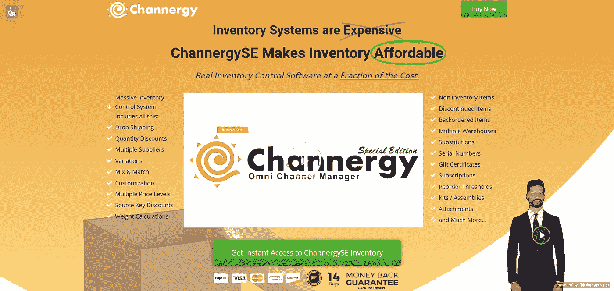
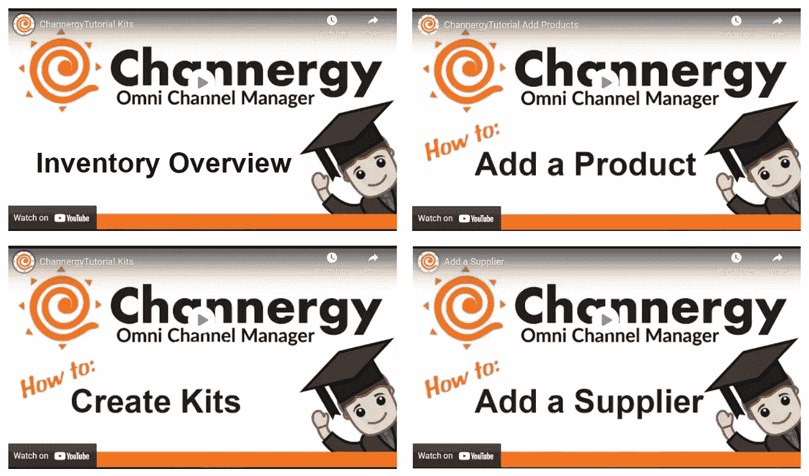
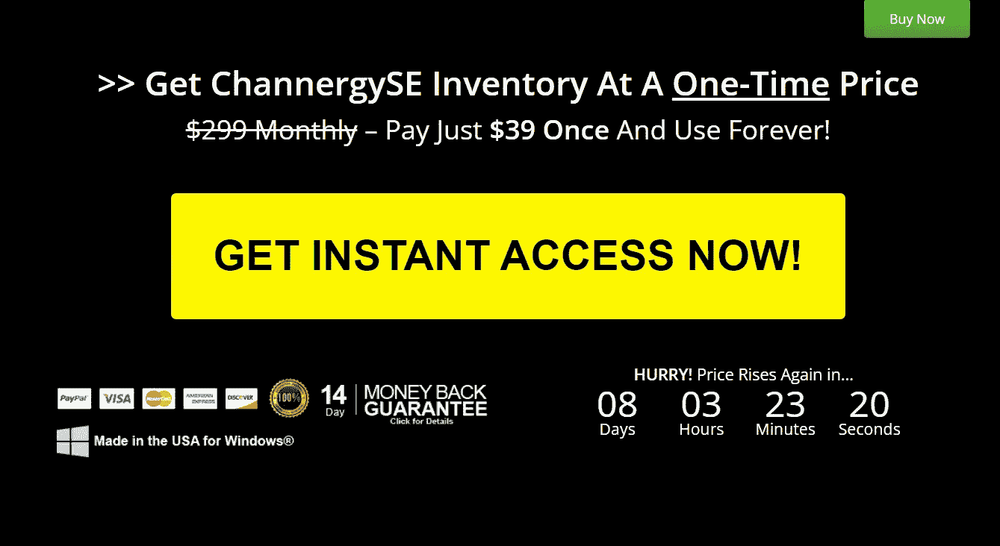

# ChannergySE 库存管理系统诚实审查

> 原文：<https://medium.com/coinmonks/channergyse-inventory-management-system-honest-review-245f93c2171c?source=collection_archive---------43----------------------->

**ChannergySE Inventory Management System**

大家好！我是 Amit，今天我将向大家介绍这款 **ChannergySE 库存管理软件**的详细信息和真实评价。

在这个博客中，你将了解这个产品的每一个方面，以及它的特性、优点、价格和更多的细节。这样你**就不会浪费你的钱**并且让你的购买 100%有保证和满意。

现在，让我们开始 ChannergySE 库存回顾，了解 ChannergySE 到底是什么，以及它如何为您的企业服务。

## ChannergySE 库存到底是什么？

**ChannergySE Inventory**

[**ChannergySE Inventory**](https://bit.ly/38C6hzu)是一个基于云的库存管理系统，可以帮助你管理库存，跟踪销售和购买情况。还可以看看需要什么产品来补充库存。

ChannergySE 库存是零售商、电子商务卖家和分销商的理想选择。它帮助你监控股票，预测销售，跟踪费用，并分析你的利润和损失。

您还可以使用 ChannergySE Inventory 来管理订单和跟踪进出货物。这款**库存管理软件**可以让你跟踪生命周期结束的产品，并了解你需要哪些产品来补充库存。

## ChannergySE 库存是如何工作的？

**ChannergySE Inventory Work**

ChannergySE Inventory 只需 **3 个简单的步骤**

**第一步:-** 在 ChannergySE 中输入或导入您的产品。你甚至可以直接导入你的亚马逊和易贝列表。

**步骤 2:-** 修改数量，添加图像，并设置直运商。你需要的信息在 ChannergySE 有一席之地。

**第三步:-** 开始销售！你的库存是安全和准确的，你有你需要的所有工具。

## ChannergySE 库存的一些关键特性

1.  超长的产品编号、名称和简短描述字段
2.  每个产品的无限长的长描述字段
3.  订单消息字段，在订单输入过程中也会显示，用于快速提醒、添加等。
4.  用户可定义的产品类型字段，用于识别、过滤搜索，并通过电子邮件或打印发送给客户
5.  定制备忘录字段和 20 个用户可定义的字段，用于深度、粒度产品选项
6.  每种产品有 4 个价格级别，每个级别都有数量折扣和混搭选项
7.  基于源密钥、订购产品、优惠券、销售、位置等的折扣
8.  绘制底价图，防止低价销售
9.  重量、体积重量、运输保险计算等
10.  库存水平、多个地点/仓库、直运商数量、供应商数量

这些是 ChannergySE 库存的一些**关键特征**，而且不止于此。这个列表一直持续下去。

## 渠道优势库存优势

1.  减少或消除延期交货
2.  始终保持准确的库存
3.  在多个市场销售
4.  大量信息集中在一个地方
5.  完全控制您的数据
6.  自动化手动任务
7.  与直运商合作
8.  最小化成本
9.  向出价最低的人购买
10.  易于访问的数据库
11.  快速、可靠且易于使用
12.  可扩展和可定制
13.  与第三方兼容
14.  25 年的跟踪记录
15.  没有月费

## 这个庞大的渠道库存控制系统包括

1.  直运
2.  数量折扣
3.  多个供应商
4.  变化
5.  混搭
6.  用户化
7.  多种价格水平
8.  源键折扣
9.  重量计算
10.  非库存项目
11.  停产产品
12.  延期交货项目
13.  多个仓库
14.  代替
15.  序列号
16.  礼券
17.  捐款
18.  重新排序阈值
19.  套件/组件
20.  附件等等。

## 库存管理软件的定价

**Price of ChannergySE Inventory**

你可以以**的一次性价格**获得 ChannergySE 库存。

你只需要支付**39 美元**一次，你就可以永远使用它！它还带有 **14 天退款保证**。因此，如果你遇到任何问题，他们会退还你的钱。

所以**快点！在价格再次上涨之前，抓住这个限时特惠。**

## 最后的话

伙计们，非常感谢检查我的诚实的 ChannergySE 审查！我希望你对这个**神奇的库存管理软件**有足够的了解。现在是你决定买还是不买的时候了。

如果你想购买 ChannergySE，你可以毫无顾虑地购买**,因为我相信你已经从这篇评论中了解了 ChannergySE 库存的一切。**

只是要小心网站，这样你就不会最终跟随骗局而失去你的钱。

为了进一步帮助你，我将**在下面**留下 ChannergySE 库存的官方网站供你访问。

如果您从下面的链接购买。我将为您提供一份**免费的特别奖励**。

为了得到那笔特别的奖金，你可以在我的 Instagram 上**联系我**。给我发一张你购物的截图，我会给你一份特别的奖励。

我希望这些信息对你有所帮助。

干杯！

## [**购买 ChannergySE 库存管理软件**](https://bit.ly/38C6hzu)

> 加入 Coinmonks [电报频道](https://t.me/coincodecap)和 [Youtube 频道](https://www.youtube.com/c/coinmonks/videos)了解加密交易和投资

# 另外，阅读

*   [3 商业评论](/coinmonks/3commas-review-an-excellent-crypto-trading-bot-2020-1313a58bec92) | [Pionex 评论](https://coincodecap.com/pionex-review-exchange-with-crypto-trading-bot) | [Coinrule 评论](/coinmonks/coinrule-review-2021-a-beginner-friendly-crypto-trading-bot-daf0504848ba)
*   [莱杰 vs n rave](/coinmonks/ledger-vs-ngrave-zero-7e40f0c1d694)|[莱杰 nano s vs x](/coinmonks/ledger-nano-s-vs-x-battery-hardware-price-storage-59a6663fe3b0) | [币安评论](/coinmonks/binance-review-ee10d3bf3b6e)
*   [Bybit Exchange 审查](/coinmonks/bybit-exchange-review-dbd570019b71) | [Bityard 审查](https://coincodecap.com/bityard-reivew) | [Jet-Bot 审查](https://coincodecap.com/jet-bot-review)
*   [3 commas vs crypto hopper](/coinmonks/3commas-vs-pionex-vs-cryptohopper-best-crypto-bot-6a98d2baa203)|[赚取加密利息](/coinmonks/earn-crypto-interest-b10b810fdda3)
*   最好的比特币[硬件钱包](/coinmonks/hardware-wallets-dfa1211730c6) | [BitBox02 回顾](/coinmonks/bitbox02-review-your-swiss-bitcoin-hardware-wallet-c36c88fff29)
*   [BlockFi vs 摄氏度](/coinmonks/blockfi-vs-celsius-vs-hodlnaut-8a1cc8c26630) | [Hodlnaut 审核](/coinmonks/hodlnaut-review-best-way-to-hodl-is-to-earn-interest-on-your-bitcoin-6658a8c19edf) | [KuCoin 审核](https://coincodecap.com/kucoin-review)