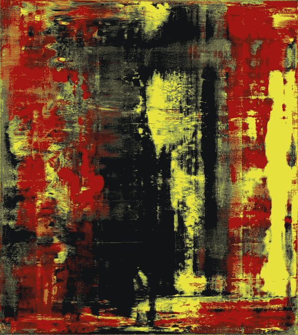

# 第 1 章:关于 NFTs 的简短介绍

> 原文：<https://medium.com/coinmonks/chapter-1-a-short-intro-about-nfts-af10c1d11305?source=collection_archive---------70----------------------->

# (或者为什么 NFT 不仅仅是一个泡沫)

NFT 被柯林斯字典选为 2021 年的年度词汇。NFTs 每天都出现在头条新闻中，吸引了全世界的注意力，因为数字艺术的副本交易了百万美元的价值，当然，也带来了来自那些认为所有炒作都是精心制作的骗局的人的大量批评。

不管你喜不喜欢，NFT 有一大堆问题需要解决。然而，最常见的是人们出于可疑的原因为非功能性测试辩护，或者纯粹出于无知而谴责它们。

让我们从基础开始:NFT 是任何类型的加密资产，它具有唯一的价值，即它不能与另一个相等的资产交换(不可能有这样的事情)。因此得名:它是一个不可替代的令牌。任何货币都可以以相应的价值兑换成另一种货币。但是 NFT 只能兑换与其价值相当的货币。请这样想:我们知道，NFT 可以卖现金，也可以用同样的给定值购买。然而，如果同一个 NFT 可以简单地换成另一个 NFT，那么参与交易的两个国家都不能被视为非关税贸易国家。

这是问题的核心。就这样。

但毕竟，我们在这里把加密资产叫做什么呢？

作为区块链一部分的任何资产都有一个称为哈希的加密记录。哈希是一种功能，节点需要通过它来处理交易数据，以便在区块链分类帐中对其进行验证。这听起来可能很复杂，但实际上并不简单。但只要理解区块链是以共识机制运行的就足够了，它可以保证交易的合法性，而无需中介(如银行或经纪公司)介入交易过程。

正是这种共识机制的作用(从区块链到区块链各不相同，目前最常见的是利益相关证明)赋予了网络上流通的资产以密码质量。但是一些非文件传输系统的价值的增加不仅仅是因为加密。加密只是一个基本功能。

NFT 是独一无二的，它们作为一个对象的原创性和属性证书。

The most expensive NFT from the Bored Ape Yacht Club collection, which current listed price on the OpenSea marketplace is about 40 million USD.

但是为什么 NFT 会受到如此多的批评呢？许多人认为百万美元的销售额是洗钱等犯罪活动的来源，或者只是一个随时可能破裂的泡沫。让我们来解决这些问题。

加密货币确实参与了犯罪计划或不规则的金融活动。但是这些相同的计划和活动在资本主义社会的几乎所有经济活动中以更大的规模存在。欢迎来到这个系统。NFT 只是锦上添花。传统金融仍是大公司游说活动产生的大部分金融犯罪、恐怖融资和腐败的驱动因素，分散化金融是传统金融的一种替代方式。

但尽管如此，这些高得离谱的价值难道不意味着这个新市场存在巨大泡沫吗？

这个论点本身包含了对艺术市场和某些经济规律的某种无知。你可能已经看到所谓的“NFT 泡沫”被拿来与 17 世纪的荷兰郁金香市场泡沫甚至 1929 年的大崩盘相提并论。

事实证明，这些危机是由一个生产链的逻辑产生的:当我们谈论生产某样东西时，这个物体会有一个内在价值，它考虑了它的生产成本、劳动力、分配等等。生产链中的物品都有用途，它们服务于某些东西。因此，它们被插入到一个典型的供求逻辑中。

NFT 本质上是艺术品。也就是说它们毫无用处。如果艺术是为了什么，那它将是艺术之外的东西。虽然这种讨论可以采取非常哲学或概念的态度，但如果艺术必须履行任何特定的功能，而不仅仅是艺术，它将受到深深的威胁。

NFT 是艺术。他们就是艺术。它们没有内在价值，它们不跟随油价，它们甚至不跟随加密货币的价值。在 2021 年末至 2022 年初期间，我们看到加密货币的波动性很大，有些下跌了 40%以上，而 NFTs 市场仍然被炒作。

所以，对于那些等待泡沫破灭的人，不要屏住呼吸。非传统艺术并不遵循供求逻辑，而是遵循艺术市场的逻辑:当我们看到一幅你 5 岁的侄子完全可以画出的当代艺术画作，我们看到它的价值是天文数字，我们脑海中留下一个问题:这个价值来自哪里？为什么这幅抽象画能值几百万？

Abstrakter Bild 908–4, by the legendary german painter Gerhard Richter, was recently auctioned for a record price: 34 million USD.

艺术市场的逻辑与成本或需求无关。重要的是:这幅画是谁画的？他都经历了哪些收藏？哪些画廊展出过？哪个专业的房子评估的？这些问题定义了所讨论的艺术对象是否有声望。

谈到非功能性测试，这并没有什么不同。每一个新的名人购买一只无聊的猿猴都会增加整个收藏的价值。再次欢迎来到这个系统。这是我们的文化逻辑，为了批评非艺术流派，重要的是首先要理解在我们的社会与艺术的关系中有更深层次的问题:通过市场。

NFT 市场不是证券交易所。油价下跌或铁矿石上涨不会影响非粮食作物的价格，至少不会像影响传统市场那样。让我们记住这一点:NFT 是艺术。你可能不喜欢这些艺术，就像许多当代艺术的例子在美学上是有问题的一样。但这与我们对当代(和数字)艺术的理解有更大的关系，而不是非数字艺术特有的问题。

最后，独特的 NFT 也很少见。尽管它们不遵循同样的供求逻辑，但很明显，稀有是价格上涨的一个因素。但是现在，我们已经谈了很多。有正当的问题值得关注和批评，我们将有篇幅更详细地谈论这些问题。事实上，尽管我们在本文中谈到了一切，但 NFT 市场有一个非常严重的缺陷:大多数 NFTs 项目并没有真正分散化！

很奇怪，不是吗？

查看第 2 章以获得更好的理解。

— — — — — — — — — —
**关注我们的社交媒体:** 推特:@[yung pixels](https://twitter.com/YungPixels) insta gram:@[yung pixels . NFT](https://www.instagram.com/yungpixels.nft/)
网站:即将发布
不和谐:即将发布