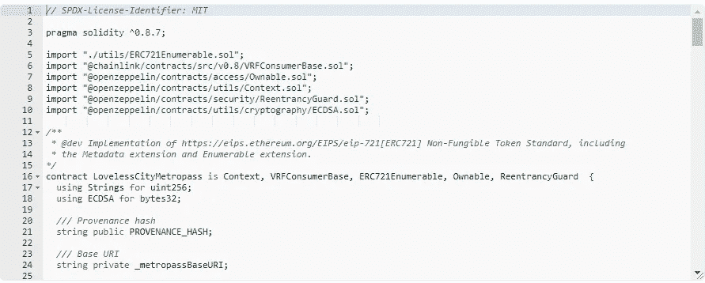
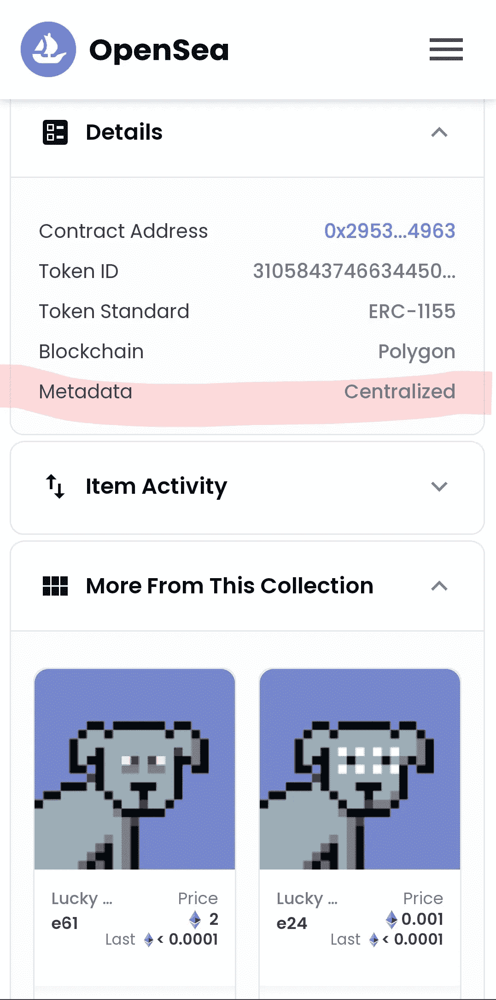
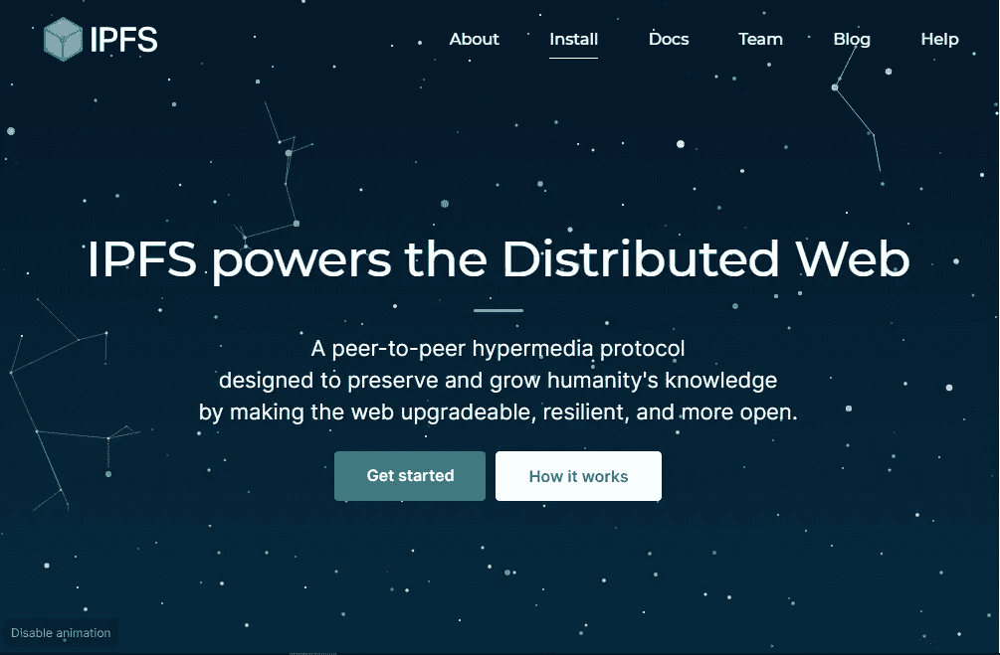

# 第二章:光谱环绕数字艺术

> 原文：<https://medium.com/coinmonks/chapter-2-a-spectrum-rounds-digital-art-4a0df01c3495?source=collection_archive---------39----------------------->

# 如果你有一辆 NFT，你可能正被以某种方式诈骗。

这不是 NFTs 固有的问题。该问题与大多数 NFT 项目的当前智能合同结构有关，尤其是 profile pic collections (PFPs)。

你可能已经被这两种方式中的一种欺骗了:缺乏分权和透明度(本章)或者不确定的随机性([第三章](/coinmonks/chapter-3-uncertain-randomness-16dffe71de87))。很重要的一点是，我们几个月前就写了这篇文章，现在的场景已经相对克服了(感谢上帝)存储分散化的问题。然而，许多项目继续以这种方式启动，问题仍然存在——这就是为什么我们认为仍然解决这个问题非常重要。这个场景当前的主要问题是在 mint/reveal 过程和新特性发布中不确定的随机性，你可以在[第三章](/coinmonks/chapter-3-uncertain-randomness-16dffe71de87)中更好地理解这一点。

对于那些仍然不知道什么是 NFT 的人来说，我们从第 1 章开始简要地讨论了它，但是让我们回到一些重要的观点:NFT 是加密资产，这意味着它们与区块链相关联。如果您仍然不知道什么是区块链，那么在投资 NFTs 之前了解这项技术是很重要的。

因此，NFT 有一个智能契约，它是一段带有一系列条件的代码，用来执行一个或多个特定的功能。智能合约允许开发人员以相对可预测的方式对分散式应用程序(dApps)进行编程，使其与网络或生态系统的交互具有可预测性。

First page of the smart contract from the LovelessCity Metropass collection at OpenSea

新区块链技术的最大特点之一是分散化的承诺:参与者之间的金融操作不需要银行、经纪人或各种公司等第三方的中介。对于非功能性测试也是如此。

NFT 实际上应该做什么？首先，按照第一章的思路，art-NFT 是艺术，除了存在于百万富翁的数字收藏中之外，不需要有任何真正的用途。这可能看起来很奇怪，但这种逻辑在 NFTs 出现之前很久就已经在推动艺术市场了。同样，现代主义收藏品的稀有复制品可以在公众开放的画廊中展出(它们属于所有者没有争议)，非艺术珍品也可以自由展出，同时保证持有者拥有它们的所有权。即:NFTs 可以作为所有权和真实性的签名。

很容易想象，通过这种方式，NFT 可以在艺术领域之外有实际用途。因为，一旦你上了区块链，没人能挑战 NFT 的合法性，对吗？

原来，正如我们所见，NFT 有一个智能合同，其中定义了存储该 NFT 数据的条件。NFT 不完全是图像，而是指示图像存储位置的契约。虽然合同确实与区块链相关，但 NFT 的数据库通常不是。

A screenshot of the details of a collection at OpenSea. Those details indicates that the metadata storage is currently on a centralized server.

如果集合通过智能合同在给定的网络上启动其 NFTs，但是该合同建立了包含在 NFT 中的数据在**私有服务器**上的存储，那么这个项目不是真正分散的，NFT 持有者不是项目的真正所有者，因为控制这个服务器的**可以自由地定义项目的进程**。如果服务器由于某种原因停机，整个项目可能会在眨眼之间消失。

解决这个问题的方法是将 NFTs 的元数据存储在星际文件系统 IPFS 上，这是一种专门为分散数据存储和共享而制定的协议。但是，即使智能协定使用 IPFS 定义了元数据的存储，仍然可以在协定中插入一个名为“set baseURI”的函数，该函数允许以后更改协定识别为元数据存储地址的基本 URL。

IPFS main page

换句话说，重要的是合同结构真正以合法的分权为目标。否则，任何认为他们正在使用 NFTs 作为属性签名的人都被误导了。许多项目仍在原开发商的控制之下，但它们被视为分散的，因为它们的合同与区块链有关。

如果你有一个 NFT，你和整个社区被业余项目伤害和诈骗的几率高得离谱。我们强调，围绕 NFTs 市场的这一灾难性问题并不纯粹是开发商的贪婪或不诚信，而是智能合同编程的业余性的结果，智能合同正在成为这些市场的规范甚至参考。绝大多数 NFT 开发商都是业余爱好者。记住这一点。在接下来的几个月里，我们可能会看到许多集合被报道为集中的，也就是说，仍然在最初的开发者的控制之下，即使是部分控制。

# **这只是第一个大问题，还不是最大的。**

查看第 3 章了解项目如何在 mint/reveal 过程中使用不确定的随机性来愚弄整个社区:**这是当前场景的主要问题。**

我们正在开发一个不同的项目，一个彻底改变场景的项目，一个从一开始就真正去中心化的项目，并且**给了用户选择的自由**。

通过赋予真正的去中心化、透明性、真正的随机性，以及让用户在他/她需要的时候(或如果需要的话)透露信息的可能性，**我们给 NFT 带来了“打开贴纸包”的真实感受**。这是前所未有的，直到今天。

**Yung Pixels 是即将到来的 NFTs 的形状。**

请继续关注更多信息。

**关注我们的社交媒体:** 推特:@[yung pixels](https://twitter.com/YungPixels) insta gram:@[yung pixels . NFT](https://www.instagram.com/yungpixels.nft/)
网站:即将发布
不和:即将发布