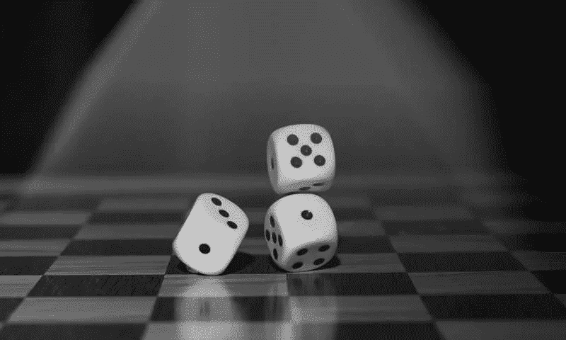
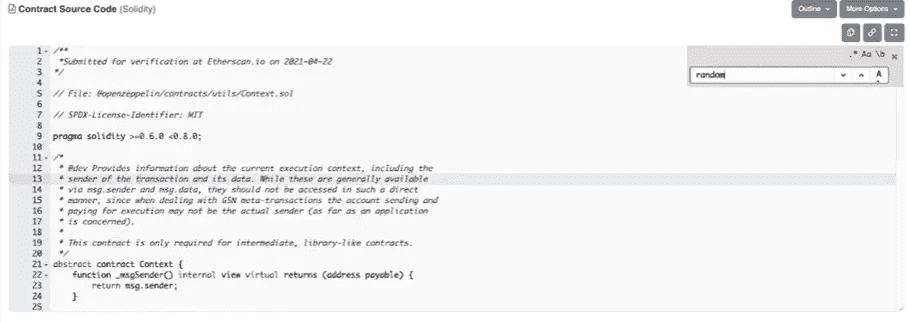

# 第三章:不确定的随机性

> 原文：<https://medium.com/coinmonks/chapter-3-uncertain-randomness-16dffe71de87?source=collection_archive---------60----------------------->

正如我们在第二章中看到的，如果你拥有一个 NFT，你很有可能被欺骗，其中一种方式是通过你所拥有的艺术元数据的集中化，外包与否，允许你的非功能性艺术永久丢失，甚至改变它们而无法做任何事情来防止它。然而，另一种方式，如果你不能阅读智能合同，可能更难理解和发现，是关于铸造过程和揭示你的收藏品的随机性。只有在以下情况下，提议交付执行绝对随机的制造/展示的合同的 NFT 项目才能被认为是公平的:

1 —合同中有一个随机性函数；

2-没有可以为所选钱包定义特定 NFT 的功能；

3 —随机性是真实的，可验证的，不是*伪随机*；

4-不可能更改元数据。

Is the mint/reveal of your NFTs random like rolling dice at least?

首先，我们需要定义什么是随机性。随机性是一组不可能从预先确定的情况下确定的事件。作为一个例子，让我们来看一些自然现象:我们不可能预测在一个特定的肯定会下雨的多云地区开始下雨的确切时间，或者第一滴雨点落下的确切位置，或者闪电击中地面的确切位置，即使我们可以访问该地区曾经发生过的所有闪电和雨滴的数据库。因此，这些现象被认为是随机的。另一方面，计算机本质上是可预测的机器，通过确定性算法运行。这意味着作为输入给出的特定值 X 将产生一个期望值 Y，该值总是通过算法中的函数来确定——除非程序员通过概率策略来施加随机性。因此，**计算机本身不会产生真正的随机数，除非有程序为机器的功能提供真正的随机性**。

The impossibility of predicting the moment and place where lightning strikes is what makes it a random phenomenon.

甚至大多数用于丢弃 NFT 的绘制程序(场景中常见的东西)都是虚假随机的，我们只需要足够长的时间就可以观察到这些绘制的结果模式。显然，在实践中，这些抽奖的结果可以被认为是“公平和无偏见的”(假设抽奖是公平的)，因为所有参赛者的参赛作品都具有相同的价值，所有参赛者都有相同的机会，但从技术上讲，它们不是随机的，它们是**伪随机**结果。

因此，伪随机性是一种产生看似随机的数字的确定性方法，在这种方法中，给定足够长的时间间隔，结果的模式将被揭示。然而，如前所述，有些程序和应用程序使用随机数发生器硬件。这些生成器使用随机现象，如大气噪声、热噪声、日期甚至天气状况，来产生真正的随机数。产生真正随机数的一个简单例子是 random.org 网站。然而，这个网站是不可能在区块链环境中使用的，即使它是，它也将是对随机性问题的一个完全集中的回答。

不幸的是，许多 NFT 项目，甚至那些有专业的、专注的、公正的员工的项目，都使用产生伪随机薄荷/揭示的函数。这样做的问题是，恶意的人可以利用合同中的这一缺陷,“强迫”铸造具有预先确定的特定特征的 NFT。在几个 NFT 中看到的另一个问题是在合同中缺少随机化功能，并且有一些项目迁移了数千美元的 ETH，尽管宣称它们是随机的，但它们甚至没有明确提到随机性。除此之外，还有其他人的合同允许开发者改变任何铸造 NFT 的元数据，也就是说，他们可以简单地改变任何人的 NFT，并为他们之前选择的钱包留下更稀有的属性。这些情况只是佐证了我们的声明的必要性:你很可能已经或正在被恶意的或简单的业余爱好者和幼稚的团队所欺骗！

Where are the randomization functions?

那么，我们如何才能创造出绝对随机、可验证且无偏见的薄荷糖/启示呢？答案是复杂的，涉及到一些细微差别，如 NFT 项目组的彻底和专业化的变化，以及实际上教育和教导 NFT 用户观察欺诈性合同以及危险和易受攻击的元数据存储的项目的出现。正是在这个答案中产生了 Yung Pixels 的想法——我们的项目就是一个答案。

我们的提议彻底改变了制作 NFT 的方式:使用经过验证的技术，特别是与 Chainlink 共同开发的 VRF(可验证的随机函数)，**让用户自由选择何时——或者如果他们想——展示他们的 NFT** ，真实和无偏见的随机性，以及在过程的所有阶段分散化。

通过赋予真正的去中心化、透明性、真正的随机性，以及用户在何时——或者是否——想要透露的可能性，**我们将“打开贴纸包”的真实感觉带到了 NFT 的场景**。这是前所未有的——直到今天。

**我们是即将到来的 NFTs 的形状。**

敬请关注，新闻即将发布。

查看我们的宣言:[第 4 章](/@yungpixels/chapter-4-the-yung-pixels-manifesto-9498b6d88186)。

**关注我们的社交媒体:** 推特:@[yung pixels](https://twitter.com/YungPixels) insta gram:@[yung pixels . NFT](https://www.instagram.com/yungpixels.nft/)
网站:即将推出
不和:即将推出