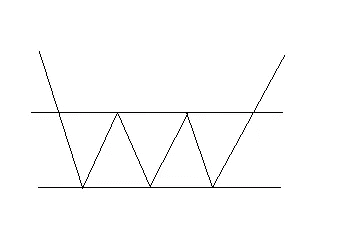

# 交易的图表模式第一部分

> 原文：<https://medium.com/coinmonks/chart-patterns-for-trading-part-1-9fa5204f6a1a?source=collection_archive---------48----------------------->

交易不是火箭科学。

Photo by [Miikka Airikkala](https://unsplash.com/@miikkair?utm_source=unsplash&utm_medium=referral&utm_content=creditCopyText) on [Unsplash](https://unsplash.com/s/photos/wall-street?utm_source=unsplash&utm_medium=referral&utm_content=creditCopyText)

当阅读这篇文章时，使用这些模式可能看起来很容易，但实际上并不容易。这需要经验和实践。

下面的形态是反转形态，顾名思义，它们标志着价格运动方向的反转。

# 反向头肩(看涨)

当价格突破红线时，该模式有效并被确认。

如果你想玩这种模式，那么让这种模式证明自己，我的意思是让价格从红线水平突破，然后进入。

图中所示的 1 级和 3 级是止损的合理选择。

# 海飞丝(看跌)

这种形态表明价格将从那条红线向下突破。

# 双底(看涨)

如果价格突破了粗红线，这个模式是有效的。理想的情况是有一次重新测试，我的意思是价格突破红色粗线，下跌并触及红色粗线，然后再次上涨。但这可能不会发生，价格可能会在突破红线后直线上升。

下方红线(细线)作为止损。

# 双顶(熊市)

如果价格跌破较低的红色粗线，这个形态就被确认了

# 看涨下跌楔形

等待价格从模式中突破，然后进场，因为有时特别是在熊市和慢市中，模式不起作用，价格继续下跌。

更确定的是，在理想的情况下，你可以等待楔子的重新测试，然后进入。重新测试楔形，我的意思是价格从楔形中突破，但再次下跌，触及上线，然后再次上涨。通过这种方式，这种模式已经证明了自己。但有时这可能不会发生，价格只是爆发，没有重新测试就上涨了。

你的止损可以是楔形内的最低价。你的目标可以是你进场的 2 到 3 倍，正如我所说，当价格突破楔形时你应该进场。

# 熊市上升楔形

当价格穿过并跌破楔形的下边界时，形态被确认。

注意是看跌形态。

# 看涨扩张三角形

当价格穿过并突破楔形的上边界时，形态被确认。

# 熊市扩张三角形

当价格穿过并跌破楔形的下边界时，形态被确认。

# 看涨三重底

当价格穿越并突破上线时，形态被确认。

# 看跌的三重顶

当价格穿越并跌破较低的线时，形态被确认。

我在看涨下跌楔形中讨论的理想情况也适用于本文讨论的其他看涨形态。

在这篇文章中，我没有把重点放在如何在面对熊市时进入交易，因为这对做空股票很有用，我现在不这么做。但重要的是要认识到熊市模式，因为它阻止你渴望这些情况，并防止损失。

感谢阅读。你可以支持我的博客。您还可以订阅电子邮件，接收新鲜出炉的内容。

> 加入 Coinmonks [电报频道](https://t.me/coincodecap)和 [Youtube 频道](https://www.youtube.com/c/coinmonks/videos)了解加密交易和投资

# 另外，阅读

*   [5 款最佳加密交易终端](https://coincodecap.com/crypto-trading-terminals) | [最佳 DeFi 应用](https://coincodecap.com/best-defi-apps)
*   [比特币基地 vs 瓦济克斯](https://coincodecap.com/coinbase-vs-wazirx) | [比特鲁点评](https://coincodecap.com/bitrue-review) | [波洛涅克斯 vs 比特鲁](https://coincodecap.com/poloniex-vs-bittrex)
*   [德国最佳加密交易所](https://coincodecap.com/crypto-exchanges-in-germany) | [Arbitrum:第二层解决方案](https://coincodecap.com/arbitrum)
*   [币安交易机器人](/coinmonks/binance-trading-bots-d0d57bb62c4c) | [OKEx 评论](/coinmonks/okex-review-6b369304110f) | [阿塔尼评论](https://coincodecap.com/atani-review)
*   [最佳加密交易信号电报](/coinmonks/best-crypto-signals-telegram-5785cdbc4b2b) | [MoonXBT 评论](/coinmonks/moonxbt-review-6e4ab26d037)
*   如何在 Bitbns 上购买柴犬(SHIB)币？ | [买弗洛基](https://coincodecap.com/buy-floki-inu-token)
*   [CoinFLEX 评论](https://coincodecap.com/coinflex-review) | [AEX 交易所评论](https://coincodecap.com/aex-exchange-review) | [UPbit 评论](https://coincodecap.com/upbit-review)