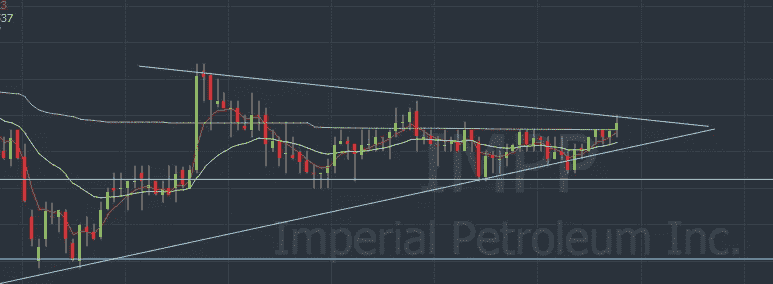
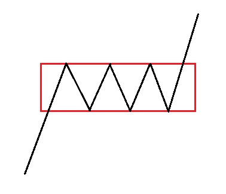
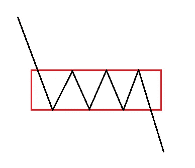
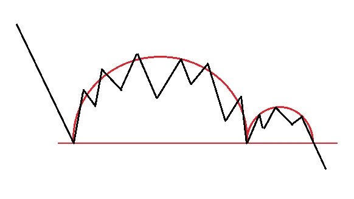

# 交易的图表模式第二部分延续模式

> 原文：<https://medium.com/coinmonks/chart-patterns-for-trading-part-2-continuation-patterns-30bcda44c995?source=collection_archive---------32----------------------->

在这一部分，我将讨论延续模式。他们的意思是价格将继续目前的趋势。

在实践中，应用这些模式很棘手，也不容易。交易需要很多经验。

# 看涨矩形

当价格上涨，但在一段时间内它横向振荡并形成矩形时，这种模式就会出现，我的意思是创造几乎相等的高点和低点，如上图所示。

理想的情况是等待价格重新测试矩形的上边，这意味着价格突破矩形上方，然后下跌并触及矩形，然后再次上涨。

选择矩形的下边作为止损。

# 看跌矩形

这种模式发生在价格下跌时，但在一段时间内，它横向振荡并形成一个矩形，我的意思是创造几乎相等的高点和低点，如上图所示。

# 看涨旗

对于止损，当使用这种模式时，我选择旗帜内的最低价格，但根据情况，我可能会使用另一个水平。

# 看跌的旗帜

# 看涨三角旗

使用这种模式时的止损取决于情况，但我选择了较低的线的中间或模式的最高低点或模式的最低低点。

由于这种模式很窄，我通常选择最低线和中线之间的某个位置。

在上图中，价格已经四次触及较低的线，所以我们有四个低点。第一个是模式的最低点，第二个是模式的最高点。

# 看跌的三角旗

# 看涨对称三角形

使用这种模式时的止损取决于情况，但我会选择较低的线的中间或模式的最高低点或这两点之间的某个地方。

为了明确最高价，例如在上面的图片中，最高价是价格第三次触及形态中的下线。

这种模式似乎类似于看涨的三角旗。我同意他们非常相似。主要区别是三角旗图案比对称三角形窄。

# 看跌对称三角形

# 看涨上升三角形

注意这个图案的上线是水平的。

在这种模式中选择止损的心态与我解释的三角旗和对称模式类似。

# 看跌下降三角形

# 杯子和把手

左半圆是杯子，右半圆是手柄。选择手柄最低点止损。杯子或手柄的 R ***adius*** 被加到价格突破水平线的点上，以获得那些想要进入交易的人的价格目标的估计值。

# 反向杯和手柄

在所有与本文中的三角形相似的看涨形态中，下图适用于选择目标价:

我们将该距离添加到 A 处的突破点，目标是点 t

请记住，这些只是理论，并不保证。

交易不是一门精确的科学，我认为这就是为什么它需要大量的实践、观察和经验。

感谢阅读。我写定义，商业，健康和技术。您可以关注以了解最新动态。您还可以订阅，以便在新内容发布时通过电子邮件获得通知。

> 加入 Coinmonks [电报频道](https://t.me/coincodecap)和 [Youtube 频道](https://www.youtube.com/c/coinmonks/videos)了解加密交易和投资

# 另外，阅读

*   [7 个最佳零费用加密交易平台](https://coincodecap.com/zero-fee-crypto-exchanges)
*   [最佳网上赌场](https://coincodecap.com/best-online-casinos) | [期货交易机器人](/coinmonks/futures-trading-bots-5a282ccee3f5)
*   [分散交易所](https://coincodecap.com/what-are-decentralized-exchanges) | [比特 FIP](https://coincodecap.com/bitbns-fip) | [宾邦评论](https://coincodecap.com/bingbon-review)
*   [用信用卡购买密码的 10 个最佳地点](https://coincodecap.com/buy-crypto-with-credit-card)
*   [加拿大最佳加密交易机器人](https://coincodecap.com/5-best-crypto-trading-bots-in-canada) | [Bybit vs 币安](https://coincodecap.com/bybit-binance-moonxbt)
*   [阿联酋 5 大最佳加密交易所](https://coincodecap.com/best-crypto-exchanges-in-uae) | [SimpleSwap 评论](https://coincodecap.com/simpleswap-review)
*   购买 Dogecoin 的 7 种最佳方式
*   [最佳期货交易信号](https://coincodecap.com/futures-trading-signals) | [流动性交易所评论](https://coincodecap.com/liquid-exchange-review)