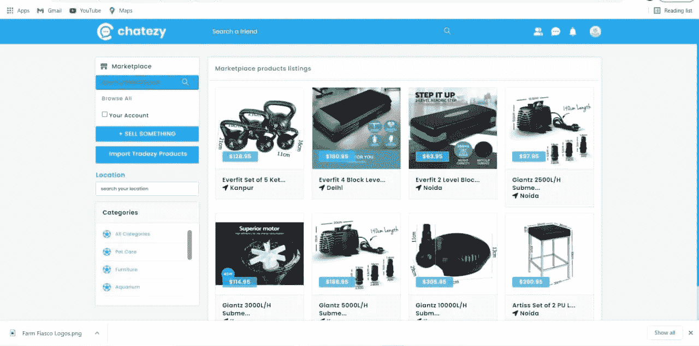
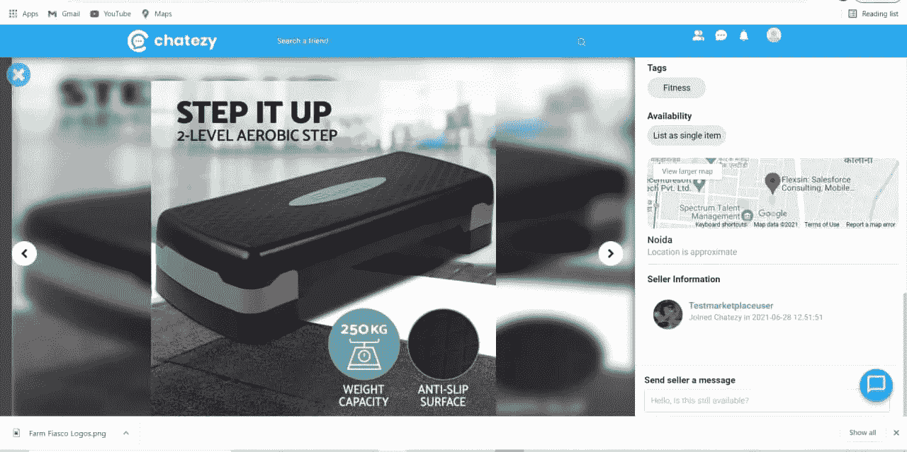

# Chatezy —免费本地市场测试

> 原文：<https://medium.com/coinmonks/chatezy-free-local-marketplace-testing-7fd1f117c8f5?source=collection_archive---------41----------------------->

Social Media

Chatezy 是一个允许注册免费资料的用户与朋友、同事或不认识的人在线联系的网站。它允许用户与他们喜欢的任何人分享图片、音乐、视频和文章，以及他们自己的想法和观点。

Chatezy 承诺保持新鲜和刺激，让买家和卖家能够通过强大的社交媒体渠道相互联系。任何人都可以加入 Chatezy 的社区。一旦他们加入 Chatezy，他们将会在 Aussie Digital 上获得最新事件的通知。此外，该平台将帮助小企业开启新的方式，通过这些方式他们可以互动地推广他们的产品和服务。

Chatezy 为小企业带来了一个充满激动人心的增长机会的全新未开发世界。这个社交平台为小企业打开了大门。通过这种方式，他们可以了解如何挖掘新的消费者群体，并在社交媒体上销售他们的产品。

Chatezy 上的企业也可以利用付费广告在正确的时间向正确的受众展示他们的产品和服务。立即释放社交的力量。

Chatezy 是一个社交媒体渠道，可以帮助你建立自己的社区。该社区对任何想做生意或只是和朋友出去玩的人开放。立即加入 Chatezy，释放社交网络的力量，浏览您最喜爱的卖家和朋友的信息。

目前，社交媒体 Chatzy 正在试用市场功能，无论如何，Chatezy 都将是你的最佳选择。

**我们的信息:**

网址:[https://www.aussiedigital.io/](https://www.aussiedigital.io/)
脸书:[https://www.facebook.com/aussiedigital/](https://www.facebook.com/aussiedigital/)
推特:[https://twitter.com/aussie_digital](https://twitter.com/aussie_digital)
电报:[https://t.me/AUDOfficialGroup](https://t.me/AUDOfficialGroup)
Youtube:[https://www.youtube.com/channel/UCGoncZDbjH21YOi4i4YwroA](https://www.youtube.com/channel/UCGoncZDbjH21YOi4i4YwroA)
insta gram:[https://www.instagram.com/aussiedigital.io/](https://www.instagram.com/aussiedigital.io/)
Github:[https://github.com/aussiedigitalio](https://github.com/aussiedigitalio)
Reddit:[https://www.reddit.com/r/aussiedigital_25b/](https://www.reddit.com/r/aussiedigital_25b/)