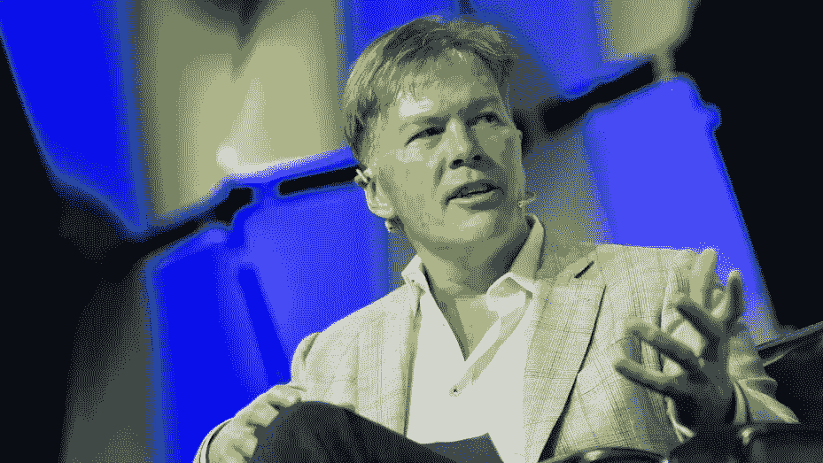
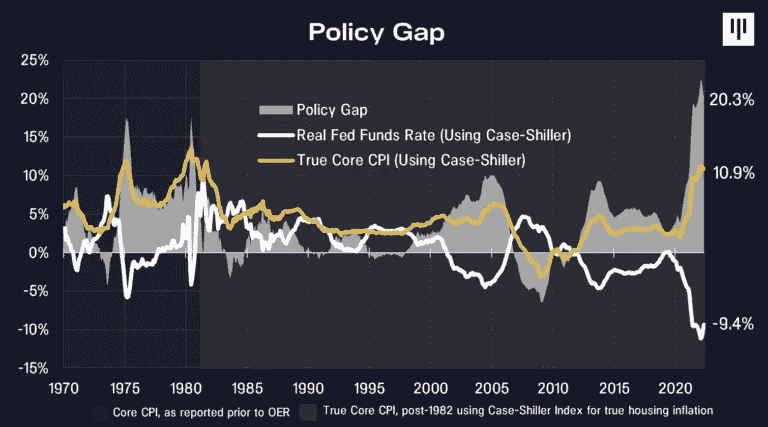
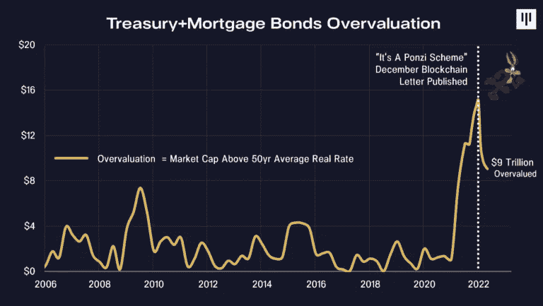
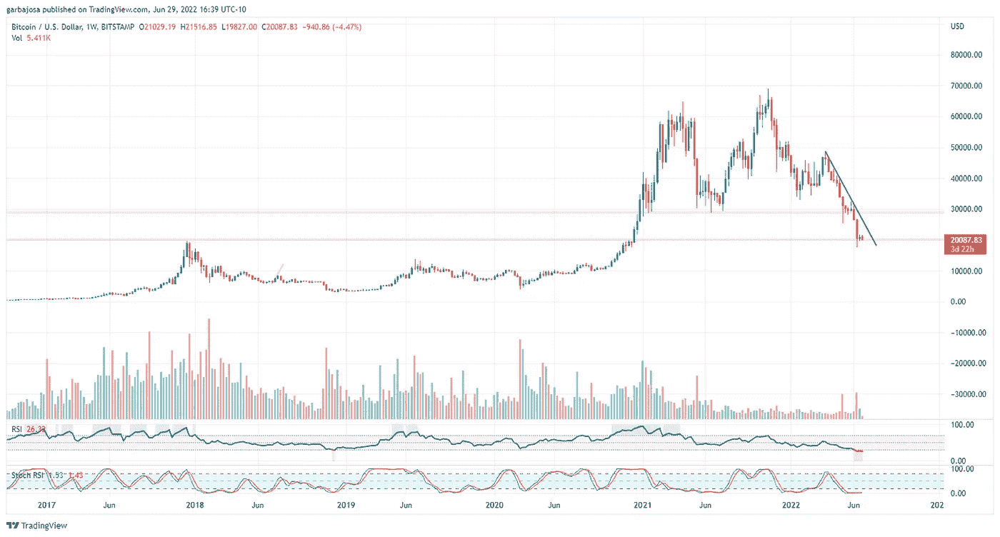
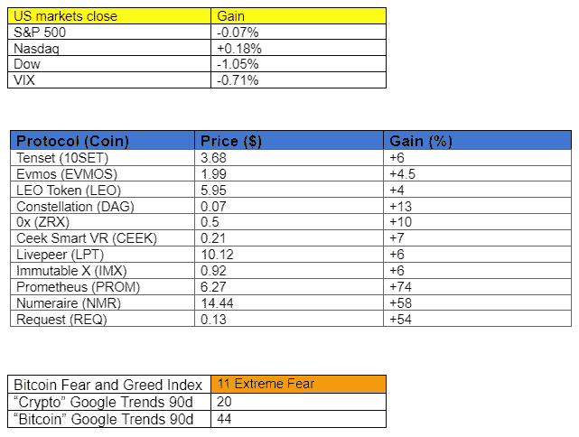

# 看看潘迪拉资本的最新报告是怎么说加密的。

> 原文：<https://medium.com/coinmonks/check-out-what-pantera-capitals-latest-report-said-about-crypto-4575fd14aa49?source=collection_archive---------2----------------------->

## 加密每日混合器#028 6.30.22

## 加密市场、新闻、指标和协议更新的每日摘要。

概观

*   潘迪拉资本报告谈衰退和加密。
*   比特币已经连续四周处于创纪录的超卖区间
*   迈克尔·塞勒购买了更多的比特币吗？
*   阿比特鲁姆奥德赛停止了！
*   灰度 ETF 拒绝促进法院上诉。

早上好，家人，

Panter Capital 的首席执行官 Dan Morehead 刚刚发布了涵盖宏观经济因素和加密的月度区块链报告。哇，它对当前的市场状况有一些深刻而大胆的见解。

根据一些见解，潘迪拉资本是业内最大的风险投资公司之一，于 2013 年开始投资 crypto，早在许多机构之前就从强大的趋势中获利。他们目前的资产负债表包含 100 多个各种早期阶段的加密项目。你可能会认出一个[几个](https://panteracapital.com/portfolio/)(或者很多)。这些人已经存在很长时间了。他们的首席执行官丹·莫尔黑德拥有超过 35 年的投资经验。所以当他们说话时，我们听着。

所以今天，我将总结一下最新的报告，它涵盖了美联储的政策错误和一些关于美联储“大放松”的预测。此外，它对密码的未来做了一些大胆的预测**！**

# 潘迪拉资本的区块链信《美联储的孪生政策错误》摘要

报告首先陈述了丹·莫尔黑德的观点，即美联储(美联储)犯了 35 年来最严重的两个政策错误。

*   错误 1:在太长时间内保持过低的利率。他们正在慢慢纠正它。
*   错误 2:更具破坏性的决定是操纵债券市场。在他们 95 年的历史中，他们从未触及过隔夜利率。

根据该报告，与联邦基金利率相比，通货膨胀率处于荒谬的水平。为 1975 年以来最高。在下面的图表中突出显示。

美联储通过操纵政府债券和抵押债券，为历史上最大的庞氏骗局之一提供了保险。首先，引发了巨大的房地产泡沫，导致 250 万演员退出劳动力市场。接下来，在他们向抵押贷款和债券市场注入 6 万亿美元之前，2020-21 年有 2.9 万亿美元用于购买房屋。市场最终用高核心通胀指数(CPI)强制了一些纪律。

> “债券市场正在经历一个狡猾的时刻。”
> 
> 丹·莫尔黑德

报告预计 10 年期利率将翻两番，从 1.34%升至 5%左右。而且美联储还在买房贷！他们需要出售。

美联储的行动对房主和投机者来说是一个巨大的胜利，而美国的其他地方正在感受宿醉。房价在两年内上涨了 38%。然而，丹担心美联储不知道是什么导致了通货膨胀(房地产市场)，这种损害将继续下去，直到美联储解除对债券市场的操纵。

该报告坚持认为，通货膨胀将继续存在，不是因为供应短缺或普京的战争，而是繁荣的住房市场和劳动力短缺。

> *“我认为美联储不会停止加息，除非至少有两种情况发生:*
> 
> *住房通胀为负*
> 
> *失业率上升两个百分点*
> 
> 核心消费物价指数接近 2.5%。由于业主等价租金需要大约两年时间才能完全发挥出来，这可能至少需要一年时间。
> 
> *美联储已经解除了大部分抵押贷款操纵。”*
> 
> *——丹·莫尔黑德*

美联储让每个人在试图拿走潘趣酒碗之前都喝醉了。它的工作是在人们喝醉之前把它清除掉。现在，他们正在经营一个“歌舞伎剧场”，将继续累积损害，直到他们“赶上现实”。

**关于灰度 GBTC 信托。**

*   GBTC 折扣可能会继续为负，报告预测这种情况还会持续几个月。
*   美联储不会很快批准现货比特币 ETF。

**关于加密与股票脱钩。**

*   股票、住房和其他资产与债券的影响高度相关，但与黄金和大宗商品没有直接联系。
*   *“数字黄金(比特币)很可能可以与黄金等东西脱钩并进行交易。在 42 年来首次加息的环境下，投资者将会蜂拥而至，投资那些不会随着美联储纠正错误而下跌的东西。”*
*   机构是密码的净买家，通常认购 10 年期基金，这些基金将继续增长，支撑密码市场。
*   “在接下来的六到九个月里，我认为私募市场的估值将会下降。这确实是投资的最佳时机。”

> 交易新手？试试[加密交易机器人](/coinmonks/crypto-trading-bot-c2ffce8acb2a)或者[复制交易](/coinmonks/top-10-crypto-copy-trading-platforms-for-beginners-d0c37c7d698c)

**外卖**

*   美联储引发了它所面临的过多问题，房地产/债券泡沫将需要很长时间才能消除。
*   通货膨胀将会持续
*   加密“可能”与黄金和石油等大宗商品的债券相关资产脱钩。
*   等待 6-9 个月再投资私人市场。

> 我们兴奋的四大区块链分别是 ***以太坊、波尔卡多特、索拉纳和 NEAR。*** *重要的一点是，绝大多数有趣的代币都不是加密货币——它们就像取代传统公司的加密公司。美国有 4000 多家上市公司，我们可以轻松拥有 4000 多只代币。”*
> 
> *Dan Morehead 出席巴伦的首次加密圆桌会议。*

# 市场更新🌍

**BTC/美元**

比特币处于人们熟悉的领域。价格再次测试 2017 年的 20k 高点。周线图显示相对强弱指数(RSI)已经连续四周处于超卖区域，这是自 2011 年价格在 3.00 美元左右以来从未出现过的情况。坏的一面是它还会继续下降。考虑到主要的支撑位、最近的大量平仓和大多数指标触底，长期投资者应该考虑美元成本平均法(DCA)。 **BTC 昨日收盘下跌 0.83%，至 20，098 美元。**

*高分辨率* [*图表*](https://www.tradingview.com/chart/v7j9tiND/?symbol=BITSTAMP%3ABTCUSD)

***在***[***Substack***](https://tradergabi.substack.com/subscribe?)***订阅，率先获得这份免费的每日简讯。***

如果你喜欢这份报告，并且认为它值 20 分(0.01 美分)，请点击下面的按钮来支持我的写作。(最多 50 次！)谢谢！

# 新闻观察📰

**看看谁回来买比特币了！** MicroStrategy 已经[以约 1000 万美元的价格](https://www.microstrategy.com/en/investor-relations/financial-documents/microstrategy-acquires-additional-480-bitcoins_06-29-2022)额外购买了 480 枚比特币，平均价格约为 20817 美元。该公司由迈克尔·塞勒经营，目前持有 129699 枚比特币，平均价格约为 30664 美元。

**阿尔比特鲁姆奥德赛停止。**Arbitrum 团队已经[停止了](https://twitter.com/arbitrum/status/1542159105946787840?s=20&t=OLbIRClqjxq04H1dlFEr7w)Arbitrum Odyssey 项目，该项目涉及网络上的高度拥塞，将在 Nitro 更新发布后恢复。考虑到我们在 Arbitrum 上玩得有多开心，这个消息有点令人失望，但似乎有太多人在同一条船上。Arbitrum 团队计划很快发布一个时间表。

**SEC 拒绝灰度比特币 ETF 灰度当即起诉。**美国证券交易委员会再次[拒绝了](https://www.globenewswire.com/news-release/2022/06/30/2471737/0/en/Grayscale-Investments-Initiates-Lawsuit-Against-the-SEC.html)gray 的比特币交易所交易基金申请，因为其“未能证明其设计能够防止欺诈和操纵行为。”。作为回应，这家机构投资公司向美国上诉法院提交了复审申请。

**和谐桥黑客背后是朝鲜吗？**据《福布斯》报道，朝鲜政府支持的拉扎勒斯[似乎是最近和谐一号(One)地平线大桥被盗 1 亿美元资金的幕后黑手](https://www.bloomberg.com/news/articles/2022-06-24/crypto-bridge-horizon-is-hacked-for-100-million#xj4y7vzkg)。结果，Harmony 团队[给](https://twitter.com/harmonyprotocol/status/1542327362200604672?s=20&t=wtF5Y7-Psn5Gg_xgMFwiGw)最后一次机会返还资金并保留 1000 万美元。

**新闻花絮:**

*   英属维尔京群岛的一家法院下令对三箭资本进行清算
*   polysign Inc .[融资 5200 万美元 C 轮](https://www.businesswire.com/news/home/20220628005141/en/Digital-Asset-Infrastructure-Leader-PolySign-Inc.-Raises-53M-Series-C-Round-to-Service-Institutional-Investors?utm_campaign=shareaholic&utm_medium=twitter&utm_source=socialnetwork)
*   OKX 加密交换到[增加](https://www.coindesk.com/layer2/2022/06/28/okx-to-increase-staff-by-30-despite-market-downturn/?utm_medium=referral&utm_source=rss&utm_campaign=headlines)人员 30%。

# 在协议层，⛓

**Frax Finance 回购 2000 万协议所有的 FXS 代币。**提案 FIP-77 [以 99.67%的投票通过](https://twitter.com/SalomonCrypto/status/1541476162542546944?s=20&t=gizcGlNMTpZojVLnLaXgnQ)焚烧 2000 万 FXS 治理令牌。此举可能会对 FXS 的未来价格产生影响。Frax Finance 提供了世界上第一个分数算法稳定币(Frax)，部分由抵押品支持。

**协议级花絮:**

*   Maker governance 投票决定投资 5 亿美元购买美国国债。
*   [介绍](https://twitter.com/QiDaoProtocol/status/1541903302580965376?s=20&t=BwhJNEWzunQmMY3KNUJtag)七道(MAI) V2。
*   强健的财政[现在](https://twitter.com/beefyfinance/status/1541521604760436743)处于乐观状态(凤凰社)。
*   浪人桥[重新开放](https://twitter.com/AxieInfinity/status/1541764201735241735)。
*   解释区块链内部通信协议[。](https://blog.cosmos.network/eli5-what-is-ibc-a212f518715f?gi=3e5bfec9d98e)

# NFT 和元宇宙最新消息🐵

*   Chai [在 testnet 上推出最初的 NFTo 标准几周后，在其 mainnet 上推出了 NFTs。](https://www.chia.net/2022/05/11/our-vision-for-chia-nfts.en.html)
*   沙箱到现在[部署](https://twitter.com/TheSandboxGame/status/1541831118458175489?s=20&t=REjkl_Eklpx6IsLTmIyuQw)降落在多边形(MATIC)上。
*   EBAY [冒险](https://finbold.com/ebay-ventures-into-metaverse-and-nfts-with-three-trademark-applications/)进一步进入元宇宙和 NFTs，申请了三个商标。

我的五分钱…

哇哦。真是疯狂新闻爆满的一天。

对我们来说不幸的是，Arbitrum Odyssey 计划被中止了。一旦它恢复，我们将继续指导，但它确实提出了一些关于第二层的未来的[担忧。不过，如果你问我的话，现在说还为时过早。](https://twitter.com/chainlinkgod/status/1542204952344285185?s=21&t=y6zZbiXOuLZXJhea2m7cTA)

令人惊讶的是，在许多人担心他的公司面临清算后，迈克尔·塞勒又开始购买比特币。不要阻止这家伙！我很好奇他是怎么得到新资金的？

关于现货比特币交易所交易基金，格雷能和法院达成一些共识吗？

哦，看看这个——Terra 的 USTC 和 LUNC 在 48 小时内分别上涨了+850%和+169%。

疯狂的时代在隐语世界继续！

感谢阅读！

# 加比

*关注我的* [*推特*](https://twitter.com/web3_gabri) *获取每日更新！*

***在***[***Substack***](https://tradergabi.substack.com/subscribe?)***订阅，抢先获得这份免费的每日简讯。***

如果你喜欢这份报告，并且认为它值 20 分(0.01 美分)，请点击下面的按钮来支持我的写作。(最多 50 次！)谢谢！

*免责声明*

*出版商、作家和图表作者表达的所有观点不应被理解为财务建议，也不一定反映秘密玩笑的观点。出版商、作家和图表制作者可能持有所讨论的代币和资产的头寸。鼓励读者自己做研究。*

> 加入 Coinmonks [电报频道](https://t.me/coincodecap)和 [Youtube 频道](https://www.youtube.com/c/coinmonks/videos)了解加密交易和投资

# 另外，阅读

*   [如何在加拿大购买加密货币？](https://coincodecap.com/how-to-buy-cryptocurrency-in-canada)
*   [无聊猿游艇俱乐部(BAYC)回顾](https://coincodecap.com/bored-ape-yacht-club-bayc-review) | [拜比特 vs 比特币基地](https://coincodecap.com/bybit-vs-coinbase)
*   [5 款最佳加密交易终端](https://coincodecap.com/crypto-trading-terminals) | [最佳 DeFi 应用](https://coincodecap.com/best-defi-apps)
*   [比特币基地 vs 瓦济克斯](https://coincodecap.com/coinbase-vs-wazirx) | [比特鲁点评](https://coincodecap.com/bitrue-review) | [波洛涅克斯 vs 比特鲁](https://coincodecap.com/poloniex-vs-bittrex)
*   [德国最佳加密交易所](https://coincodecap.com/crypto-exchanges-in-germany) | [Arbitrum:第二层解决方案](https://coincodecap.com/arbitrum)