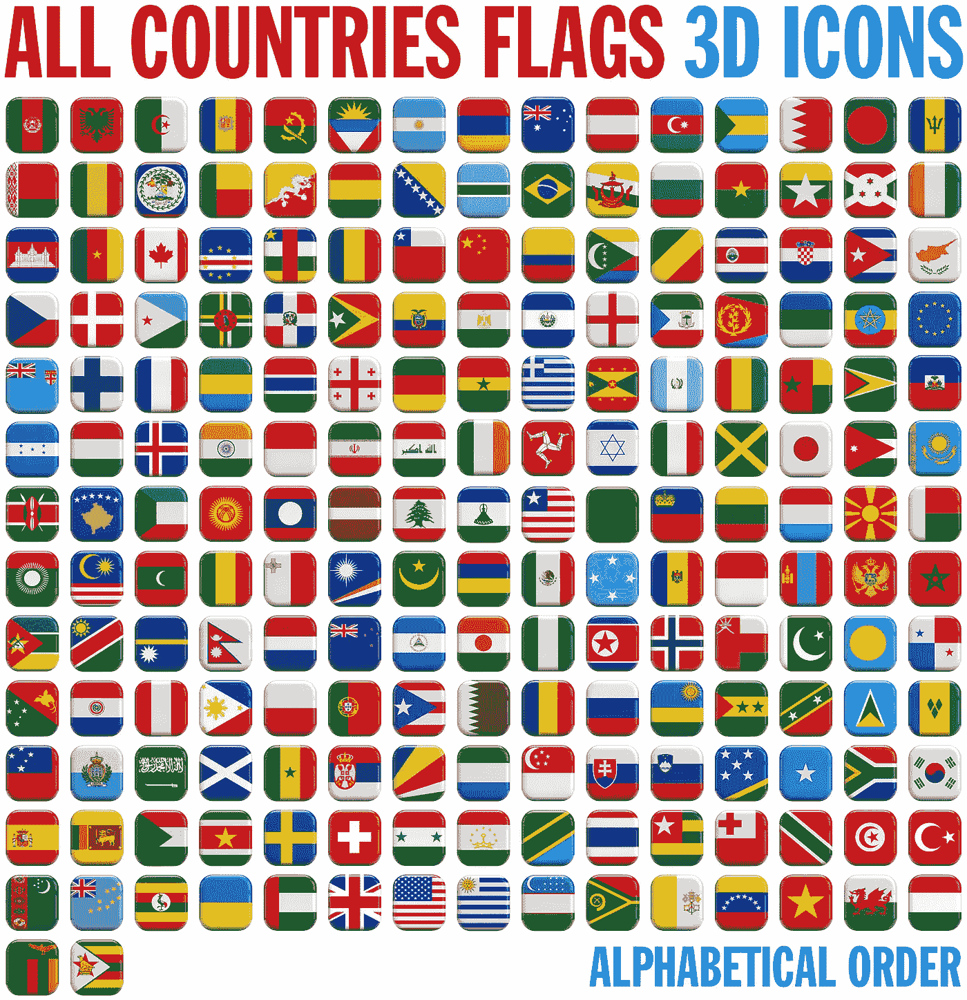

# 检查你的国家是否是这些加密中心之一

> 原文：<https://medium.com/coinmonks/check-whether-your-country-is-one-of-these-crypto-hubs-51e53c9e19ab?source=collection_archive---------17----------------------->

您可以利用这一点来赚取$$$

作为个人，你的国家在这个名单上的优势是巨大的。我将在本文的结尾部分陈述一些好处。

根据 China analysis(2021)，以下是世界上加密货币采用水平最高的国家。Chainalysis 使用各种指标对 154 个不同国家的加密采用情况进行评分。

1.**越南:**越南是东南亚的一个国家。然而，越南拥有世界上最高的加密货币交易量。越南 Finder 的一项调查发现，41%的受访者投资过加密货币。越南采用加密货币的原因之一是它为海外的越南人提供了一种简单的汇款方式，而没有传统金融交易相关的高额交易费用。

越南盾(越南货币)的快速贬值是大量采用加密货币的另一个原因。人们正在寻找对冲通货膨胀的方法。此外，它还是中国的一种投资工具。“先玩后赚”概念的出现让越来越多的越南人转向了游戏玩家

2.**印度:**印度在采用加密技术方面处于领先地位，因为他们对新技术的倾向，以及他们善于寻求创新的投资方式。在加密货币之前，印度人流行股票和外汇交易。Bitmex 的首席执行官亚历山大·霍普特纳(Alexander hopt ner)表示，“经济实力、人口结构和技术实力的结合，使印度成为大规模采用加密技术的理想推动力。”

3.**巴基斯坦:**Waqar Zaka 的努力极大地促进了加密货币在巴基斯坦的应用。该国法律禁止拥有比特币，直到瓦卡尔和他的团队不知疲倦地工作，以确保法院通过一项命令，禁止当局逮捕比特币持有者，除非他们从事非法活动，如洗钱。

4.**乌克兰:**据估计，超过 550 万人，占乌克兰总人口的 12.7%，目前拥有加密货币。

2019 年 7 月至 2020 年 6 月，乌克兰发送了价值 82 亿美元的加密货币，并收到了价值 80 亿美元的加密货币。俄罗斯-乌克兰战争正在增加乌克兰对加密货币的采用。乌克兰政府也求助于密码来资助军事行动。

5.肯尼亚:肯尼亚连续第二年成为全球 P2P 交易量的领头羊。据 **Marius Reitz、** [**Luno**](https://www.luno.com/en/ng) **【的非洲总经理**“该国的密码产业正在蓬勃发展，一批公司正在快速崛起，构建基于区块链的解决方案。考虑到其年轻的人口，移动连接的高跟鞋和对移动货币等数字支付解决方案的熟悉，它在 2022 年将成为东非领先的加密中心。”

6.尼日利亚:尼日利亚是非洲人口最多的国家。Statista 的一项调查显示，近三分之一的尼日利亚人表示他们拥有或使用数字货币。虽然尼日利亚的交易量不是最高的，但据说截至 2020 年，来自尼日利亚的交易量超过 4 亿美元。

尼日利亚人拥抱比特币的两个原因是；

*   它可以对冲通货膨胀肆虐的当地货币奈拉。
*   对于大多数尼日利亚人来说，这是一种投机资产，因为他们打算低买高卖或低卖低买来获利。

7.委内瑞拉:2021 年，委内瑞拉越来越多的人和企业接受加密货币作为一种支付形式，以对抗恶性通货膨胀和国家货币玻利瓦尔的贬值。

根据剑桥大学的一份报告，委内瑞拉在 2021 年初名列前十大加密货币开采国。

8.美国:通常情况下，美国应该是采用加密技术的领先国家，因为它的经济实力和技术，但它是一个受到严格监管的市场，不支持分散的货币。不像非洲和亚洲的国家在采用水平上排在它前面。大约 14%的美国人拥有加密货币，这个数字还在快速增长。

9.多哥:除了加密技术在多哥的受欢迎程度，**多哥是唯一一个在 Chainalysis 即将推出的 DeFi 采用指数**中排名前 20 的国家。多哥是一个西非国家，加密技术的应用正在快速增长。加密带来的投资机会是多哥越来越多地采用加密的原因之一。

10.阿根廷:估计 2.94%的阿根廷人拥有约 130 万阿根廷公民。合法的加密货币利润在 2021 年价值 2 亿美元。阿根廷的经济动荡使得许多人去区块链保护他们的资产。

**结论**

如果你生活在一个加密货币采用率很高的国家，你可以通过以下方式来利用这一点:

*   帮助加密初创公司在你的国家推出他们的用例。例如，我住在上面提到的一个国家，我正在帮助许多加密初创公司在我的国家实现他们的用例。
*   在你的国家做一个加密项目的大使。
*   努力成为有影响力的人，帮助加密项目在您的国家组织聚会和活动。我还帮助一些项目通过视频会议把人们带到船上。
*   建立一个社区，在那里你可以帮助创造加密货币的进一步采用，并培训人们如何开始收费交易
*   成为加密交易平台的会员
*   您可以开始用您的本地语言编写加密项目。

点击“跟随”按钮获得更多关于如何从加密空间获利的提示。

> 加入 Coinmonks [电报频道](https://t.me/coincodecap)和 [Youtube 频道](https://www.youtube.com/c/coinmonks/videos)了解加密交易和投资

# 另外，阅读

*   [3 商业评论](/coinmonks/3commas-review-an-excellent-crypto-trading-bot-2020-1313a58bec92) | [Pionex 评论](https://coincodecap.com/pionex-review-exchange-with-crypto-trading-bot) | [Coinrule 评论](/coinmonks/coinrule-review-2021-a-beginner-friendly-crypto-trading-bot-daf0504848ba)
*   [莱杰 vs n rave](/coinmonks/ledger-vs-ngrave-zero-7e40f0c1d694)|[莱杰 nano s vs x](/coinmonks/ledger-nano-s-vs-x-battery-hardware-price-storage-59a6663fe3b0) | [币安评论](/coinmonks/binance-review-ee10d3bf3b6e)
*   [Bybit Exchange 审查](/coinmonks/bybit-exchange-review-dbd570019b71) | [Bityard 审查](https://coincodecap.com/bityard-reivew) | [Jet-Bot 审查](https://coincodecap.com/jet-bot-review)
*   [3 commas vs crypto hopper](/coinmonks/3commas-vs-pionex-vs-cryptohopper-best-crypto-bot-6a98d2baa203)|[赚取加密利息](/coinmonks/earn-crypto-interest-b10b810fdda3)
*   最好的比特币[硬件钱包](/coinmonks/hardware-wallets-dfa1211730c6) | [BitBox02 回顾](/coinmonks/bitbox02-review-your-swiss-bitcoin-hardware-wallet-c36c88fff29)
*   [BlockFi vs Celsius](/coinmonks/blockfi-vs-celsius-vs-hodlnaut-8a1cc8c26630)|[Hodlnaut 点评](/coinmonks/hodlnaut-review-best-way-to-hodl-is-to-earn-interest-on-your-bitcoin-6658a8c19edf) | [KuCoin 点评](https://coincodecap.com/kucoin-review)