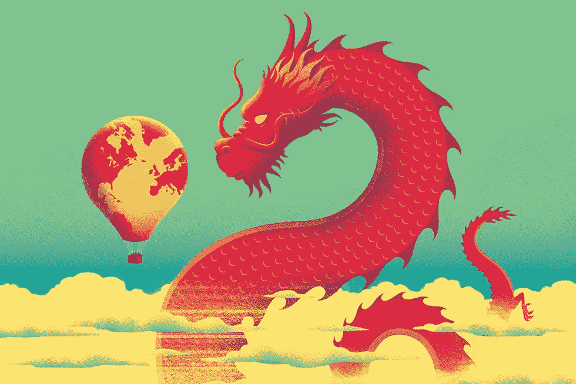
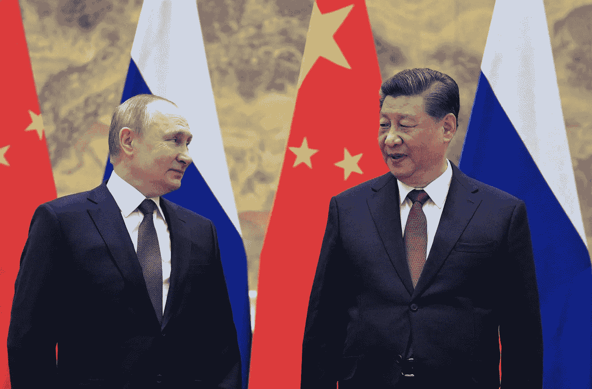
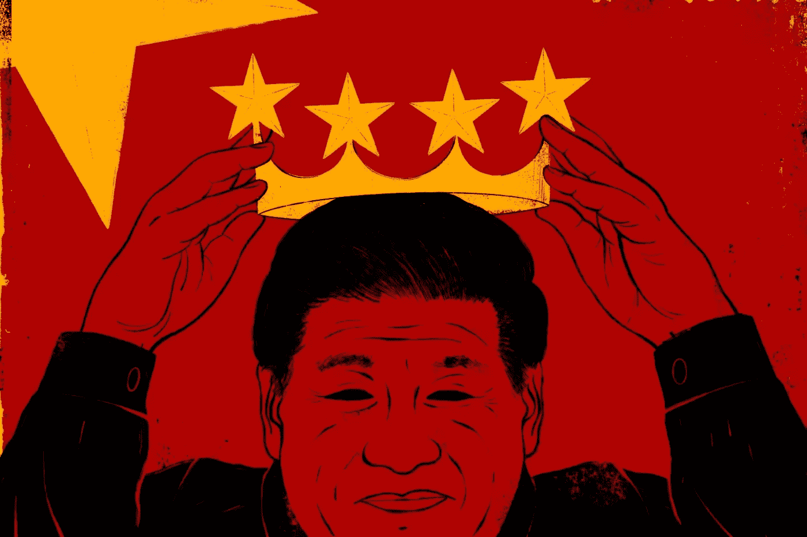
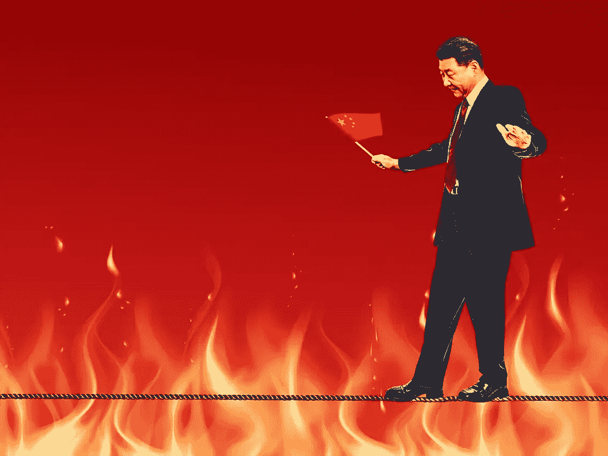
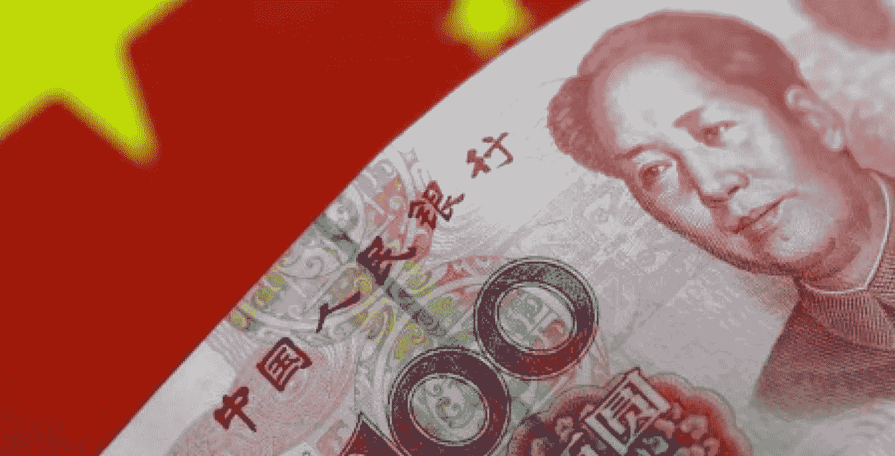
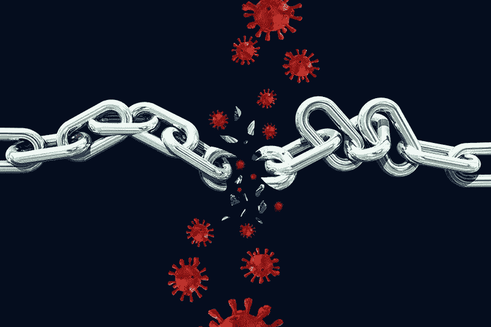
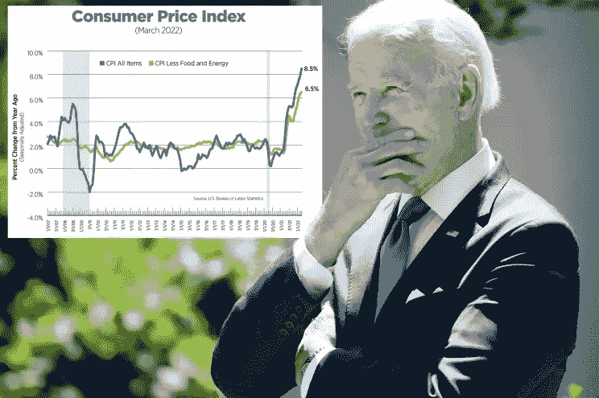
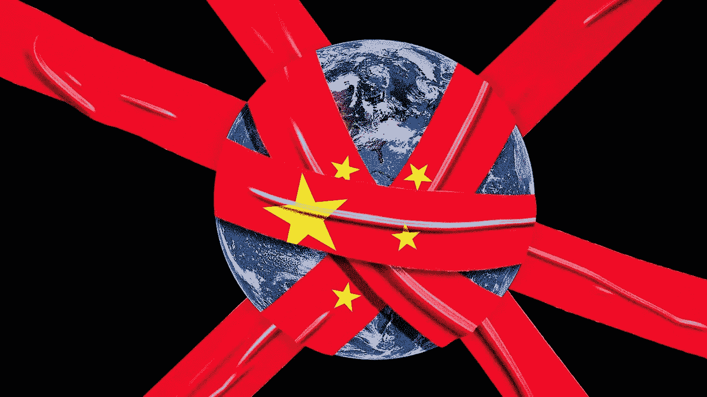

# China and the economic decoupling from the West: is it all part of the dragon’s powerplay?

> 原文：<https://medium.com/coinmonks/china-and-the-economic-decoupling-from-the-west-f09a5674354b?source=collection_archive---------16----------------------->

Defeating ***Covid-19***, or rather ***Omicron***, at all costs and making the national economy as self-sufficient as possible, both energy-wise and economically/commercially.

In this instance, **China** has been continuing to adopt the ***ZERO-COVID*** strategy for two years now. A move that was as useful in the first phase of the *pandemic* as it was essentially *ineffective* now that highly contagious but less-than-lethal variants have taken hold. There are even those who question the real motivations that are leading ***Beijing*** to insist on this path.

Is it really and only health reasons that are driving the People’s Republic to pigeonhole its economy with such ***violence***, or does the *Dragon* intend to implement a kind of economic “**self-decoupling**” from the ***West***, in an attempt to disentangle itself from the ***United States*** and achieve an alternative global order with ***Russia***?

Russian President Vladimir Putin and his Chinese counterpart, Xi Jinping

## Between rumors and more or less plausible clues, the debate rages on.

B*eijing* does not seem to care much about the fact that, thanks to the combined effect of vaccines and adaptation of the human organism to the pathogen, the latest mutations of **Sars-CoV-2** seem less dangerous than the initial form of the virus. Chinese President **Xi Jinping** has reiterated that the Chinese government’s goal is to “**annihilate the virus”**.

**That is, in the most radical way possible.** To make sure that the daily epidemiological bulletins record the number zero under new cases, active cases and victims, the authorities have implemented draconian measures, including the lockdown of mega-cities inhabited by tens and tens of millions of people, resulting in economic blockades and to the entire supply chain of the country, and therefore global.

***The script is always the same:*** people locked in their homes until further notice, business activities suspended with sporadic exceptions, and mass testing to ferret out even the most asymptomatic infected in every single neighborhood.

The ***reality*** is, that we have witnessed is a far worse situation since the beginnings of **Wuhan**, this virus has become even more contagious, and thus it is almost impossible to stop its spread. Yet *Xi Jinping* does not intend to change strategy, as *China* insists on having, perennially and permanently, **zero Covid cases on its agenda.**

## **Apparently, even at the cost of delivering mortal blows to its economic system.**

L**et’s start with the first hypothesis:** China is implementing the zero Covid policy because it intends to zero Sars-CoV-2 cases on its territory.

## Fine, BUT…

One might immediately wonder about the **sense of such a move**, given that *Omicron* and its cousins have not given the impression that they are ***not as deadly and dangerous as the virus strain dating back to 2019.***

 [## Is Omicron really less severe than Delta? Here's what the science says.

### If you get COVID-19 in the United States right now, chances are high that it's the Omicron variant, which now accounts…

www.nationalgeographic.com](https://www.nationalgeographic.com/science/article/is-omicron-really-less-severe-heres-what-the-science-says) 

> *“The cost of China’s zero Covid policy is going up and policy support will not be sufficient to soften the blow,”*

**Allianz** explained in an in-depth report last April devoted to the issue. Estimates of the effects of *Covid* in the first quarter and in April speak of **-0.4 percentage points of Chinese GDP growth in 2022**.

 [## The cost of the zero-Covid policy for China and the world

www.allianz-trade.com](https://www.allianz-trade.com/en_global/news-insights/economic-insights/china-zero-covid-economics.html) 

The **People’s Bank of China (PBOC)**, or *Central Bank of China*, is expected to implement a further cut in the benchmark rate in the second quarter of 2022\. Meanwhile, additional public investment of about **3 percent of GDP** is planned for this year, but it seems that the support of such policies will not be enough to cushion the blow caused by the collapse in domestic demand. The aforementioned report goes on to talk about a reduction in China’s 2022 ***GDP*** growth forecast from the **+4.9 percent predicted a month ago to the current +4.6 percent.**

In a downside scenario in which the lockdown of ***Shanghai*** — the country’s main economic center — lasts more than two months, and it spreads onto other cities, then China’s **GDP growth would slow to +3.8 percent.**

## 另一方面，最糟糕的情况是 GDP 增长+1.3%。

# 对中国来说是这样，但世界其他地方呢？

2022 年第二季度全球贸易量极有可能萎缩。中国需求的放缓意味着对世界其他地区的出口下降了 1400 亿美元。在*供应方面，*中国工业活动的突然停止将给全球制造业带来风险，尤其是在电子和汽车行业。此外，中国港口的拥堵表明，到 2022 年，全球货运延误仍将居高不下。

## 更糟糕的是，持续的供应链中断将给全球带来额外的通胀压力。

# 脱钩的阴影？

*第二个假设*是**中国正在利用 Covid 的长波来重新审视它与世界其他国家的经济关系**，其中西方是最重要的。

在确定了“零 Covid 战略”并未得到充分理解，而且中国经济的这种冻结也将对世界其他地区产生影响之后，最近几周，在成千上万的怀疑和假设中，自愿脱钩的迹象越来越明显。当然，没有足够的证据能够证实或反驳前一种或后一种假设。然而，有一些有趣的线索需要考虑。

例如，在中国的美国商会(美国商会)发布了一份白皮书，概述了对在长城以外经营的美国公司的担忧和一系列政策建议。

“*我们仍然反对任何让美中关系完全脱钩的企图，”美国商会*说*，并解释说，任何**中美脱钩**的代价都将是*的重大代价，而且 ***不会产生一个明确的赢家*** 。**

*在抑制高通胀的压力下，美国总统乔·拜登上周表示，他甚至可能降低特朗普政府对中国进口商品征收的部分关税。*

**

***我们正面临着一个完全相反的现实:**过去，是美国通过唐纳德·特朗普*之口，想尽一切办法脱离中国。**

*的确，即使在那个时候，许多公司和协会都向共和党领导人指出了这一最终决定的重要性，但现在似乎是美国人自己想要避免可能的脱钩，这种脱钩是由中国启动和加速的，我们不知道有多自愿，这要归功于严格的反 Covid 措施。*

*H*owever*, this whole reconstruction could be belied by the fact that ***Beijing*** intends to ***increase foreign investment***, albeit of *quality*, and no longer aimed at feeding the ***production of cheap junk as in the past*** (***dual circulation policy***).*

*It is also useful to remember that between the *Dragon* and ***Brussels*** there is still the **Comprehensive Agreement on Investment (CAI)**, or the **Comprehensive Agreement on Mutual Investment**, currently still on *standby*.*

*Whatever the truth of the matter, *China* continues to **replenish its strategic energy stockpile**, with Bloomberg reporting that Beijing is in talks to buy Russian oil at discounted prices.*

* [## China quietly increases purchases of low-priced Russian oil

### China is quietly ramping up purchases of oil from Russia at bargain prices, according to shipping data and oil traders…

www.cnbc.com](https://www.cnbc.com/2022/05/20/china-quietly-increases-purchases-of-low-priced-russian-oil.html) 

The feeling is that ***Xi Jinping*** is pursuing the health policy he embarked on in 2019, simply refusing to change strategy on the run. But in continuing along this increasingly uphill and fraught road,

## Beijing is unintentionally moving economic levers it may not have wanted to and would not want to activate.

*

**For updates & the latest news and analysis — follow me on* ***Twitter*** *@FilandroMi**

> *Extra Resources:*

*   **China Zero-Covid Policy: a political approach that could heavily backfire**

* [## China's zero-Covid policy becomes a political liability for President Xi Jinping

### Protests bubbling in big cities, dismal economic indicators and rampant discontent online - China's zero-Covid policy…

www.hindustantimes.com](https://www.hindustantimes.com/world-news/chinas-zero-covid-policy-becomes-a-political-liability-for-president-xi-jinping-101653107509849.html)  [## China underlines capital pledge as zero-Covid prompts overseas firms exodus

### Front-page article in Communist Party mouthpiece, the People's Daily, echoes words used by Premier Li Keqiang at a…

www.scmp.com](https://www.scmp.com/economy/china-economy/article/3178642/peoples-daily-underlines-chinas-foreign-capital-pledge-zero)  [## WHO chief says China's zero-COVID policy not sustainable

### The head of the World Health Organization (WHO) says China's zero-tolerance COVID-19 policy is not sustainable given…

www.abc.net.au](https://www.abc.net.au/news/2022-05-11/world-health-organization-china-covid-policy-not-sustainable/101055166)  [## Xi missing from front pages of CCP's People's Daily, experts reading between the lines

### hina watchers speculate about tensions between President Xi Jinping and Premier Li Keqiang. Technocrats are making a…

theprint.in](https://theprint.in/opinion/chinascope/xi-missing-from-front-pages-of-ccps-peoples-daily-experts-reading-between-the-lines/966754/) 

*   *How the Covid crisis changed the Globalization trend:*

 [## The turning tide for Globalization

### 在更频繁的不确定性和破坏性事件中，市场情绪正在下跌:我们正在目睹…

medium.com](/coinmonks/the-turning-tide-for-globalization-4da1fc591ea9)  [## 全球经济面临的挑战

### 面对影响全球经济的负面事件，全球经济正在寻求新的平衡。新的挑战和…

medium.com](/coinmonks/the-awaiting-challenges-for-the-global-economy-3c6dd60afec) 

> 加入 Coinmonks [电报频道](https://t.me/coincodecap)和 [Youtube 频道](https://www.youtube.com/c/coinmonks/videos)了解加密交易和投资

# 另外，阅读

*   [3 商业评论](/coinmonks/3commas-review-an-excellent-crypto-trading-bot-2020-1313a58bec92) | [Pionex 评论](https://coincodecap.com/pionex-review-exchange-with-crypto-trading-bot) | [Coinrule 评论](/coinmonks/coinrule-review-2021-a-beginner-friendly-crypto-trading-bot-daf0504848ba)
*   [莱杰 vs n rave](/coinmonks/ledger-vs-ngrave-zero-7e40f0c1d694)|[莱杰 nano s vs x](/coinmonks/ledger-nano-s-vs-x-battery-hardware-price-storage-59a6663fe3b0) | [币安评论](/coinmonks/binance-review-ee10d3bf3b6e)
*   [Bybit Exchange 审查](/coinmonks/bybit-exchange-review-dbd570019b71) | [Bityard 审查](https://coincodecap.com/bityard-reivew) | [Jet-Bot 审查](https://coincodecap.com/jet-bot-review)
*   [3 commas vs crypto hopper](/coinmonks/3commas-vs-pionex-vs-cryptohopper-best-crypto-bot-6a98d2baa203)|[赚取加密利息](/coinmonks/earn-crypto-interest-b10b810fdda3)
*   最好的比特币[硬件钱包](/coinmonks/hardware-wallets-dfa1211730c6) | [BitBox02 回顾](/coinmonks/bitbox02-review-your-swiss-bitcoin-hardware-wallet-c36c88fff29)
*   [BlockFi vs 摄氏度](/coinmonks/blockfi-vs-celsius-vs-hodlnaut-8a1cc8c26630) | [Hodlnaut 审核](/coinmonks/hodlnaut-review-best-way-to-hodl-is-to-earn-interest-on-your-bitcoin-6658a8c19edf) | [KuCoin 审核](https://coincodecap.com/kucoin-review)*