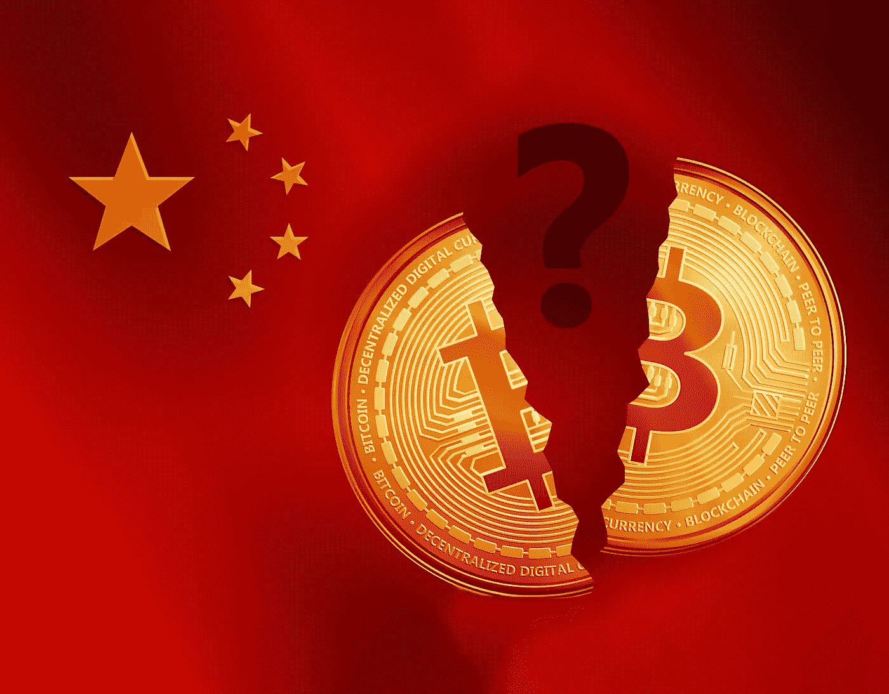

# 中国继续其严格的加密措施

> 原文：<https://medium.com/coinmonks/china-continues-its-stringent-crypto-measures-derev-blog-64216519602f?source=collection_archive---------62----------------------->

# 快速拍摄:

*   中国监管机构警告非金融交易及其金融风险。
*   **监管机构将加密交易主要与非法活动联系在一起。**

中国正在收紧加密市场，因为他们警告说，这是一个非法活动的空间。自从一家中国媒体报道说非英语国家急需…