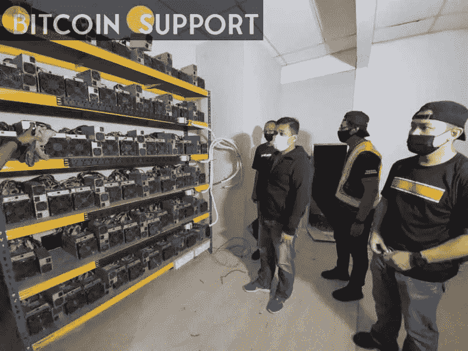

# 中国当局在捣毁一个非法地下采矿厂后逮捕了 190 名矿工

> 原文：<https://medium.com/coinmonks/chinese-authorities-grab-190-miners-after-busting-an-illegal-crypto-mining-plant-f6c38fb6d8e4?source=collection_archive---------98----------------------->

**Visit our website:-** [**https://bitcoinsupports.com/**](https://bitcoinsupports.com/)

广东省发展和改革委员会扣押了 190 台价值约 500 万元的加密采矿机。

据报道，广东省发改委发现了一个在电动汽车充电站内秘密运营的非法地下采矿场。据当地一份出版物称，这个秘密的地下采矿场是在广州市被发现的，执法人员一直在该地区进行例行检查，以加强和摧毁任何形式的采矿作业。在这次秘密采矿行动中，共缴获了 190 多件价值 500 万元(791450 美元)的秘密采矿设备。当局声称，尽管采矿作业消耗大量能源，但他们仍然对当局隐瞒，因为他们经营的充电站耗电量高。采矿作业据称是秘密进行的，在大门口有一名警卫，并有栅栏和障碍来隐藏他们。运营采矿场花费了 1，000 多个小时，消耗了 90，000 多千瓦时的电力。

在评估充电站的能源使用情况并发现使用中的异常后，当局关闭了秘密采矿作业。今年 2 月，揭阳市查封了 916 台矿机。去年，北京政府彻底禁止了全国的地下采矿活动，理由是他们的碳排放目标和地下采矿公司的过度用电。该决定导致大多数采矿场和工业秘密采矿作业关闭或搬迁。

自那以后，中国多个地区的政府部门进行了州级和市级检查，以杜绝哪怕是最小的采矿活动，包括在家中进行的活动。在镇压之前，中国占据了比特币(BTC)网络 60%以上的哈希力量。现在，它约占全球比特币挖矿活动的 0%。

**访问我们的网站:-**[**https://bitcoinsupports.com/**](https://bitcoinsupports.com/)

**免责声明:以上为作者观点，不应视为投资建议。读者应该自己做研究。**