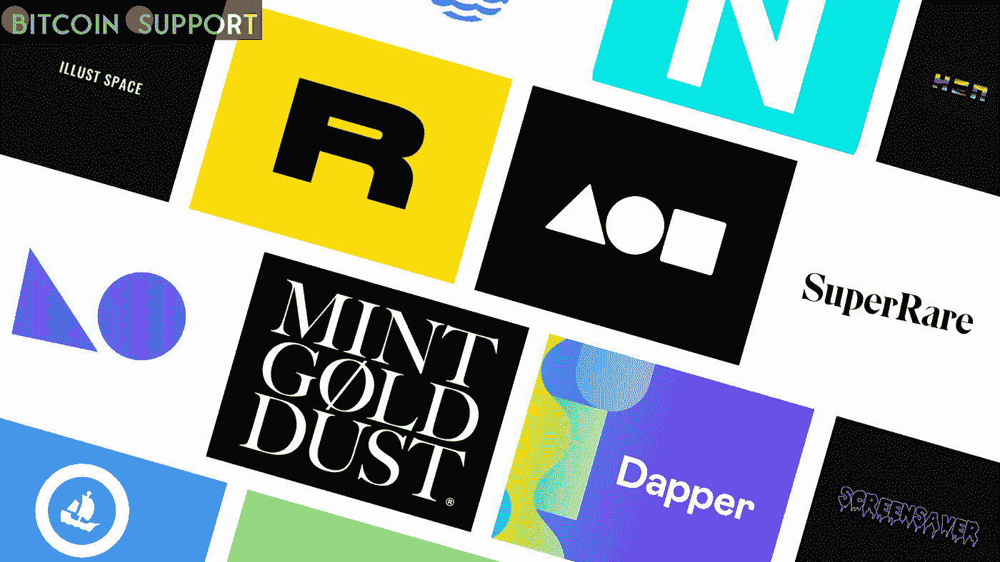

# 中国互联网巨头关闭了 NFT 平台，期待政府的打击

> 原文：<https://medium.com/coinmonks/chinese-internet-giants-shut-down-nft-platforms-in-anticipation-of-a-government-crackdown-d8f9b2651969?source=collection_archive---------78----------------------->

**Visit our website:-** [**https://bitcoinsupports.com/**](https://bitcoinsupports.com/)

微信因违反其反非法贸易政策而暂停了许多与数字收藏平台相关的账户，而蚂蚁集团和腾讯旗下的 NFT 平台修改了他们的用户协议。中国最大的社交媒体网站和互联网公司修改了政策，以限制或消除不可伪造的令牌(NFT)平台，理由是缺乏监管透明度和对政府打击的担忧。

中国最大的社交网络平台微信因违反平台规定，暂停了多个数字收藏平台账号。西湖 1 号是一个数字收集平台，是市场上最受欢迎的 NFT 计划之一，也已被撤回。据当地一家报纸报道，另一个平台东一元店证实，其官方应用已被屏蔽。科技巨头蚂蚁集团(Ant Group)创办的数字收藏品平台 WhaleTalk 最近修改了规则，加大了对通过场外交易(OTC)进行非金融交易的惩罚力度。重要的是要注意，虽然 NFT 不一定是非法的，但任何涉及数字收藏品衍生令牌的投机交易仍然是非法的。以下是谷歌翻译报告的摘录:

**“鉴于围绕数字收藏合规性的模糊性，许多平台已经开始积极打击违规行为，以限制相关行为的传播。”NFT 平台上非法交易和 bot 购买的增加已经导致一些技术公司采取预防措施。在 2021 年 9 月宣布的全面加密货币禁令期间，任何被发现为加密交易提供便利的公司或海外加密公司都将被追究责任。因此，这些公司最近的活动和对其用户协议条例的修订似乎是出于逃避政府影响的愿望。

虽然加密货币在中国内地是非法的，但北京政府表示无意禁止非加密货币。这是腾讯和阿里巴巴去年申请多项 NFT 专利的一个重要因素。然而，随着数字收藏品在中国越来越受欢迎，它们变得更容易受到价格投机和欺诈的影响。

**访问我们的网站:-**[**https://bitcoinsupports.com/**](https://bitcoinsupports.com/)

**免责声明:以上为作者观点，不应视为投资建议。读者应该自己做研究。****

> 加入 Coinmonks [电报频道](https://t.me/coincodecap)和 [Youtube 频道](https://www.youtube.com/c/coinmonks/videos)了解加密交易和投资

# 另外，阅读

*   [比诺莫评论](https://coincodecap.com/binomo-review) | [斯多葛派 vs 3Commas vs TradeSanta](https://coincodecap.com/stoic-vs-3commas-vs-tradesanta)
*   [Capital.com 评论](https://coincodecap.com/capital-com-review) | [香港的加密借贷平台](https://coincodecap.com/crypto-lending-hong-kong)
*   [如何在 Uniswap 上交换加密？](https://coincodecap.com/swap-crypto-on-uniswap) | [A-Ads 审查](https://coincodecap.com/a-ads-review)
*   [WazirX vs CoinDCX vs bit bns](/coinmonks/wazirx-vs-coindcx-vs-bitbns-149f4f19a2f1)|[block fi vs coin loan vs Nexo](/coinmonks/blockfi-vs-coinloan-vs-nexo-cb624635230d)
*   [本地比特币评论](/coinmonks/localbitcoins-review-6cc001c6ed56) | [加密货币储蓄账户](https://coincodecap.com/cryptocurrency-savings-accounts)
*   什么是融资融券交易
*   [支持卡审核](https://coincodecap.com/uphold-card-review) | [信任钱包 vs MetaMask](https://coincodecap.com/trust-wallet-vs-metamask)