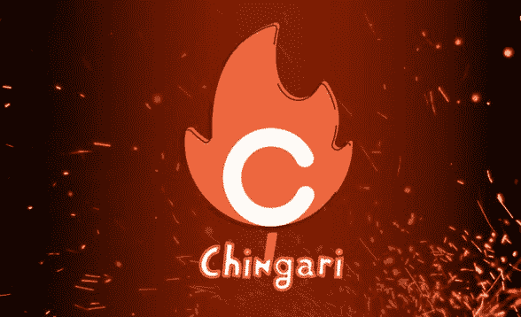

# Chingari 社交网络宣布每年发放 1200 万美元的本地代币

> 原文：<https://medium.com/coinmonks/chingari-social-network-announces-annual-distribution-of-12m-in-native-tokens-217736fa1e6e?source=collection_archive---------32----------------------->

印度社交网络 Chingari 推出了 gari 采矿计划，每年将奖励用户相当于 1200 万美元的奖金。

GARI 本地代币的每日奖励池将为 50，000 个硬币，其中 5，000 个将作为进入社交网络的奖金分发。剩余的 45，000 GARI 将奖励给用户进行应用内活动，包括视频上传和分享、观看、喜欢和评论。

你可以在 NFT 徽章的帮助下增加收入。它们分为五个等级——基本级、青铜级、白银级、黄金级和钻石级，分别提供 x2、x3、x4、x5 和 x10 乘数。

> “GARI 矿业将为大大小小的出资者提供一个公平的竞争环境。现在，应用程序用户可以获得 GARI 代币，而不是依赖品牌合作伙伴关系作为他们的唯一收入来源，”Chingari 联合创始人兼首席执行官 Sumit Ghosh 说。

据开发者称，Chingari 于 2018 年推出，是世界上下载量最高的 20 个应用之一。其用户数量超过 1.3 亿。

📰 ***订阅*** [***斐波那契***](/@unclefibonacci) ***我来保持最新***

> 加入 Coinmonks [电报频道](https://t.me/coincodecap)和 [Youtube 频道](https://www.youtube.com/c/coinmonks/videos)了解加密交易和投资

# 另外，阅读

*   [币安期货交易](https://coincodecap.com/binance-futures-trading)|[3 comas vs Mudrex vs eToro](https://coincodecap.com/mudrex-3commas-etoro)
*   [如何购买 Monero](https://coincodecap.com/buy-monero) | [IDEX 评论](https://coincodecap.com/idex-review) | [BitKan 交易机器人](https://coincodecap.com/bitkan-trading-bot)
*   [尤霍德勒 vs 科恩洛 vs 霍德诺特](/coinmonks/youhodler-vs-coinloan-vs-hodlnaut-b1050acde55a) | [Cryptohopper vs 哈斯博特](https://coincodecap.com/cryptohopper-vs-haasbot)
*   [顶级付费加密货币和区块链课程](https://coincodecap.com/blockchain-courses)
*   [MXC 交易所评论](/coinmonks/mxc-exchange-review-3af0ec1cba8c) | [Pionex vs 币安](https://coincodecap.com/pionex-vs-binance) | [Pionex 套利机器人](https://coincodecap.com/pionex-arbitrage-bot)
*   [如何在印度购买比特币？](/coinmonks/buy-bitcoin-in-india-feb50ddfef94) | [WazirX 评论](/coinmonks/wazirx-review-5c811b074f5b)