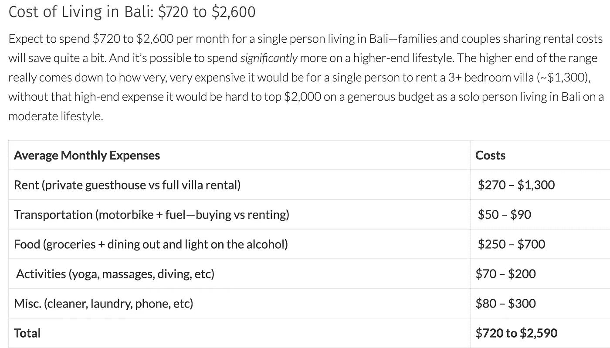

# 选择和路径。

> 原文：<https://medium.com/coinmonks/choices-and-paths-80bd4e760534?source=collection_archive---------27----------------------->

*“建立对世界，一个自我。你想要的结果，或者你想成为的人。那就打工赚吧。”*

这是我收到的最好的建议之一。“假装它，直到你做到”的一个更严厉的变体，它从下面的问题中获得了所有的庄严感:

谁会想成为那个“傻瓜”，告诉朋友和家人他将在 5 年内成为百万富翁，却可怕地失败了？

大多数人不知道——上帝知道我也不知道。

但另一方面是:

**你永远不必深挖动机。**

你有没有停下来回答过，为什么在截止日期前一个小时，做作业或复习迎考的动力会突然出现？

让我们大多数人感动的不是成功的动力，而是对失败的恐惧，更糟糕的是，被视为失败。人类是注重生存的群居动物。为什么我们都害怕风险？成功是不确定的，所以对失败的恐惧就来了——*。*

为什么泰隆不约格蕾丝，当他的机会甚至不接近可以忽略不计的时候(拜托泰隆！)?如果他被拒绝了，这可能向他周围的人表明他不是一个好男人。那也是— *害怕失败*。

这是大多数灵长类动物都有的，并因社会压力而加剧。这对于一个人的生存和繁衍后代是有逻辑意义的。如果你输了一场战斗，你会变得害怕与打败你的人相似的人，害怕一般的战斗。如果你在其他你希望吸引的人面前被拒绝，这肯定会影响你与他人相处的机会，以及你再次克服拒绝恐惧的能力。这实际上有助于不足的你管理期望和做出更安全的选择。

它并没有让你更加充实，甚至没有接近。

现在我要标新立异，声称任何人都可以如此有效地利用这一现象，以至于你每天早上都会诅咒自己的创造力。

把自己退到角落里。向所有你认识的人宣布，你将在“Y 时间内”成为“X”。

如果你*失败了*，你会比那些暗笑自己没有足够勇气赌上自己的骄傲的人更接近你的目标。再加上你的下一次尝试更加见多识广。

如果你逃跑，他们的窃笑将是合理的，而你将会是你所认识的最大的傻瓜。

你对失败的恐惧会让你不太可能去做这件事，因为谁会选择一条屈辱的道路呢？不是理性的人。

除了成功，你别无选择。
虐待狂，但是天才。

所以，如果你也有勇气去做这件事，而且你是真心的，那就伸出你的手。我正在建立一个由志同道合的大胆朋友组成的网络，WAGMI。

但是让我们暂时把鼓舞士气的话放在一边，进入主题。

**我看到了许多路径……**

有些通向天堂。他们看起来有些孤独，不确定(沿途的遭遇和距离都是未知的)，而且大部分是人迹罕至的。在我看来，在这里制造它是控制母体的最好方法。

然后还有既定路线。这些通向退休度假村。用低风险，也是可以理解的，低回报来拉拢许多人。铺着柏油路，布满路标，旅行者知道会发生什么，周围都是渴望 20-40 年后到达目的地的人，在西班牙的某个可爱的地方。

或者，还有跑步机。人们可以拼命地跑，也可以在上面慢慢地走。它没有改变没有地面覆盖，最终，疲惫是结果。没有其他简单的选择，只能依靠家人或你最好的朋友，国家，带你回家锻炼。

有趣的是，这甚至不接近提供的路径。

在我看来，这就是西方如此令人向往的地点——选择。通常为大多数国家和发展中国家的富人保留的选择，在我们这里被确立为规范和惯例。我们有很多值得感激的事情。

此外，这些路径有如此多的变化，把它们都写下来是没有用的。

我个人认识一个在迪拜建造出租公寓的优步司机，

一个在巴厘岛拥有餐厅和海滨别墅的水管工，

和一个住在伦敦的四大会计师，过着城市生活，一张接一张地付账。

**你不能编造这些。**

尽管我很敏锐，但我已经找到了通向有利位置的选择和路径。通过把这些点联系起来，我得出了一些明显的结论。

以下是其中的一些。

**拥有有价值的东西。**

让我们来分类这些可能看起来像什么:

1.  别人现在和将来都想/需要付钱给你“使用”的东西。这些东西你可以出租获得被动收入。
2.  别人现在不想要的东西，但很快就会想用自己的一只胳膊和一条腿来交换。即在 10 年内会增值的商品、资产或服务的交易者。

现在记住第二个，让我们开始探索第一类。

传统上，这些类型的资产可以进一步分为房地产、企业所有权(股票)、货币(贷款)、知识产权(版税)。这些是被动收入的主要来源。简单地通过拥有来赚钱。在你掏出钱包之前，对大多数人来说，即使有银行的“帮助”，如果没有漫长的积累、KYC 和储蓄，这些资产类别也是无法实现的。因为拥有这些东西的全部意义在于不必花费我们最宝贵的资源(时间)和尽快挥霍在奢侈品上，我们需要变得有创造性。

人们可以:

(A)研究这些资产类别的未来趋势。在我看来，购买或创建这些资产的虚拟迭代似乎正在获得回报，但要得出自己的结论。对于懒人，以下是我的结论:

元宇宙涉足房地产(尽管似乎被过分夸大了), DeFi 涉足贷款/加密和公用事业 NFT 的杠杆交易，涉足初创企业/风险投资机会。

(B)在发展中国家创造或积累廉价的房地产或企业——快速——并获得丰厚且需求旺盛的外汇。在一个正在崛起的地区建立一个帝国，而你的英国护照和英镑仍然激发国际尊重和钦佩(这本身就是一个奇迹)。侨民贷款计划，外国投资集团等。利用你的国籍和种族(如果可能的话)。

(C)通过探索类别(2)中的资产来炫耀资本。

好了，现在进入第二个一般范畴(2)。

回想一下，这些是“别人现在不想要，但很快就会想用一只胳膊和一条腿来交换的东西。”

进行交易，将这些收益转换成第(1)类的被动收益。用积累的被动收入反复冲洗，直到你摆脱奴役。

一些我认为任何人都可以完成的交易的例子。鉴于乌克兰爆发战争，国防类股(战争最终没有发生，但一些美国武器制造商仍与乌克兰和斯洛伐克达成了一些大宗采购交易)。俄罗斯天然气，冬季前是一个显而易见的问题(低进入点和低全球供应量，由于 Covid 抑制能源需求)。FAANG 股票在 Covid 锁定期间，这样的例子不胜枚举。

最后，我们来提出最坏的情况。你已经决定你不能鼓起勇气去做以上任何一件事。责任浇灭了内心的火焰，或者更糟糕的是，缺乏自信。

嗯，我发现了一种可以替代薪水支票的生活方式，它需要两样东西。首先，拥有西方人的平均收入(3 万到 4 万美元)。其次能够远程生活和工作。对大多数人来说，它们独立地很容易完成，但是放在一起有点挑战性(我得到可靠的消息)。

但是…

看看这个:

一个月 3000 美元。这就是住在永久度假胜地的代价:充满新体验和新活动的别墅。

对那些有洞察力的人来说，有很多方法可以发现它们。

祝你好运，并在评论区分享你想到的任何通往天堂或地狱(以避免)的道路！

> 加入 Coinmonks [电报频道](https://t.me/coincodecap)和 [Youtube 频道](https://www.youtube.com/c/coinmonks/videos)了解加密交易和投资

# 另外，阅读

*   [加密复制交易平台](/coinmonks/top-10-crypto-copy-trading-platforms-for-beginners-d0c37c7d698c) | [Coinmama 审核](/coinmonks/coinmama-review-ace5641bde6e)
*   [印度的加密交易所](/coinmonks/bitcoin-exchange-in-india-7f1fe79715c9) | [比特币储蓄账户](/coinmonks/bitcoin-savings-account-e65b13f92451)
*   [OKEx vs KuCoin](https://coincodecap.com/okex-kucoin) | [摄氏替代度](https://coincodecap.com/celsius-alternatives) | [如何购买 VeChain](https://coincodecap.com/buy-vechain)
*   [币安期货交易](https://coincodecap.com/binance-futures-trading)|[3 commas vs Mudrex vs eToro](https://coincodecap.com/mudrex-3commas-etoro)
*   [如何购买 Monero](https://coincodecap.com/buy-monero) | [IDEX 评论](https://coincodecap.com/idex-review) | [BitKan 交易机器人](https://coincodecap.com/bitkan-trading-bot)
*   [CoinDCX 评论](/coinmonks/coindcx-review-8444db3621a2) | [加密保证金交易交易所](https://coincodecap.com/crypto-margin-trading-exchanges)
*   [红狗赌场评论](https://coincodecap.com/red-dog-casino-review) | [Swyftx 评论](https://coincodecap.com/swyftx-review) | [CoinGate 评论](https://coincodecap.com/coingate-review)
*   [Bookmap 评论](https://coincodecap.com/bookmap-review-2021-best-trading-software) | [美国 5 大最佳加密交易所](https://coincodecap.com/crypto-exchange-usa)
*   [如何在 FTX 交易所交易期货](https://coincodecap.com/ftx-futures-trading) | [OKEx vs 币安](https://coincodecap.com/okex-vs-binance)