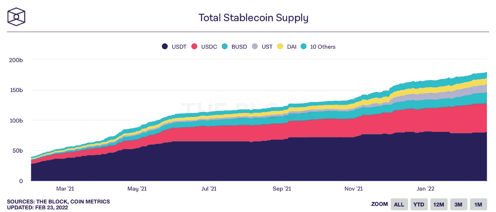

# 选择正确的稳定硬币

> 原文：<https://medium.com/coinmonks/choosing-the-right-stablecoin-8abdb9091ba8?source=collection_archive---------12----------------------->

过去几个月，随着比特币和其他数字资产经历极度波动，Stablecoins 的规模急剧膨胀。根据 Block 汇编的数据，所有 stablecoins 的总市值约为 1800 亿美元，高于一年前的 380 亿美元。相比之下，整个数字资产领域在过去一年中基本保持停滞。

稳定玉米市场份额的增长表明了需求和重要性的增长。目前 stablecoin 生态系统中有超过 200 种 stable coin，投资者很难在不同的选项中做出选择。

**需要考虑哪些因素？**

稳定图标在创建方式、固定机制和可用性方面有所不同。因此，这些差异导致以下方面的不同程度:

-安全

-透明度

-稳定性

-产量

让我们来看看最常见的 stablecoins…

**系绳(USDT):**

最初成立于 2014 年，USDT 理所当然地位于稳定名单之首。它拥有 800 亿美元的市值，几乎是第二高的稳定币的两倍。由于菲亚特支持的性质，USDT 非常安全和稳定。换句话说，USDT 与以现金或现金等价物形式持有的资产的比例至少为 1:1，这意味着 USDT 总是可以以同等的美元价值被赎回。

然而，一些机构群体成员认为 USDT 缺乏透明度，因为审计报告并不经常获得和披露。尽管支付了纽约总检察长办公室对缺乏财务透明度的指控的和解金，摩尔开曼公司后来的审计报告证实，已发行 USDT 的数量没有超过该公司持有的资产。

作为第一个行动者和最大的稳定者，投资者基本上把 USDT 作为他们的主要选择。集中式和分散式交易所也选择 USDT 作为主要的交易对手。这导致 DeFi 收益率被压缩，因为 USDT 池可能锁定最高总价值(**【TVL】**)；因此，稀释了流动性提供者/储户的回报。

**美元硬币(USDC):**

USDC 与比特币基地全球数字资产交易所(digital asset exchange)一起成立，通过获得法定支持的方式与美元挂钩。由于菲亚特的支持，安全性和稳定性无疑都很高。与 USDT 不同，USDC 的储量每月由均富 LLP 公司进行验证。值得注意的是，证明不同于审计。证明意味着公司将检查现有数据的有效性，但不会对数据的不一致性进行额外的审计。

USDC 被认为是安全的，因为它有菲亚特的支持，但也因为它与比特币基地的关系。最近的趋势表明，尽管 USDC 的总市值仍然是 530 亿美元，大大低于 USDT 的总市值，但其市场份额一直在超过 USDT。

关于 DeFi 收益率，某些 USDC 池最近已经超过了 TVL 的 USDT 池，这反映了对 USDC 日益增长的偏好。一般来说，USDC 的收益率比 USDT 略高。然而，USDC 在货币市场上的收益率往往较低，因为 USDC 通常会获得较高的抵押品系数，这使得它们作为抵押品更具吸引力。

**币安美元(BUSD):**

BUSD 是第三大稳定货币，市值 180 亿美元。与 USDT 和 USDC 类似，BUSD 由菲亚特支持，由币安在 BUSD 背后的合作伙伴 Paxos Trust Co .发行。2020 年 8 月，BUSD 被纽约州金融服务局列入“绿色名单”。此外，监管机构还负责监督其储备，所有储备都必须以可信的形式持有，如美国国债和 FDIC 保险的银行账户。这使得 BUSD 成为市场上最安全和稳定的选择之一。

然而，BUSD 最大的劣势是其对币安智能链(**【BSC】**)的专注。BUSD 在 BSC 之外的其他区块链上不常用，使得 BUSD 的 DeFi 机会相当有限。尽管有这种限制，如果协议提供，BSC 之外的某些利基 BUSD 池可能是有利可图的。

**特拉乌德(UST):**

与上面的例子不同，UST 没有任何真实世界或连锁资产的支持。这是一种算法稳定的硬币，是针对其易变的对应物 LUNA token 铸造/燃烧的。UST 的机制相对简单。Terra 平台允许 UST 对卢纳的铸造/燃烧，使市场能够控制 UST 的供应，以确保和维持 1 美元的挂钩。

与菲亚特支持的期权不同，UST 面临智能合约风险，并要求市场参与者维持其盯住汇率制度。在市场低迷时期，如果没有足够的套利者，UST 可能会进入“死亡螺旋”, UST 会经历持续的抛售压力，而 LUNA 也会同时失去价值。这创造了一个不利的环境，可能会阻止套利者试图确保 UST 的联系汇率。

另一方面，由于其安全性和稳定性的不确定性，UST 的收益率对流动性池和存款贷款池极具吸引力。此外，由于其在区块链运作的 Terra 平台的性质，UST 是高度透明的。

**戴(戴):**

戴是数字资产支持的稳定币。更具体地说，它是由过度抵押的数字资产债务头寸支持的。它由马克道在区块链发行和维护。用户需要提供抵押品以铸造 DAI stablecoin，如果不能维持适当的贷款价值比，抵押品将被清算。

2017 年，ETH token 在 24 小时内出现了超过 30%的修正，数亿份协议抵押品被清算，以保护其 DAI stablecoin 的完整性。经过几天的调整后，戴的交易价格略低于其盯住美元的价值，然后完全恢复到 1 美元的价值。

尽管完全恢复挂钩可能需要几天时间，但戴被认为是最安全的数字资产支持稳定币之一，也是最透明的，因为该项目位于区块链。然而，它的稳定性可以说是低于菲亚特支持的 stablecoins。就 DeFi 收益率而言，DAI 的排名通常高于菲亚特支持的期权，因为其 TVL 普遍较低。

**结论:**

通过如何铸造稳定硬币和它们的钉机制，不同的稳定硬币可以在安全性、透明度、稳定性和可用性方面有所不同。重视安全和稳定的投资者应该将更多的资本投入到菲亚特支持的稳定债券中。追求绝对收益的投资者应该将更多的资金投入算法稳定型债券。介于两者之间的投资者应该考虑数字资产支持的稳定债券。

最终，多元化和风险管理仍将是散户和机构投资者的两大要务。投资者应该在不同的稳定货币类别中分配他们的资本，优先选择投资者重视其独特特征的类别。

**安全稳定:** USDT、USDC、BUSD、TUSD 等。

**德菲产量:**、、费等。

**中间派:**戴、、阿鲁斯德、米姆等。

*Compound Capital Partners 是一只开放式基金，通过其稳定货币和 delta 中性收益农业的双重方法提供对数字资产类别的投资。*

*推特:*[*https://twitter.com/investcompound*](https://twitter.com/investcompound)

*网址:*[*https://www.compound.capital/*](https://www.compound.capital/)

> 加入 Coinmonks [电报频道](https://t.me/coincodecap)和 [Youtube 频道](https://www.youtube.com/c/coinmonks/videos)了解加密交易和投资

# 另外，阅读

*   [加拿大最好的加密交易机器人](https://coincodecap.com/5-best-crypto-trading-bots-in-canada) | [库币评论](https://coincodecap.com/kucoin-review)
*   [用于 Huobi 的加密交易信号](https://coincodecap.com/huobi-crypto-trading-signals) | [HitBTC 审核](/coinmonks/hitbtc-review-c5143c5d53c2)
*   [如何在 FTX 交易所交易期货](https://coincodecap.com/ftx-futures-trading) | [OKEx vs 币安](https://coincodecap.com/okex-vs-binance)
*   [OKEx vs KuCoin](https://coincodecap.com/okex-kucoin) | [摄氏替代品](https://coincodecap.com/celsius-alternatives) | [如何购买 VeChain](https://coincodecap.com/buy-vechain)
*   [ProfitFarmers 点评](https://coincodecap.com/profitfarmers-review) | [如何使用 Cornix 交易机器人](https://coincodecap.com/cornix-trading-bot)