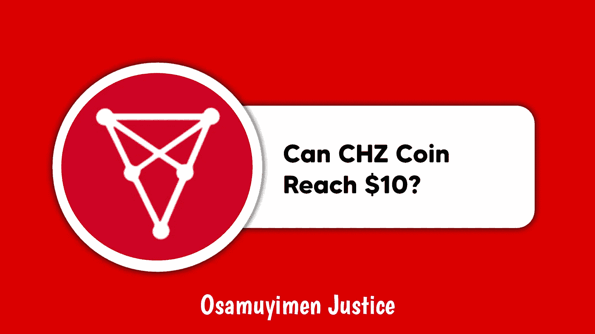
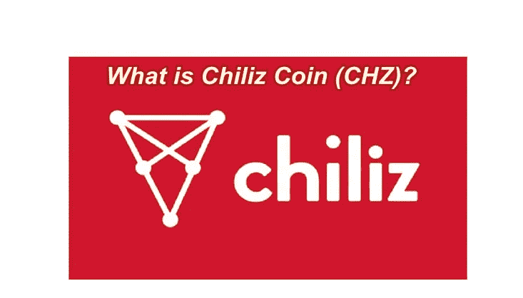
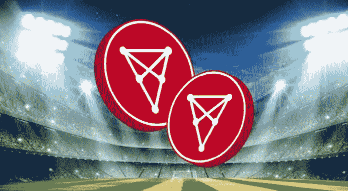

# CHZ 硬币——CHZ 硬币能达到 10 美元吗？

> 原文：<https://medium.com/coinmonks/chz-coin-can-chz-coin-reach-10-af5927e26458?source=collection_archive---------26----------------------->

由于目前加密市场的牛市，CHZ 硬币最近表现良好。同时，CHZ 硬币是一种具有很大价格增长潜力的硬币，但与它的生态系统相比，它的价格仍然被低估。

CHZ 生态系统支持一支足球队，其一些投资者认为其价格与他们对该项目的预期相比非常低，有些人预计其价格是现在的 4 倍，有些人预计不止如此。

这是什么 CHZ？谁拥有它，它能达到 10 美元吗？。如果这些是你的问题，那么当你通读这篇文章来寻找你的答案时，放松并感到舒适。

# 什么是 CHZ 硬币？

[Chiliz](https://www.chiliz.com/en/) (CHZ)是由总部位于马尔他的同名金融科技提供商监管的体育和娱乐数字硬币，它利用总部位于区块链的体育娱乐协议 Socios，方便用户为其特殊体育品牌的管理做出贡献。

Socios.com 的众多粉丝代币就是一个例子。对于体育俱乐部和协会来说，粉丝代币提供了一种与粉丝联系的方式，并开启了新的收入流。

对于样本，球迷可以通过人口普查和投票参与和影响俱乐部的相关决定，比如队长应该戴在臂章上的信息。该组织旨在弥合活跃粉丝和不活跃粉丝之间的差距。

奇利兹已经与世界上一些最大的体育协会建立了合作伙伴关系:巴塞罗那俱乐部、曼城、尤文图斯都灵和巴黎圣日耳曼。它还与 UFC 和博彩机构建立了合作伙伴关系。通过购买 CHZ，球迷可以获得大量球迷代币，并在他们的俱乐部中拥有股份。

Chiliz 为体育和娱乐商品提供基于区块链的工具，帮助他们吸引观众并从中获利。CHZ 是全球领先的区块链体育和娱乐金融科技提供商。

# 谁拥有 CHZ 硬币？

Chiliz(CHZ)由 CHZ 公司的新任首席执行官 Alexandre Dreyfus 创建。Dreyfus 在创建和发展基于网络的公司方面拥有超过 20 年的经验。

例如，在 2017 年建立 Chiliz 之前，他制定了互动旅游指南 Webcity 以及在线扑克方案 Winamax 和 Chilipoker。

他对该公司的详细目标是“比以往任何时候都更加努力地工作，以充分建立粉丝代币作为绝对的粉丝参与工具，并作为体育行业有影响力的新收入来源。”

这一点在球迷代币的争议发展中得到了强调，这种代币已经见证了许多欧洲足球强国，但也有较小的俱乐部签约。

# CHZ 硬币能达到 10 美元吗？

当谈到 CHZ，他们的开发团队正在努力使该项目 10 美元，同时，这取决于市场的决定。也就是说，这取决于投资者/交易者对市场的反应。

他们是购买 dip 还是销售 dip，尽管团队也有权宣布新的开发、特性以及创建一个系统来回馈社区的方法？

CHZ 现在到 10 年后可能会达到 10 美元，尽管如果投资者看到了投资这个项目的理由，众所周知，市场是基于需求和供应的。需求量越大，它达到 10 美元的希望就越大。

**也可阅读:**[Deso Crypto——Deso Crypto 到底是什么？](https://link.medium.com/vbbaQgDnXob)

# 结论

奇利兹开发了 Socios.com 体育迷参与平台，该平台建立在奇利兹区块链基础设施之上，使用$CHZ 作为其独有的平台货币。

Chiliz 有自己的加密交易所，交易者可以交易他们喜欢的运动硬币或交易所列出的其他硬币。

请注意，本文仅供参考，不提供任何投资建议。

*加入我们的电报社区，获取加密新闻，加密宝石，支持&加密教程；*

电报链接:[https://t.me/+6ek5FpdVW89jNjE0](https://t.me/+6ek5FpdVW89jNjE0)

> 加入 Coinmonks [电报频道](https://t.me/coincodecap)和 [Youtube 频道](https://www.youtube.com/c/coinmonks/videos)了解加密交易和投资

# 另外，阅读

*   [有哪些交易信号？](https://coincodecap.com/trading-signal) | [Bitstamp vs 比特币基地](https://coincodecap.com/bitstamp-coinbase) | [买索拉纳](https://coincodecap.com/buy-solana)
*   [ProfitFarmers 点评](https://coincodecap.com/profitfarmers-review) | [如何使用 Cornix 交易机器人](https://coincodecap.com/cornix-trading-bot)
*   [十大最佳加密货币博客](https://coincodecap.com/best-cryptocurrency-blogs) | [YouHodler 评论](https://coincodecap.com/youhodler-review)
*   [my constant Review](https://coincodecap.com/myconstant-review)|[8 款最佳摇摆交易机器人](https://coincodecap.com/best-swing-trading-bots)
*   [MXC 交易所评论](/coinmonks/mxc-exchange-review-3af0ec1cba8c) | [Pionex vs 币安](https://coincodecap.com/pionex-vs-binance) | [Pionex 套利机器人](https://coincodecap.com/pionex-arbitrage-bot)