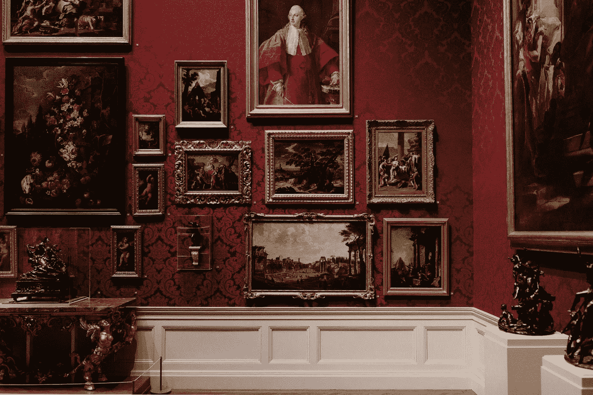

# 使用区块链的艺术品拍卖中的循环信息

> 原文：<https://medium.com/coinmonks/circular-information-in-art-auctions-using-blockchain-a70d057fdaf1?source=collection_archive---------45----------------------->

## 艺术品拍卖中的区块链技术在环保的同时增加了可追溯性

## 介绍

预计到 2024 年，拍卖市场规模将超过 380 亿美元。也是世界上最循环的行业之一。让我告诉你为什么。

关注可持续发展比以往任何时候都重要，因为我们从经济理论中知道，资源是稀缺的。然而，这些资源的使用却不是。这就是引入循环概念的地方。一旦一件艺术品被生产出来，它就可以被分发给多个所有者，而不会承受太大的价值损失，如果有的话。虽然 Ellen MacArthur Foundation (2013)认为现有的业务流程是线性的，但艺术市场是少数几个应用循环经济原则的市场之一。艺术拍卖市场*就其本质而言*，遵循循环的原则。受艾伦·麦克阿瑟基金会(Ellen MacArthur Foundation，2013 年)提出的“摇篮”概念的启发，在线拍卖平台 Bidpath.com 提出了“[拍卖循环](https://bidpath.com/auctions-the-circular-economy/)，让高价值的物品留在循环中，因为物品从一个所有者转移到另一个所有者。然而，为了实现更高水平的可持续性，艺术品拍卖与买家和卖家分享信息的方式仍有改进的空间。

随着越来越多的 Z 世代和千禧一代涌向艺术品拍卖会，循环角度变得更加重要。众所周知，今天的年轻一代比以往任何时候都更倾向于做出可持续的决策，并且正在推动更可持续的变革。这表明，对于拍卖商来说，向潜在买家展示循环信息应该是优先考虑的事情。在这篇文章中，我认为出处是一个关键的循环信息组成部分，必须在艺术品拍卖平台上共享。

## 缺乏可追溯性

> “拍卖的真正力量在于其价值归属代表了拍卖界的集体判断
> 
> ——(价值的社会建构，C.W 史密斯)

艺术市场高度不受监管。艺术品的价值大部分来源于拍卖行提供的有限数据。可追溯性是在拍卖市场中获取艺术品价值的一个关键概念。自然，在拍卖会上，阿达·芬奇的画会比像我这样不太懂艺术的人画的画得到更高的出价。同样，价值也会受到拍卖前拥有艺术品的人的影响，这个概念也被称为 T2 来源。一件艺术品的前所有权是该艺术品当前估价的一个决定因素，因为不仅前所有者有能力营销该艺术品以影响对该艺术品的需求，而且买家可能会认为某件艺术品的**价值更高**，因为它是由某个处于权力地位的人物所拥有。这是决定艺术品价值的一个经典因素，然而，由于缺少记录，核实这些信息并不容易。如果数据不完全可用，许多当前信息可能是高度推测性的。例如，艺术品销售的报价是追溯艺术品来源的唯一证据。人们也许能够根据历史记录拼凑出其他信息，但是，这些记录也是有限的。这在艺术品市场上造成了巨大的不对称，因为买家并不总是确定他们买的是什么。

为了确保艺术品得到公平的估价，而不至于面临被完全从市场上拿走的风险，重要的是要表明谁曾拥有过艺术品。这种举措可以通过区块链技术来促进，以增加艺术品的可追溯性。总的来说，为了确保艺术品被准确估价，出处对买卖双方来说都是一个关键的信息，但也带来了挑战。

## 我们热爱挑战

然而，重要的是要注意到，高端艺术品的价值部分在于其独特性。局外人可能不知道这幅画为什么被高度重视背后的价值，但对于爱好者来说，这是有意义的。在他的信息空间理论中，Max Boisot 警告说，如果不考虑扩散率，信息扩散可能会降低产品的价值。这一概念在花卉市场中被观察到，在那里信息是易腐的和时间敏感的。利益相关者可以行使权力来控制信息的传播([技术遇到鲜花:开启循环和数字经济)](https://link.springer.com/content/pdf/10.1007/978-3-030-69303-9.pdf)，以确保鲜花的价值不会减少。也就是说，艺术品卖家冒着牺牲艺术品价值的风险，代价是提供更多的流通信息。这就产生了摩擦，卖家必须在提供准确信息和通过保持信息排他性来保留权力之间进行权衡。

## 解决办法

作为应对这种情况的一种方式，拍卖商可能会允许卖家使用秘密定价方法，这也会邀请更认真的买家，从而保留有问题的艺术品的排他性。这只是让卖家至少保留杠杆的一种方式，同时提供有助于增加流通的信息。这又回到了受控扩散的理念，卖家现在更愿意分享关于这幅画的信息。由于这种透明度，艺术品的价格变得更加公平，有一个公平的竞争环境，平衡了信息不对称。下一步是什么？

可追溯性的改进大有可为，因为它们可以减少运输过程中的排放。在电子商务中，我们看到，更好的信息实际上有望导致更少的产品退货和更长的使用阶段，从而有助于减少对环境的影响([罗马尼奥利*等人，2020*](https://op.europa.eu/en/publication-detail/-/publication/58453588-1fe3-11eb-b57e-01aa75ed71a1/language-en/format-PDF/source-247895046) *)。*同样，当向买家提供更好的信息时，可以预期会有更少的艺术品被退回。通过查看艺术品的来源(之前的所有权和在移动交付艺术品期间的所有接触点)，买家可以更好地感受排放物，并确认他们拥有真实的艺术品。因此，可追溯性，也称为出处，在创造艺术品拍卖的可持续循环经济中发挥着重要作用。

使用区块链技术可以释放这种可追溯性的力量。区块链本质上是一个分布式账本，其中信息被编码和传播，通过安全存储信息来创建可追溯性，同时创建可持续的外部性。NFT 已经朝着这个方向迈进了一步。这尤其是由于 NFTs 的固有属性是数字的，不需要额外的维护或任何形式的运输来将艺术传递给新的所有者。买家可以放心地验证数字艺术的来源。佳士得拍卖行以 6900 万美元的价格卖出了它的第一件 NFT，这暗示了推广这项新技术背后的经济动机。

虽然要真正实现这些技术还有很多工作要做，但我希望这篇文章能阐明商业模式可能如何适应以及对各种利益相关者的影响。作为循环信息的出处是艺术界的一个根本性的颠覆。人们希望为概述艺术品真实历史的可靠信息奠定基础，进而向买家保证他们在拍卖会上购买的是一件有价值的历史，而不是投资于一些童话故事。区块链只是实现这一目标的工具。

> 加入 Coinmonks [电报频道](https://t.me/coincodecap)和 [Youtube 频道](https://www.youtube.com/c/coinmonks/videos)了解加密交易和投资

# 另外，阅读

*   [Bookmap 评论](https://coincodecap.com/bookmap-review-2021-best-trading-software) | [美国 5 大最佳加密交易所](https://coincodecap.com/crypto-exchange-usa)
*   最佳加密[硬件钱包](/coinmonks/hardware-wallets-dfa1211730c6) | [Bitbns 评论](/coinmonks/bitbns-review-38256a07e161)
*   [新加坡十大最佳加密交易所](https://coincodecap.com/crypto-exchange-in-singapore) | [购买 AXS](https://coincodecap.com/buy-axs-token)
*   [红狗赌场评论](https://coincodecap.com/red-dog-casino-review) | [Swyftx 评论](https://coincodecap.com/swyftx-review) | [CoinGate 评论](https://coincodecap.com/coingate-review)
*   [投资印度的最佳密码](https://coincodecap.com/best-crypto-to-invest-in-india-in-2021)|[WazirX P2P](https://coincodecap.com/wazirx-p2p)|[Hi Dollar Review](https://coincodecap.com/hi-dollar-review)