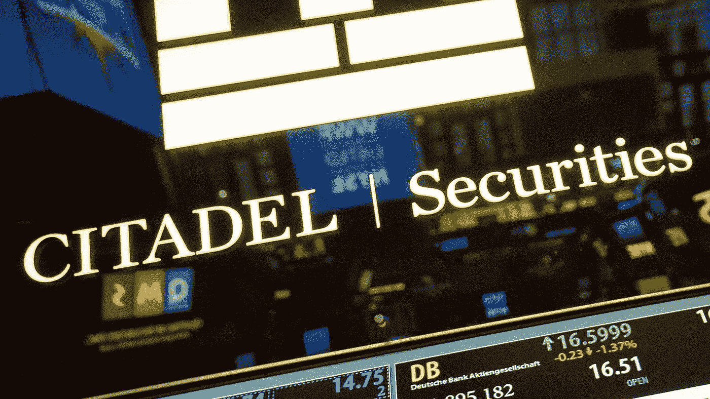

# Citadel 证券将进入加密市场

> 原文：<https://medium.com/coinmonks/citadel-securities-will-enter-the-crypto-market-b0690750f571?source=collection_archive---------53----------------------->

**Visit our website:-** [**https://bitcoinsupports.com/**](https://bitcoinsupports.com/)

据首席执行官肯·格里芬称，2 月 25 日至 3 月 3 日。密码行业:另一位亿万富翁承认他对比特币的看法是错误的，2 月 25 日至 3 月 3 日，据首席执行官肯·格里芬称，Citadel Securities 将进入密码市场。灰度产品从 DCG 获得了 2.5 亿美元的股票买断。经过多年对比特币和密码货币的诋毁后，华尔街的亿万富翁阶层现在开始接受虚拟资产推动数字经济的想法。Citadel 创始人兼亿万富翁肯·格里芬本周表示，他的公司将开始向其客户提供数字资产，扭转他的反加密态度。当然，格里芬并不是唯一改变主意的富裕投资者，所以我们不会对他太苛刻。

因此，当密码分析师们在争论我们是处于牛市还是熊市时，机构、风险资本家和普通个人继续接受数字资产。在地缘政治动荡和暴力时期，像比特币这样的不可信货币提供了独特的价值主张，这在东欧可以看到。

当 Citadel 着眼于加密市场时，一位亿万富翁承认自己在比特币问题上被误导了。价值数十亿美元的对冲基金管理公司 Citadel Securities，在创始人肯·格里芬承认自己对资产类别的看法有误后，将很快提供密码货币投资。在一次采访中，他说，“可以肯定的是，你会看到我们在接下来的几个月里从事隐货币交易。”格里芬警告人们，比特币是一个巨大的泡沫，类似于五年前 17 世纪的郁金香狂潮。尽管我怀疑有人会再把比特币比作荷兰的郁金香泡沫，但如果你有任何顾虑，请阅读本文。

灰度级商品从 DCG 获得了 2.5 亿美元的股份买断。

数字货币集团(Digital Currency Group，简称 DCG)宣布，将回购 Litecoin、Zcash 和 Horizen Trusts 等灰度级投资产品高达 2.5 亿美元的股份。尽管这家风险投资公司没有说明回购股票的原因，但首席执行官巴里·西尔伯特(Barry Silbert)周一在推特上单独表示，他的业务在市场上变得越来越积极。他指出，“比特币看起来棒极了，”并补充道，“我们正在购买。”(目前还不清楚这意味着什么，但在国际不确定性的背景下，比特币价格最近飙升至 4.5 万美元以上，这可能是积极评价的一个因素。)

[支付服务公司 https://twitter.com/BarrySilbert/status/1499025022723268609](https://twitter.com/BarrySilbert/status/1499025022723268609)

shift 4 以 5400 万美元购买了赠予地块。

Shift4 本周宣布，已斥资 5400 万美元收购了密码货币贡献平台“给予块”。这笔购买是以现金和股票支付的，可能会产生 2.46 亿美元的收益。本周，基于密码的慈善事业再次成为焦点，因为乌克兰政府和与之相关的慈善机构收到了超过 3700 万美元的数字礼物，主要是比特币(BTC)、以太网(ETH)和系绳(USDT) (USDT)形式的礼物。捐赠集团已经设立了一个乌克兰紧急基金，允许密码持有者在俄罗斯持续冲突后为人道主义行动捐款。

https://Twitter . com/the giving block/status/1497380202242093069

尽管受到严格控制，韩国密码市场在 2021 年仍将上升至 459 亿美元。

如果你在加密领域已经呆了足够长的时间，你就会知道韩国是数字资产最活跃的交易场所之一。我们现在有一些确凿的数据来支持它:韩国金融服务委员会本周早些时候宣布，到 2021 年底，韩国的密码货币市场已经增长到 459 亿美元，即 55 万亿韩元。韩国 21 家受监管的交易所平均每天处理价值 94 亿美元的交易。尽管有严格的密码限制，韩国仍然是该领域的活动中心。令人惊讶的是，监管机构现在正专注于不可替代的代币，这使韩国有望成为首批颁布 NFT 税收立法的国家之一。

**访问我们的网站:-**[**【https://bitcoinsupports.com/】**](https://bitcoinsupports.com/)

**免责声明:这些是作者的观点，不应被视为投资建议。读者应该自己做研究。**

> 加入 Coinmonks [电报频道](https://t.me/coincodecap)和 [Youtube 频道](https://www.youtube.com/c/coinmonks/videos)了解加密交易和投资

# 另外，阅读

*   [网格交易机器人](https://coincodecap.com/grid-trading) | [Cryptohopper 审查](/coinmonks/cryptohopper-review-a388ff5bae88) | [Bexplus 审查](https://coincodecap.com/bexplus-review)
*   [7 个最佳零费用加密交易平台](https://coincodecap.com/zero-fee-crypto-exchanges)
*   [氹欞侊贸易评论](https://coincodecap.com/anny-trade-review) | [霍比保证金交易](/coinmonks/huobi-margin-trading-b3b06cdc1519)
*   [分散交易所](https://coincodecap.com/what-are-decentralized-exchanges) | [比特 FIP](https://coincodecap.com/bitbns-fip) | [Pionex 评论](https://coincodecap.com/pionex-review-exchange-with-crypto-trading-bot)
*   [用信用卡购买密码的 10 个最佳地点](https://coincodecap.com/buy-crypto-with-credit-card)
*   [最好的卡达诺钱包](https://coincodecap.com/best-cardano-wallets) | [Bingbon 副本交易](https://coincodecap.com/bingbon-copy-trading)