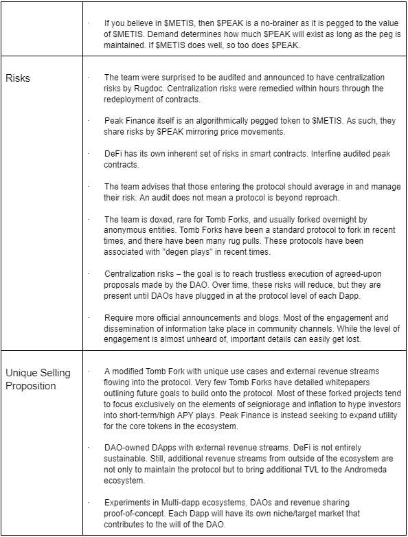

# 登上大教堂山看下面的白云——尖峰金融基本面分析

> 原文：<https://medium.com/coinmonks/climbing-cathedral-mountains-to-see-the-silver-clouds-below-peak-finance-fundamental-analysis-5a2e4c95476e?source=collection_archive---------25----------------------->

利益冲突披露——CCI 的团队要求我提供对 Peak Finance 的基本分析。我的确是 Peak Finance 的创始人之一，尽管我认识到了明显的利益冲突，但我接受了尽可能客观的挑战。尽管毫无疑问会有隐含/无意识的偏见，但请记住，本 FA 仅用于教育、娱乐和信息流程，并不构成财务建议或购买邀请。

*这份基本面分析是 Crypto Consulting Institute 付费时事通讯的一部分，提供市场洞察、可操作的交易信号和基本面分析。更多信息请访问:*【https://www.cryptoconsultinginstitute.com/newsletter 

传统的社会经济范式正变得越来越集中和单调。我们去学校学习所需的技能，只是为了成为经济车轮中的一个齿轮，去赚钱生存。对许多人来说，这包括不得不做一份他们不喜欢的工作，他们发现自己是一个被迫进入方孔的圆钉子。

其他人找到了他们的激情，但这些激情往往超越了他们的职业领域。但在工作之外，我们都是经济的参与者，这种参与对于确保其他人获得工资至关重要。这些正反馈循环产生网络效应，使人们能够获得机会，不管有人是否喜欢他们的工作，这对于一个系统的工作是必不可少的。

一切都很美好，我们知道这一切，因为我们生活在其中。然而，当我们赖以生存的金钱通过被称为通货膨胀的隐性税收而贬值时，这总是会导致法定货币贬值，我们正在失去我们的劳动力，尽管这并不是我们自己的过错。

这些钱从哪里来？凭空而来。

它通向哪里？当央行印钞时，它们需要加载资产负债表。他们购买政府债券、股票和商品。当我们看到印钞机运转不灵，股市疯狂时，那些有内幕消息的人可以投资于可能被载入央行资产负债表的资产，这绝非巧合。驱动这种结构的经济模式是涓滴经济学。把钱给最杰出的公司会带来更多的就业机会。至少，这是经常与现实不符的理论基础。

我们大多数人的祖父母会告诉我们他们可以去电影院，买饮料和爆米花，而且花费不会超过 1 美元。我们想知道为什么在那些日子里它如此便宜，但底线是它不是更实惠，但他们的钱有更多的购买力。

更糟糕的是，我们将血汗和泪水投入到与我们的价值观不一致的工作中，或者他们不认可我们不懈的努力。

Peak Finance 是部署社区所有的多 dapp 生态系统的第一步。最初的设计是铸币税/通货膨胀协议，一个修改的坟墓融资叉。

目标是发布带有$PEAK 令牌用例的 DApps，并与$PRO 共享收入流。随着需求和外部收入流的增加，我们寻求创造条件，使联系汇率不那么容易受到通缩时期的影响。虽然没有多少人会被算法令牌吸引，因为它们天生复杂，但他们会利用 NFT，让持有者从印有 NFT 的每件商品中分享收入。普罗米修斯将是一个活跃的交易国库，将饲料收入流到$PRO。Jive DAO 是一个子 DAO 模型的概念证明，它将为辛迪加提供 DAO 工具来共同管理他们的资产。这只是冰山一角。

这一基本分析将相对简短，但我们将探讨什么是铸币税/通货膨胀，以及为什么它对一个多 dapp 生态系统很重要。我们将用 DAOs 来总结，形成将 Peak 生态系统内的所有 DApps 或与我们的合作伙伴交织在一起的基础层。

## 关键外卖；你的 TLDR 总结

Your TLDR summary, DISRUPT key takeaways. *No score was assigned due to a conflict of interest*.

# 通往巅峰的旅程更好分享。

铸币税和通货膨胀是峰值金融协议的主要激励结构，该协议规定了算法上的钉住美元梅蒂斯。对许多人来说，这些是外来的概念，是 DeFi 中的一个相对概念，

鉴于$PEAK 仅由$METIS 担保，因此只要流动性池中有大约相等数量的$PEAK 代币，那么作为基础担保价值资产的$METIS 将具有$PEAK 的价格。

如果流动性池中有更多的美元，该协议将进入一个通胀时代。对于尽可能接近 1.00 的$峰值钉住值，当 TWAP 为 1.05 时，会将额外的$峰值打印到供应中。这些通货膨胀时期是由一个时期内的时间加权平均价格(TWAP)定义的。每个时期持续 6 个小时，这里$PEAK 的平均价格将决定下一个时期是否会通货膨胀。为了获得这些膨胀性的$峰值排放量，需要在峰会中下注$PRO(股票代币)。可以购买$PRO 并用于提供$PRO-$METIS 流动性对，以获得更多的$PRO 令牌，从而在峰会中复合头寸，以保持有竞争力的排放份额。

如果流动性池中的美元梅蒂斯减少，该协议将进入通缩时期。$POND(债券)是一种非流动性代币，当 peg 高于 1.01 时，可兑换为$PEAK，并且 POND 国库中有足够的$PEAK。

最终，我们的目标是按照钉住汇率制行事。如果挂钩很高，卖出一些美元。如果钉住率很低，就买 100 美元的峰值.那些尊重联系汇率制的国家将处于有利地位来捕捉通胀性排放。

$PRO 相当于中央银行用新印的钞票装满资产负债表的股票。如前所述，只有他们才能从这一过程中受益，铸币税/通货膨胀协议所做的是让每个进入生态系统的人都成为利益攸关方，守则奖励符合协议集体利益的行为。

在最高级别，不涉及战略(我们有大量的教育内容和社区中可用的支持)，墓叉是一毛钱一打。然而，拥有一个 doxed 团队和超越简单现金攫取的雄心确实减轻了对地毯拉的担忧，这是一种普遍的恐惧，鉴于隔夜协议带着人们的钱逃跑的状态，这是正确的。

问题是，我们如何让有吸引力的排放变得可持续？

答案就在我们面前，并且一直是以前的 FAs-Utility 的焦点。

墓叉缺乏其算法挂钩令牌的效用，它们的存在仅仅是为了挂钩目标资产。但是，创造对其货币的需求将会比其他情况下维持更长的时间。

此外，这些协议使用一个共享令牌来操作，该令牌的值随着 peg 而波动。如果这些代币的唯一功能是捕捉通胀排放，我们如何提高底价，降低盯住汇率引发的波动？

我们将外部收入重新纳入令牌，这不是生态系统的产品，而是外部收入。想一想国内生产总值(GDP)这样的术语，它是衡量一个国家的生产率水平是否足以承受进口债务或流出一个国家经济的资金的指标。其他经济部门的活动往往弥补了其他部门的不足。澳大利亚的一个例子是严重依赖资源和农业出口。

最迫在眉睫的发行，峰值彩票和 NFT 市场将利用$峰值作为支付货币，以创造高峰排放的需求。那些在通货膨胀时代务农的人有机会通过排放物轻松获得非粮，或者在彩票中试试运气。

当然，这些都是低垂的果实。尽管如此，随着具有附加功能的 MVP 与生态系统内的 DApps 互连，它将有助于所有企业的总体目标，即共享和维持本地网络效应。这是我们在之前的职能中经常讨论的问题。

如果我们想要创造分散的经济，我们需要能够为整个生态系统贡献专门功能的组织。

Dao 是 Peak 生态系统的一个重要焦点，Prometheus Treasury 将是一个积极管理的财政部，随着时间的推移，它将增加无信任执行的功能。不仅如此，Prometheus Treasury 将成为监督所有子 DAO 并相应分配资源的核心 DAO。

正如在以前的 FAs 中所提到的，Dao 是一种脱离传统组织方式的范式转变。这些结构奖励参与和社区贡献，同时也让成员接触到新的收入来源。Dao 使一群人能够走到一起，与社区、目标和价值观保持一致。从本质上来说，通过选择做一些你热爱的、与 DAOs 使命一致的事情，你有机会获得有意义的工作。Dao 可以为贡献者提供机会，并奖励他们做自己关心的事情。

此外，道中的民主结构是达成真正共识的一种手段。作为“道”的一部分，你的利益经常与“道”相一致，没有什么动机去对抗一个广泛认同的、会带来积极结果的共识。

Dao 还允许志同道合的个人以辛迪加的形式将他们的资金集中在一起，积累资产(NFTs，交易组资金，play-2-earns；查看[功德圈](/coinmonks/there-is-merit-to-a-dao-revenue-sharing-model-merit-circle-fundamental-analysis-ab37d08f76c7)法】并积极投票决定如何最好地利用它们来加强道的地位。

*Peak and Prometheus Ecosystem roadmap from whitepaper*

# 像一个专业人员一样在通往顶峰的路上徒步旅行——令牌经济学和税率表

**最大供应量:700 万**

**循环供应量:410，815**

**价格:2.58 美元**

****$PRO 排放****

**12 个月内可获得并线性释放的$PRO 排放量:**

**高峰-梅蒂斯公司:355 万股**

**$ PRO-$ METIS LP:185 万股**

**DAO 分配:1，100，000 美元，在 12 个月内线性分配。**

**团队分配:500，000 美元，在 12 个月内线性分配。**

**剩余的 5，400，000 美元 PRO 和通过 TX 税获得的额外代币可以激励$PEAK-$METIS 和$PRO-$METIS 赌注者至少 12 个月。奖励期可能会延长或变更。**

****$PONDS(债券)令牌经济学****

**需要从流通中去除的峰值美元数量的供应合同，以恢复峰值美元 TWAP 高于钉住汇率。**

**赎回时不过期。道财资部必须有足够的美元储备用于赎回美元债券。**

****$峰值表征组学****

**$PEAK 旨在与$METIS 的价值挂钩。**

**供给没有上限，通过收缩和扩张时期进行调整。**

****$池塘排放****

**当$PEAK 跌破 1 梅蒂斯钉住汇率时，可以购买$PONDS。如果$PEAK 的 TWAP 介于 1.00 和 1.01 之间，则$PONDS 和$ PEAK 都不会发行。**

****$峰值排放量****

**在膨胀时期:**

**80% $PEAK 由“The Summit”中的$PRO stakers 获得。**

**15%归 Peak Finance 下属的财政部(普罗米修斯财政部的 AUM，由 Aeacus Capital 管理)。**

**5%用于开发、贡献者报酬和营销基金。**

**纪元扩展:如果有未偿债券需要赎回，65%的铸造美元峰值进入国库，直到它达到所需的金额，允许完全赎回美元英镑。**

**收缩时期:当$PEAK TWAP 钉住汇率低于 1.01 时，不会出现$PEAK。**

****税收计划****

**在购买或出售$PRO 以建立普罗米修斯国库和 Peak Finance 子国库的初始资本时，将有条件征税。购买或出售$PRO 时会有条件税。$PEAK 还将实行低于 1.05 的可变燃烧税。**

****$PRO 税务机制****

**所有$PRO 买卖交易收取 10%的费用。这些税收结构可能是暂时的和有条件的。**

****卖家/买家:****

**4%的梅蒂斯人曾经回购并烧毁$PRO。**

**$PRO 的 6%分配给道国库。**

****挂钩征税:****

**PEG > = 1.1—峰值税关闭— PRO 税开启**

**钉住去< 1.1 — PEAK tax goes on — PRO tax goes off**

****$峰值税收:****

**燃烧税适用于低于 1.10 的卖出和增加流动性。
注意，这不是协议的预期功能，Peak 正在开发自己的 DEX 路由器来解决$PRO 和$PEAK 的征税问题。请查税(测试互换，看是否有滑点需求；如果是这样的话，在你增加流动性之前。**

# **在想到珠穆朗玛峰之前征服小山峰——讨论**

**与我们迄今为止在所有财务领域中涉及的其他大型项目相比，Peak Finance 的规模并不大。大规模的雄心是部署一个智能合同生态系统，与其他 Dao 联系起来，并促进商定的收入共享安排。**

**但就目前情况来看，在该项目进行不到一个月的时候，人们很容易认为没有太多的峰值，他们不会因为这些观察而有错。**

**更复杂的是，市场已经看到了更好的日子，美元 METIS 也不例外，我们最近在市场上看到了下行。交易量很低，很难在市场上找到底部。恐惧仍然普遍存在。**

**出于这个原因，明确声明在早期投资 Peak Finance 是一个高风险的游戏是很重要的。**

**这并不是因为协议的性质，在协议中，我们可以看到坟墓本身，并看到当采取结构化的方法时，它是相当有利可图的。但过去许多福克斯的表现几乎没有努力教育他们的社区，这并不总是好的结局。根据 what the fork——有超过 325 个活跃的墓叉。**

**所以问题是，我们为什么要这么做？**

**为了理解铸币税协议的有利可图的本质，我们看看坟墓金融。他们的协议是在$FTM 大约 30c 时发布的。它横盘了几个月，但当$FTM 的价格开始上涨时，它在$3 上方占据了$TOMB。受益最大的是那些在战略上融入生态系统、并在此过程中尊重钉住汇率制的人。$TSHARE 也从 500 美元到 1000 美元的范围内大踏步前进了几个月，然后$FTM 一起飞，$TSHARE 就追上了每令牌 24，000 美元的历史高点。**

**基于仙女座生态系统的婴儿期，Peak 的团队相信$METIS 发现自己处于类似的“暴风雨前的平静”情景。$METIS 现在的处境有点类似于$FTM 在把$TOMB 带向历史高点之前的处境。让这些坟墓般的模式成功的是目标资产的增长。鉴于这两种网络代币都有巨大的销量，在币安智能链或雪崩上分叉对于坟墓分叉不是特别有效。Peak Finance 认为$METIS 还没有运行，这些协议设计最适合新兴的令牌。请参考我们之前对 [$METIS](https://justmy2satoshis.medium.com/metis-the-future-of-decentralized-human-organizations-199a32d97ab9) 的基本面分析，以了解我们认为可以将它带到 [$FTM](https://justmy2satoshis.medium.com/it-looks-a-little-dag-gy-fantom-fundamental-analysis-dc68fbf8a70e) 的高度甚至更高的基本面。**

**Peak Finance 的立场是，从长期来看，我们不关心捕捉美元 METIS 的牛市情绪。我们的重点是为$PEAK 提供简单实用的适合用途的 DApps。尤其是 DACs，不仅对仙女座菌株的未来，而且对顶峰生态系统都将变得极其重要。**

****

***Template front-end for upcoming $PEAK Lottery***

**正如我们在整个加密货币中所知道的那样，一个项目会说它会做事情，但它是否能满足这些基准是评估它能否满足其设定目标的有效指标。一些项目未能满足他们的时间表，仍然有大量的追随者。$ADA 和 ETH 2.0 的部署就是相关的例子。**

**如果团队能够克服挑战，这些社区理解复杂性的深度和含义。对这些项目目标表现出的坚持是维持对具有宏伟设计的项目投资的有效理由。当观察者认识到他们寻求实现的规模在技术上很复杂时，这并不总是一个交易破坏者。**

**Peak Finance 的早期涉及培养一个冠军社区，该社区理解 Peak 的更广泛含义，而不仅仅是“另一个坟墓岔道”，该金融模型具有尚未开发的新用例以及与协议共享的 DApp 收入。铸币税协议是一种手段，而不是目的。**

**回到现有的经济范式，利用通货膨胀/通货紧缩的货币政策类似于今天货币的存在方式。一个例外是，协议是算法规定的，而不是央行随意印刷的。这可能看起来是良性的，但它是建立一个新经济的重要第一步，在这个新经济中，货币可以不受信任和限制。**

**如果多个 DApps 需要使用$PEAK，那么就有更多的理由保持在 peg 之上，将更多的$PEAK 带入流通。如果需求动摇，通胀时代将在钉住汇率制下得到修正。如果这些 DApps 能产生收入，它就能提高$PRO 的底价。**

****

***即将到来的 NFT 服装销售模板前端。***

**让我们简单讨论一下匹克即将开展的 NFT 服饰生态系统合作伙伴开发。NFT 市场 V0 和 Web2 商品化组件迫在眉睫。这些是最低限度可行的产品，但是一旦部署并集成了其他版本，这些协议将合并为 web 3 协议，客户可以通过以下方式轻松购买他们喜欢的任何产品:**

**a)铸造一个不存在的 NFT，以制造定制设计的商品，创作者可以转售每笔销售的利润分成。**

**b)通过存放 NFT，他们拥有允许销售商品上的 NFT，并且所有者从每笔销售中获得一份。**

**从表面上看，这是一个简单的设计，但当白皮书与 NFT 市场 V0 一起发布时，精心设计的收入共享模式将变得显而易见，这是与以前的 NFT 商品尝试不同的一点。当 NFT 市场饱和时，需要考虑的一个重要方面是，商品供应可能会在其他 NFT 市场之间创造套利机会。NFT 市场的交易量越大，他们的利益相关者就越有利可图，也就是$PRO 和$NFTA(哎呀，阿尔法泄漏)。Metis 最近发布了 ERC-721 和 ERC-1155 令牌的 NFT 桥，使得跨链套利的 NFT 成为可能。以较低的底价买入，然后在另一个 NFT 市场以较高的底价卖出，是从非上市交易中获利的一种可行方式。值得注意的是，尽管在更广泛的加密市场的情绪下降，几个主要的 NFT 版本已经积累了大量的美元。**

**如果我们把目光投向普罗米修斯，它将在一开始就发挥管理所有 Dapp 国债的作用。随着时间的推移，这些 DAO 功能将增长到支持$PEAK 的一系列用例，子 DAO 的一部分税收将回到普罗米修斯财政部。**

**一旦子 DAO 可供部署，这就为 Jive 辛迪加和我们在 SIC-Fund 的合作伙伴打开了访问 DAO 基础设施的大门，这些基础设施将适合通过集体治理来管理共享资产。这些只是寻求颠覆性的未来应用的概念证明。**

**下一步，给 DAOs 工具来进行链上的沟通和协作，以实现联合治理提议。BlockchatDAO 将为此发挥重要作用。**

**这给我们留下了一个问题，这将把$PEAK 和$PRO 作为一项投资放在哪里？**

**在协议生命的这个阶段，这些令牌只在 Peak Finance 协议中有价值。对于那些相信元梅蒂斯并希望通过种植元皮克实现元梅蒂斯收益的人来说，它们确实是可行的投资工具。**

**除非有额外的 DApps 对$PEAK 和$PRO 有明确的使用案例，否则它们都是高风险投资。**

**为了消除这种风险，这类协议会奖励那些长期平均仓位的人。那些扔厨房水槽的人经常受伤。在任何人采取行动之前，还有一个必须遵守的税率表。**

**此外，Metis 确实面临生态系统挑战。尽管我们相信这是未来，但我们不能否认，最近发生的事件(我们在之前的 FAs 中称之为“流动性蝗虫”事件)抑制了市场情绪。**

**至于价格预测，未来$METIS 去哪儿，$PEAK 就去哪儿。美元峰值与美元梅蒂斯价格的紧密联系将完全取决于联系汇率。**

**$PRO 是另一回事，它是一种不稳定的资产，在历史上，在类似的设计中，它是根据挂钩的状态“博弈”的。在有稳定的外部收入来源之前，美元汇率可能会继续波动，这取决于通胀时期是否存在对美元兑人民币的需求，或者这种需求是否会消失，直到联系汇率制度复苏。基于代币供应和税收，$PRO 不同于$TSHARE。如果我们着眼于$TSHARE 的历史最高价 24，382 美元，那么我们可以预测$PRO 在未来可能达到 243 美元一个令牌，比当前价值增长 100 倍。这是一个雄心勃勃的价格目标。然而，我们完全是在铸币税协议的前提下运作的。很难说有多少外部收入会巩固代币的价格下限。一年后,$PRO 的排放将结束，而获得$PEAK 的通胀排放的唯一途径将是购买$PRO。**

**与此同时，我们将密切关注 Peak，看看它是否会表现出实现其发展目标的毅力。对于任何想参与其中的人来说，小心不要过度暴露在你的风险承受能力之外。如果你决定投资这样一个东西，在 Peak 社区寻求指导和支持，特别是如果你是第一次在 DeFi 或坟墓岔道做任何投资之前。但对于那些不打算“模仿”而只想加入一个由热心的密码爱好者组成的社区的人来说，他们乐于教学、分享知识并相互了解——那么 Peak Finance 至少是一个值得偶尔去聊聊的地方。**

**加入电报频道:[https://bit.ly/peakdao](https://bit.ly/peakdao)**

**网站和白皮书: [https://peakfinance.io](https://peakfinance.io/)**

**不和:【https://discord.com/invite/DPVj2CPF4E】T2**

**推特:【https://twitter.com/PeakFinance_DAO **

**所有链接:[https://linktr.ee/peakfinancedao](https://linktr.ee/peakfinancedao)**

> **加入 Coinmonks [电报频道](https://t.me/coincodecap)和 [Youtube 频道](https://www.youtube.com/c/coinmonks/videos)了解加密交易和投资**

# **另外，阅读**

*   **[OKEx vs KuCoin](https://coincodecap.com/okex-kucoin) | [摄氏替代品](https://coincodecap.com/celsius-alternatives) | [如何购买 VeChain](https://coincodecap.com/buy-vechain)**
*   **[币安期货交易](https://coincodecap.com/binance-futures-trading)|[3 comas vs Mudrex vs eToro](https://coincodecap.com/mudrex-3commas-etoro)**
*   **[如何购买 Monero](https://coincodecap.com/buy-monero) | [IDEX 评论](https://coincodecap.com/idex-review) | [BitKan 交易机器人](https://coincodecap.com/bitkan-trading-bot)**
*   **[CoinDCX 评论](/coinmonks/coindcx-review-8444db3621a2) | [加密保证金交易交易所](https://coincodecap.com/crypto-margin-trading-exchanges)**
*   **[红狗赌场评论](https://coincodecap.com/red-dog-casino-review) | [Swyftx 评论](https://coincodecap.com/swyftx-review) | [CoinGate 评论](https://coincodecap.com/coingate-review)**