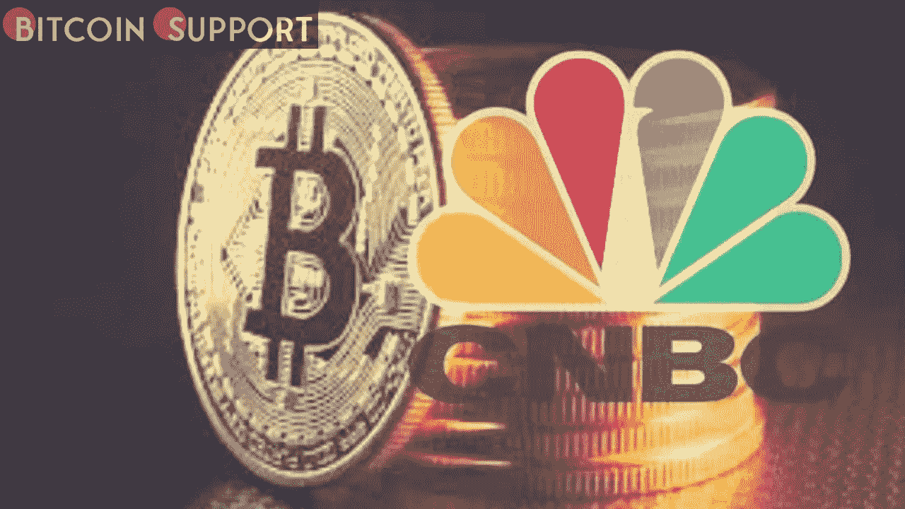
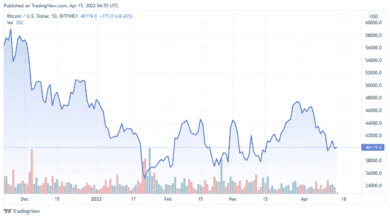

# 为了测试闪电网络，美国消费者新闻与商业频道向一名居住在波兰的乌克兰人发送了比特币，以便他可以试用。结局是什么？

> 原文：<https://medium.com/coinmonks/cnbc-sent-bitcoin-to-a-ukrainian-in-poland-to-test-the-lightning-network-what-is-the-result-d60e84e408c7?source=collection_archive---------52----------------------->

**Visit our website for full blog:-** [**https://bitcoinsupports.com/cnbc-sent-bitcoin-to-a-ukrainian-in-poland-to-test-the-lightning-network-what-is-the-result/**](https://bitcoinsupports.com/cnbc-sent-bitcoin-to-a-ukrainian-in-poland-to-test-the-lightning-network-what-is-the-result/)

主流媒体，即美国消费者新闻与商业频道，见证了闪电的力量。“我们把比特币从迈阿密转给了波兰的一名乌克兰人，他用不到三分钟的时间就把比特币换成了现金，”文章的标题写道。Alena Vorobiova 是获奖者，她在视频结束时的表情也说明了一切。比特币开发者格莱布·瑙门科(Gleb Naumenko)协助操作，麦肯齐·西加洛斯(MacKenzie Sigalos)代表美国消费者新闻与商业频道。她主持了比特币 2022 中最有吸引力的小组之一，实验时她仍在迈阿密。

**“底线是什么？”它的工作原理与比特币支持者声称的完全一样。**

朋友们，那就是闪电网的力量。让我们研究一下这种情况是如何形成的，以及为什么它对全世界的难民来说至关重要。事实上，对每个人来说。

**美国消费者新闻与商业频道寄了多少钱？**

根据美国消费者新闻与商业频道的说法，“资金提供者从美国向乌克兰汇 100 美元时，通常会收取 10%或更多的转账费用。“然而，你可能已经听说，她的国家目前的处境有些困难。她目前在波兰，更准确地说是在弗罗茨瓦夫市。场所内有 15 台比特币自动取款机。幸运的是，其中至少有一家允许闪电交易，这些交易包括:

“她最后得到了 170 兹罗提，这是波兰货币，大约相当于 100 000 萨特或 40 美元。自动取款机操作员收取 10 兹罗提的费用，大约是交易总额的 5.5%。

那当然是自动提款机的取款。虽然这是最简单的方法，但它不是将 BTC 兑换成法定货币的理想方法。闪电网络的费用“只是一角硬币的一小部分”，你最好记住这一点。此外，“例如，在波兰，有超过 175 台比特币自动取款机，允许携带比特币逃跑的难民将其兑换成法定货币。

然而，一个提前的提示是，你不需要一台收取 5%佣金的比特币 ATM 机来将 BTC 兑换成法定货币。由于 BTC 的高价值和高需求，该网络在全球范围内具有流动性。理解它并拥有法定货币的个人希望将他们的钞票兑换成 BTC。无论如何，“这一过程展示了缺乏现金和无法存取自己物品的移民如何使用加密货币钱包进行银行存款。"

**Visit our website for full blog:-** [**https://bitcoinsupports.com/cnbc-sent-bitcoin-to-a-ukrainian-in-poland-to-test-the-lightning-network-what-is-the-result/**](https://bitcoinsupports.com/cnbc-sent-bitcoin-to-a-ukrainian-in-poland-to-test-the-lightning-network-what-is-the-result/)

这整个情况是如何发生的？

事实证明，美国消费者新闻与商业频道转让给波兰的 BTC 起源于比特币所做的彼得·麦科马克(Peter McCormack)。去年 8 月，他通过从他的账户向我们的账户发送“100，000 satoshis(比特币的最小单位，约为 0.00000001 BTC)，训练美国消费者新闻与商业频道如何利用闪电网络向全球任何人进行即时支付。”转账总额约为 50 美元。”

美国消费者新闻与商业频道引用一位比特币常客的话来结束这篇报道。人权基金会的亚历克斯·格拉德斯坦告诉主流媒体我们都知道的事情:

“即使我在加利福尼亚，我也可以在任何时候把任何数额的钱即时转到你的手机上。“我们不关心你的难民身份。如果你没有波兰护照或银行账户，这没什么区别。这些都不重要。”

这就是比特币网络的实力。如果你使用 Lightning，所有这一切可能在几秒钟内发生，只需“几分之一便士”的费用。

**访问我们的网站获取完整博客:-**[**https://bitcoinsupports . com/CNBC-sent-bit coin-to-a-Ukrainian-in-Poland-test-the-lightning-network-what-is-the-the-result/**](https://bitcoinsupports.com/cnbc-sent-bitcoin-to-a-ukrainian-in-poland-to-test-the-lightning-network-what-is-the-result/)

**免责声明:以上为作者观点，不应视为投资建议。读者应该自己做研究。**

> 加入 Coinmonks [电报频道](https://t.me/coincodecap)和 [Youtube 频道](https://www.youtube.com/c/coinmonks/videos)了解加密交易和投资

# 另外，阅读

*   [AscendEx 保证金交易](https://coincodecap.com/ascendex-margin-trading) | [Bitfinex 赌注](https://coincodecap.com/bitfinex-staking) | [bitFlyer 审核](https://coincodecap.com/bitflyer-review)
*   [Bitget 回顾](https://coincodecap.com/bitget-review)|[Gemini vs block fi](https://coincodecap.com/gemini-vs-blockfi)cmd |[OKEx 期货交易](https://coincodecap.com/okex-futures-trading)
*   [AscendEx Staking](https://coincodecap.com/ascendex-staking)|[Bot Ocean Review](https://coincodecap.com/bot-ocean-review)|[最佳比特币钱包](https://coincodecap.com/bitcoin-wallets-india)
*   [霍比审核](https://coincodecap.com/huobi-review) | [OKEx 保证金交易](https://coincodecap.com/okex-margin-trading) | [期货交易](https://coincodecap.com/futures-trading)
*   [网格交易机器人](https://coincodecap.com/grid-trading) | [Cryptohopper 审查](/coinmonks/cryptohopper-review-a388ff5bae88) | [Bexplus 审查](https://coincodecap.com/bexplus-review)