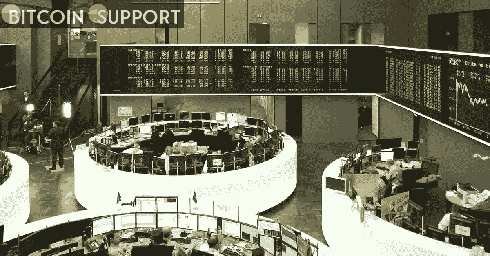
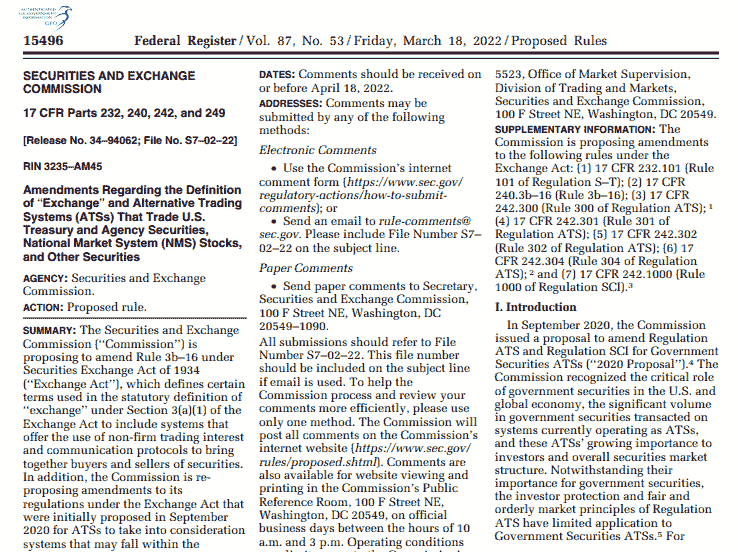
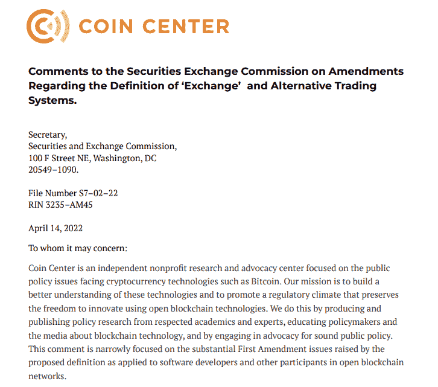

# 硬币中心表示，证交会对“交易所”一词的重新定义是“违宪的”。

> 原文：<https://medium.com/coinmonks/coin-center-challenges-the-secs-unconstitutional-redefining-of-the-term-exchange-a9b3f89b1a3?source=collection_archive---------53----------------------->

**Visit our website for full blog:-** [**https://bitcoinsupports.com/coin-center-challenges-the-secs-unconstitutional-redefining-of-the-term-exchange/**](https://bitcoinsupports.com/coin-center-challenges-the-secs-unconstitutional-redefining-of-the-term-exchange/)

这家总部位于 DC 华盛顿州的非营利组织认为，证交会对交易所的新定义严重越权，该定义将涵盖所有交流方式，而不仅仅是交易。区块链一家非盈利倡导组织——硬币中心(Coin Center)称，美国证券交易委员会(SEC)重新定义“交易所”的提议是“违宪的越权行为”

游说团体在一份书面回应中发表了上述评论，该回应是针对美国证券交易委员会 3 月 18 日对“交易所”定义的修正案，该修正案详细阐述了将“交易所”的定义从一种证券的“集合订单的系统”改为“集合买家和卖家的系统”

**Visit our website for full blog:-** [**https://bitcoinsupports.com/coin-center-challenges-the-secs-unconstitutional-redefining-of-the-term-exchange/**](https://bitcoinsupports.com/coin-center-challenges-the-secs-unconstitutional-redefining-of-the-term-exchange/)

将订单(即事物)带到一起与将人带到一起截然不同，Coin Center 断言后者无异于胁迫。

规则的改变暗示着通信协议系统也是交易所，吸引了仅仅为了密码交易而共享代码的程序员。如果该提议被 SEC 采纳为一项规则，UniSwap (UNI)和 PancakeSwap (CAKE)等分散式交易所(DEX)将被告知，SEC 要求它们注册为交易所。根据硬币中心的说法，这种向“基于语音的定义”的转变将影响“成千上万的开发者、出版商和再版者”，他们交易代码而不是代币。对于 DEX 的开发者来说尤其如此。

**Visit our website for full blog:-** [**https://bitcoinsupports.com/coin-center-challenges-the-secs-unconstitutional-redefining-of-the-term-exchange/**](https://bitcoinsupports.com/coin-center-challenges-the-secs-unconstitutional-redefining-of-the-term-exchange/)

4 月 14 日，这家非营利组织以冗长的评论回应了拟议中的变化，宣布这是违宪的，并引用了最高法院(SC)的先例，认为这可能迫使 SEC 撤回其提议:

**“这种方式将创建一个过于宽泛的注册标准，对数以万计的软件开发人员和技术人员受保护的言论活动施加违宪的事先限制。”**

根据美国证券交易委员会(SEC)的说法，将通信协议系统纳入“交易”的定义，承认了个人买方和卖方从市场内的通信中获得的价值。根据该报告，将这些用户包括在定义中有助于“减少类似市场之间的监管差异。”

另一方面，硬币中心认为，新定义是企图限制言论自由，违反了第一修正案。在开创性的 1985 年 Lowe 诉 SEC 一案中，SEC 被指控正是这样做的。SEC 试图通过出版一份金融时事通讯来迫使 Lowe 停止在该案中担任投资顾问。在最高法院裁定他的时事通讯受言论自由保护后，Lowe 赢了这场官司。在 Lowe 诉 SEC 一案中，Coin Center 表示，委员会“通过对其法定权力的过度解释，威胁了美国人的言论自由权。在 4 月 18 日之前，SEC 将接受美国公民对该规则提案的评论。

去年 11 月，基础设施法案获得通过，要求软件开发商、交易验证商和节点运营商作为加密经纪人报税，加密行业的许多人认为这个定义过于宽泛。

**访问我们的网站获取完整博客:-**[**https://bitcoinsupports . com/coin-center-challenges-the-secs-违宪-redefining-of-the-term-exchange/**](https://bitcoinsupports.com/coin-center-challenges-the-secs-unconstitutional-redefining-of-the-term-exchange/)

**免责声明:以上为作者观点，不应视为投资建议。读者应该自己做研究。**

> 加入 Coinmonks [电报频道](https://t.me/coincodecap)和 [Youtube 频道](https://www.youtube.com/c/coinmonks/videos)了解加密交易和投资

# 另外，阅读

*   [Bookmap 点评](https://coincodecap.com/bookmap-review-2021-best-trading-software) | [美国 5 大最佳加密交易所](https://coincodecap.com/crypto-exchange-usa)
*   最佳加密[硬件钱包](/coinmonks/hardware-wallets-dfa1211730c6) | [Bitbns 评论](/coinmonks/bitbns-review-38256a07e161)
*   [新加坡十大最佳加密交易所](https://coincodecap.com/crypto-exchange-in-singapore) | [购买 AXS](https://coincodecap.com/buy-axs-token)
*   [红狗赌场评论](https://coincodecap.com/red-dog-casino-review) | [Swyftx 评论](https://coincodecap.com/swyftx-review) | [CoinGate 评论](https://coincodecap.com/coingate-review)
*   [投资印度的最佳密码](https://coincodecap.com/best-crypto-to-invest-in-india-in-2021)|[WazirX P2P](https://coincodecap.com/wazirx-p2p)|[Hi Dollar Review](https://coincodecap.com/hi-dollar-review)