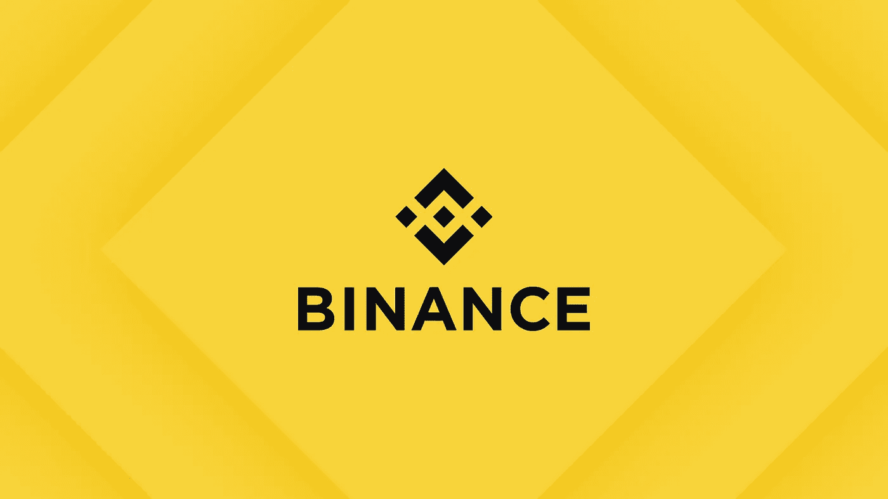
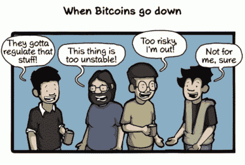

# 硬币兑换的故事——币安

> 原文：<https://medium.com/coinmonks/coin-exchange-story-binance-77f8b1621b99?source=collection_archive---------70----------------------->

你好！大家都好吗？:)*今天，我们要谈谈另一个交易所，币安！*

From Binance.com

币安是一家快速发展的加密货币交易所，由华裔加拿大人赵长鹏于 2017 年创立。

By Pamela Ambler on Forbes

这是世界上最大的加密货币交易所之一。

*(我们很快会上传关于赵昌鹏的帖子。如果你好奇，请给我们一个关注。* ❤️ *)*

## 币安的愿景

令人惊讶的是，币安的愿景是让加密货币为更多人所知，而无需大规模增加。

GIF on Tenor

## 币安的排名和成交量

币安实际上是世界上使用最广泛的交易所之一，所以它非常有名，排名也很高。

From CoinMarketCap

排名一直来回，我就不详细说了。

24 小时交易价格为 16.0434 亿韩元。

*(请注意实时变化。)*

## 币安的优势和劣势

与许多其他 exchange 应用相比，币安以提供稳定的速度和服务而闻名。

另外，你可以进行现货和期货交易。

由于有各种各样的硬币，你可以认为大多数加密货币在币安交易。​

*缺点是韩语不支持，所以对我们韩国人来说会很不方便……*

*然而，有如此多的其他不同的加密货币和方便的应用程序得到支持，所以许多韩国人都在寻找它们。*

## 币安期货交易

币安期货有 USD-M 和 Coin-M，我会告诉你两者的区别。

USD-M 使用美元作为证据进行交易，Coin-M 使用虚拟货币和加密货币作为证据进行交易。

由于美元的流动性相对于硬币来说要小一些，所以在此通知大家，用硬币交易风险要大一点！

GIF on Tenor

## 币安发射台

币安发射台是为币安硬币(BNB)持有者提供的服务。

Launchpad 是一个 IEO(通过交易所公开销售硬币)概念。

这里显示的硬币是新上市的硬币，但在许多情况下，它们已经在其他交易所上市。

(在声明发布前一周，我持有的 BNB 股票变成了我可以认购的数量。)

From Binance.com

> 我们已经谈到了币安，第二个加密货币交易所。你觉得怎么样？
> 
> 关于交流，硬币和 NFT 的问题和讨论总是受欢迎的。
> 
> 我希望你今天过得开心！
> 
> 如果您有任何问题或想要获得硬币相关的信息，请随时来和我们下面的社区交谈:)
> 
> 推特:[https://twitter.com/el_coinmonster](https://twitter.com/el_coinmonster)
> 
> 然后，下一个故事再见！​

> 加入 Coinmonks [电报频道](https://t.me/coincodecap)和 [Youtube 频道](https://www.youtube.com/c/coinmonks/videos)了解加密交易和投资

# 另外，阅读

*   [Bookmap 点评](https://coincodecap.com/bookmap-review-2021-best-trading-software) | [美国 5 大最佳加密交易所](https://coincodecap.com/crypto-exchange-usa)
*   最佳加密[硬件钱包](/coinmonks/hardware-wallets-dfa1211730c6) | [Bitbns 评论](/coinmonks/bitbns-review-38256a07e161)
*   [新加坡十大最佳加密交易所](https://coincodecap.com/crypto-exchange-in-singapore) | [购买 AXS](https://coincodecap.com/buy-axs-token)
*   [红狗赌场评论](https://coincodecap.com/red-dog-casino-review) | [Swyftx 评论](https://coincodecap.com/swyftx-review) | [CoinGate 评论](https://coincodecap.com/coingate-review)
*   [投资印度的最佳密码](https://coincodecap.com/best-crypto-to-invest-in-india-in-2021)|[WazirX P2P](https://coincodecap.com/wazirx-p2p)|[Hi Dollar Review](https://coincodecap.com/hi-dollar-review)