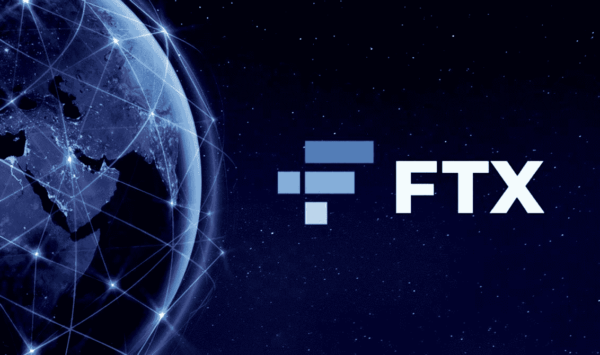
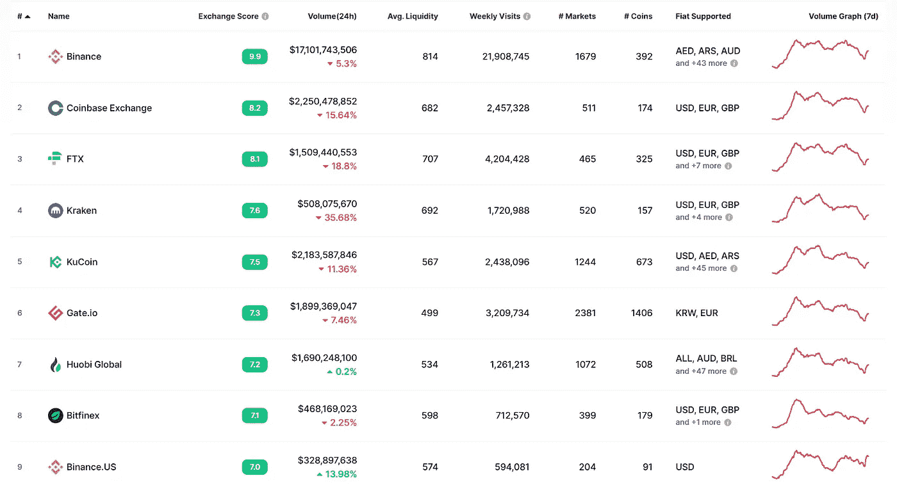
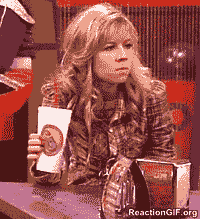
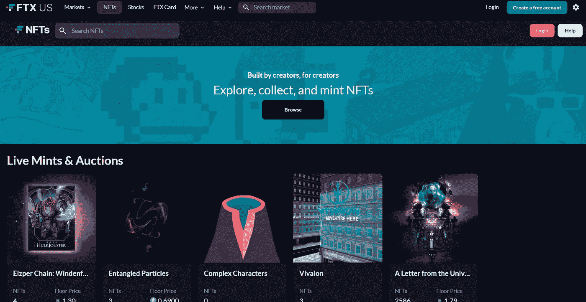

# 硬币兑换的故事——FTX

> 原文：<https://medium.com/coinmonks/coin-exchange-story-ftx-c90d9361e3b3?source=collection_archive---------44----------------------->

大家好:)

今天，我给你带来了一个交易故事，你可能想知道更多。

有演员般的创始人，所以大家，集中注意力！😉

GIF from Giphy

*那么，我们开始吧？*

## FTX 交易所

By Caroline Kuria on Bitcoin KE

FTX 交易所成立于 2019 年。

根据当前时间，可交易的虚拟货币数量为 317 个硬币。

根据目前的硬币市值，它排名第三。

screenshot of Coin Market Cap (as of April 30, 2022 at 11:18pm PST)

这是最大的交易所之一，24 小时交易量为 1，509，440，553 美元。

## FTX 创始人

山姆·班克曼·弗里德

From Forbes

*   1992 年 3 月 6 日出生
*   毕业于麻省理工学院
*   他创建了加密货币交易所 FTX，现任首席执行官

2021 年，《福布斯》将他列为美国 400 富豪榜上最年轻也是唯一一个 20 多岁的人，排名第 32 位。

哇，他不年轻吗？这么小的年纪，我能想到的只有…

GIF from Giphy

*(我嫉妒…)*

## FTX 的优点

🌟杠杆交易每一种可以最大化利润的虚拟货币都是可能的，有各种各样的头寸。

*(杠杆？简单来说就是一个借钱的概念。它没有利息，没有期限，是无限期无息交易。例如，如果你将 100 万韩元杠杆化 10 次，你可以购买 1000 万韩元)*

🌟FTX 交易所是世界上唯一允许直接卖空和卖空美国股票的交易所，如特斯拉、亚马逊、苹果和谷歌。类似于 KOSPI 期货 ETF 和杠杆代币。

## FTX 的硬币

From CoinMarketCap

FTX 硬币是 FTX 交易所自己的硬币。

它在币安扮演着与 BNB 相同的角色。

FTT 的赌注也由 FTX 来承担，所以参与其中会很好。

## FTX 的 NFT 交易所

screenshot of FTXUS

你可以通过他们的 NFT 交易所探索、收集和铸造 NFT。

## C2X IEO 进步

这几天很流行🔥

from Google Play

Com2uS 硬币是韩国硬币，但它成为一个问题，因为韩国不能作为参赛国参加 IEO。

很遗憾，事实是我们不能参加，因为交易所已经禁止了…

↓网址↓

 [## FTX

### FTX 加密货币衍生品交易所，由交易商建立，面向交易商。买卖 BTC，瑞士联邦理工学院，溶胶代币和期货…

ftx.com](https://ftx.com/c2x-ieo) 

> 今天的 FTX 交易所故事怎么样？
> 
> 我觉得我很享受。
> 
> 如果你有更多的问题或想获得硬币相关的信息，请随时来和我们下面的社区交谈。:)
> 
> 推特:[https://twitter.com/el_coinmonster](https://twitter.com/el_coinmonster)
> 
> 然后，下一个故事再见！

> 加入 Coinmonks [电报频道](https://t.me/coincodecap)和 [Youtube 频道](https://www.youtube.com/c/coinmonks/videos)了解加密交易和投资

# 另外，阅读

*   [CoinDCX 评论](/coinmonks/coindcx-review-8444db3621a2) | [加密保证金交易交易所](https://coincodecap.com/crypto-margin-trading-exchanges)
*   [红狗赌场评论](https://coincodecap.com/red-dog-casino-review) | [Swyftx 评论](https://coincodecap.com/swyftx-review) | [CoinGate 评论](https://coincodecap.com/coingate-review)
*   [Bookmap 评论](https://coincodecap.com/bookmap-review-2021-best-trading-software) | [美国 5 大最佳加密交易所](https://coincodecap.com/crypto-exchange-usa)
*   [如何在 FTX 交易所交易期货](https://coincodecap.com/ftx-futures-trading) | [OKEx vs 币安](https://coincodecap.com/okex-vs-binance)
*   [CoinLoan 评论](https://coincodecap.com/coinloan-review) | [YouHodler 评论](/coinmonks/youhodler-4-easy-ways-to-make-money-98969b9689f2) | [BlockFi 评论](https://coincodecap.com/blockfi-review)