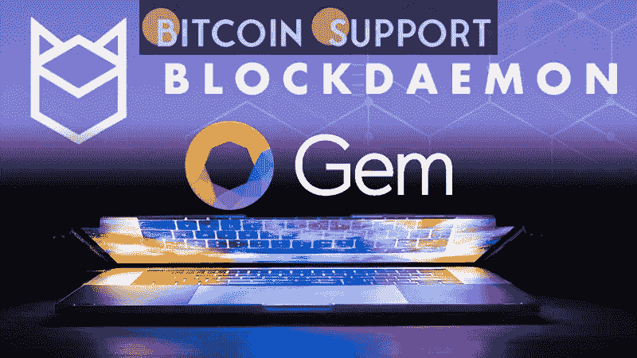

# Blockdaemon 收购了一家名为 Gem 公司硬币

> 原文：<https://medium.com/coinmonks/coin-onramp-company-gem-has-been-acquired-by-blockdaemon-e4f513544477?source=collection_archive---------63----------------------->

**Visit our website:-** [**https://bitcoinsupports.com/**](https://bitcoinsupports.com/)

Gem 的入职和离职解决方案将集成到区块链基础设施平台中。区块链领先的基础设施平台 Blockdaemon 以未知金额购买了加密货币入口业务 Gem。

Gem 是一家应用编程接口(API)提供商，提供平面到加密的斜坡和斜坡，或者连接货币和数字资产。此外，该公司还提供贸易数据汇总和了解您的客户(KYC)解决方案。

block daemon 区块链节点架构具有机构级安全性和监控功能，支持用户对节点进行标记、扩展和部署。该平台目前支持 50 多个不同的区块链网络，主要由交易所、托管机构、加密货币平台和金融机构使用。

“我们的目标是为机构提供完整的节点堆栈，包括专用实例、高可用性集群、抽象 API，以及通过赌注和流动性获得收益的节点。”Blockdaemon 首席执行官康斯坦丁·里希特(Konstantin Richter)告诉。“我们认为节点应该服务的另一个领域，对我们的机构客户群至关重要，是菲亚特的入口和出口。”

虽然加密货币的入口往往是“可怕和糟糕的产品”，但 Richter 表示，设计良好的入口可以提供新的基于交易的收入流。今年早些时候，Blockdaemon 进行了 2.07 亿美元的 C 轮投资，对该公司的估值为 32.5 亿美元。

Blockdaemon 将整合 Gem 的嵌入式用户界面(UI)流和 API，使用户能够通过分散式金融平台 Celsius 和支付平台 MoonPay 利用的入口服务，从 125 个国家获得 40 多种加密货币。

“让任何人从任何地方接受现金，并将它们连接到另一个支付或收益平台，类似于 Stripe，变得非常简单，”Richter 解释了 Blockdaemon 收购 Gem 的原因。“最终，它是基于交易的支付收入和固定入口和出口收入。”

**访问我们的网站:-**[**https://bitcoinsupports.com/**](https://bitcoinsupports.com/)

**免责声明:以上为作者观点，不应视为投资建议。读者应该自己做研究。**