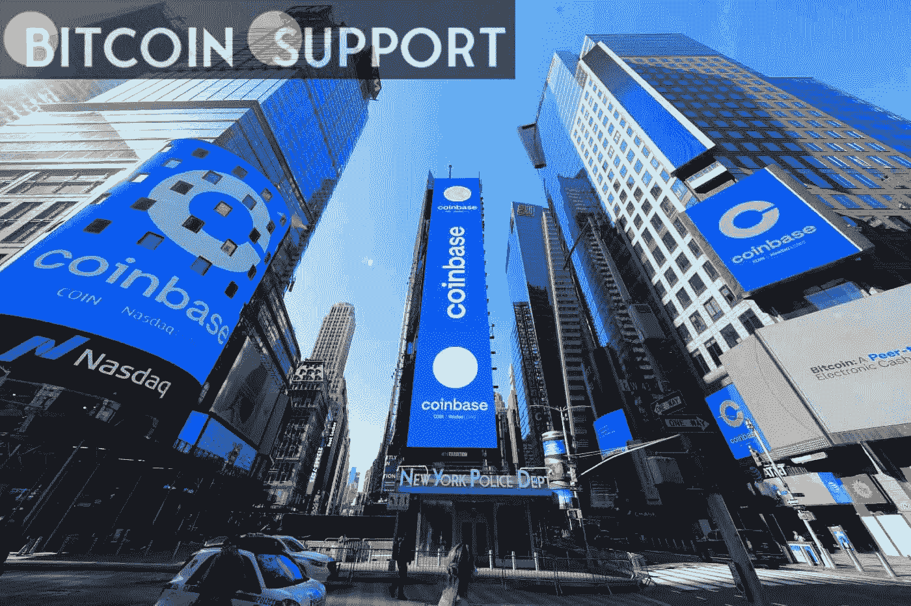

# 一旦税收法规变得更加清晰，比特币基地计划投资印度加密货币和 Web3

> 原文：<https://medium.com/coinmonks/coinbase-is-planning-to-invest-in-indian-cryptocurrency-and-web3-once-tax-regulations-become-dbc244ced75a?source=collection_archive---------42----------------------->

**Visit our website:-** [**https://bitcoinsupports.com/**](https://bitcoinsupports.com/)

比特币基地风险投资公司将在孟加拉鲁鲁举办一场面对面的推介活动，通过投资 crypto 和 Web3 来帮助印度实现金融普惠的愿望。美国比特币基地加密交易所的投资部门比特币基地风险投资公司宣布，计划通过一场面对面的推介活动，向各种印度加密货币和 Web3 项目投资 100 万美元。

比特币基地首席执行官 Brian Armstrong 在印度撰写的博客中表示，这家风险投资公司计划使用 crypto 和 Web3 技术来利用印度的软件专业知识，并帮助加快印度的经济和金融包容性雄心。

4 月 8 日，将与 Buidlers 部落合作在 Bengaluru 举办一场面对面的投球日，信仰道还提供高达 25000 美元的奖金。有争议的加密税法带来的新的监管清晰度可以归功于国际投资者对印度加密市场日益增长的兴趣。根据 4 月 1 日生效的印度秘密税法，所有印度公民都必须缴纳未实现秘密收入的 30%作为税款。此外，投资者将无法平衡任何加密损失以减轻税收。

当被问及对 Web3 作为颠覆者的普遍看法时，Buidlers Tribe 的联合创始人 Pareen Lathia 表示，印度企业家渴望在国际上扩展他们的业务。Lathia 指出了新税法对吸引外国投资的影响:

**“税收立法只是朝着正确方向迈出的一步。这是一个范式的转变，立法也会相应调整。”当印度财政部长 Nirmala Sitharaman 表示她打算在不久的将来重新考虑加密税时，比特币基地的首次亮相吸引了超过 110 名申请者。据阿姆斯壮称，比特币基地此前已向印度的加密和 Web3 公司投资了 1.5 亿美元，并计划在其印度创新集群雇佣 1000 人。阿姆斯特朗认为，立法是对外国投资的明确鼓励。

**“印度是一个神奇的国家，我感觉加密货币在这里前景光明。”我们很高兴成为塑造这一未来的一部分，这次活动是关键的第一步。"**

阿姆斯特朗仍然处于在美国实现加密货币监管确定性的最前沿。去年，比特币基地克服了美国国会和证券交易委员会提出的各种监管挑战。因此，这项业务可能会在围绕加密货币的全球监管讨论中发挥关键作用。作为数字印度计划的一部分，马哈拉施特拉邦政府开始使用多边形区块链技术来颁发种姓证书。

马哈拉施特拉邦政府与 LegitDoc 合作，分发了 65，000 份种姓证书，以帮助分配政府计划和福利。

印度行政服务局(IAS)的一名官员 Shubham Gupta 表示，印度政府一直在寻找能够帮助公民服务民主化的创新技术:

**“Web3 将民主化的概念带到了一个全新的水平，在 web 3 中，数据/信息不仅可以公开共享，还可以公开不可伪造。"**

**访问我们的网站:-**[**https://bitcoinsupports.com/**](https://bitcoinsupports.com/)

**免责声明:以上为作者观点，不应视为投资建议。读者应该自己做研究。****

> 加入 Coinmonks [电报频道](https://t.me/coincodecap)和 [Youtube 频道](https://www.youtube.com/c/coinmonks/videos)了解加密交易和投资

# 另外，阅读

*   最佳[区块链分析](https://bitquery.io/blog/best-blockchain-analysis-tools-and-software)工具| [赚比特币](/coinmonks/earn-bitcoin-6e8bd3c592d9)
*   [Cloudbet 赌场评论](https://coincodecap.com/cloudbet-casino-review) | [点火赌场评论](https://coincodecap.com/ignition-casino-review)
*   [加密套利](/coinmonks/crypto-arbitrage-guide-how-to-make-money-as-a-beginner-62bfe5c868f6)指南| [如何做空比特币](/coinmonks/how-to-short-bitcoin-568a2d0b4ae5)
*   [如何在加拿大购买加密货币？](https://coincodecap.com/how-to-buy-cryptocurrency-in-canada)
*   [无聊猿游艇俱乐部(BAYC)回顾](https://coincodecap.com/bored-ape-yacht-club-bayc-review) | [拜比特 vs 比特币基地](https://coincodecap.com/bybit-vs-coinbase)