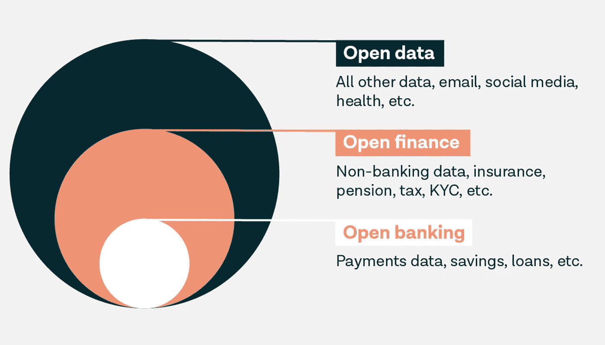
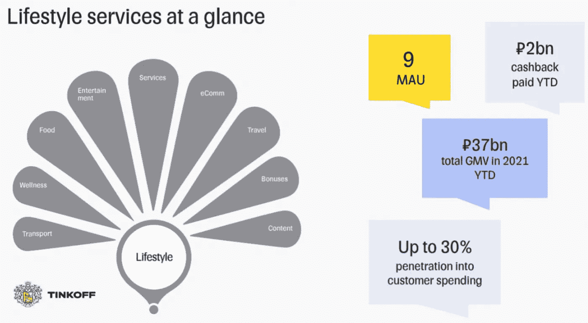
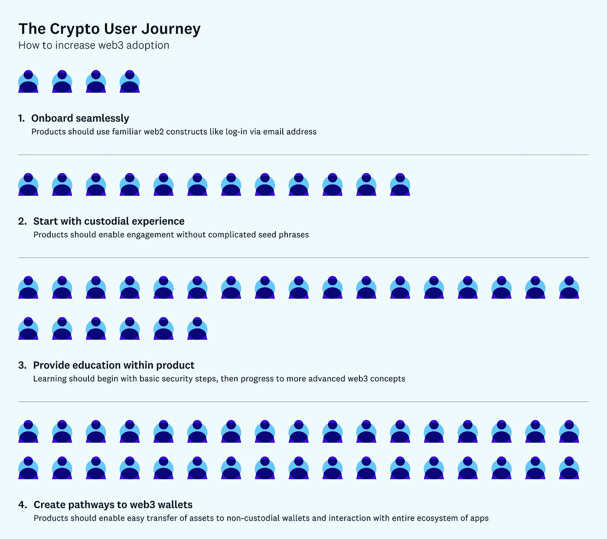
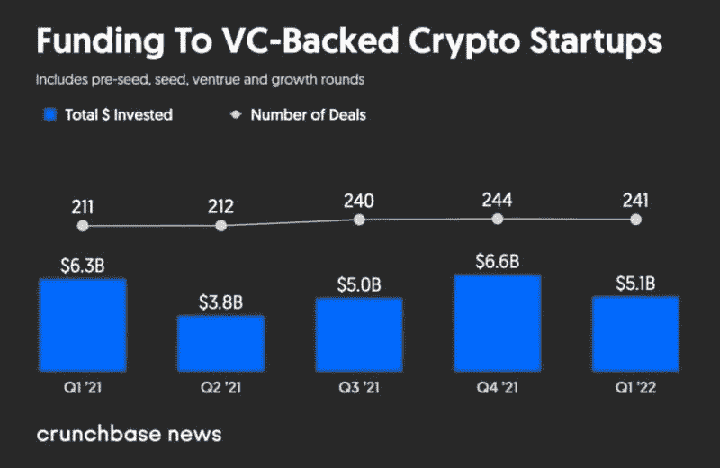
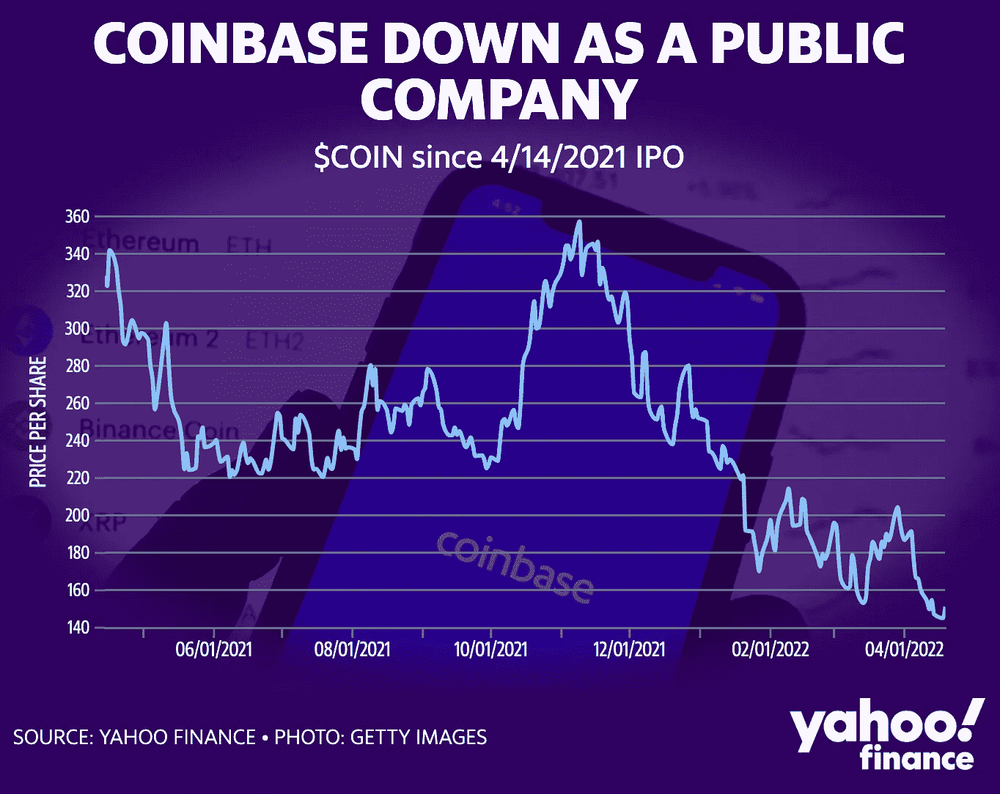
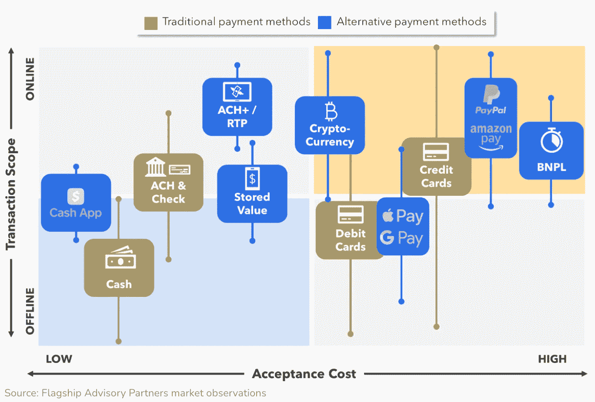
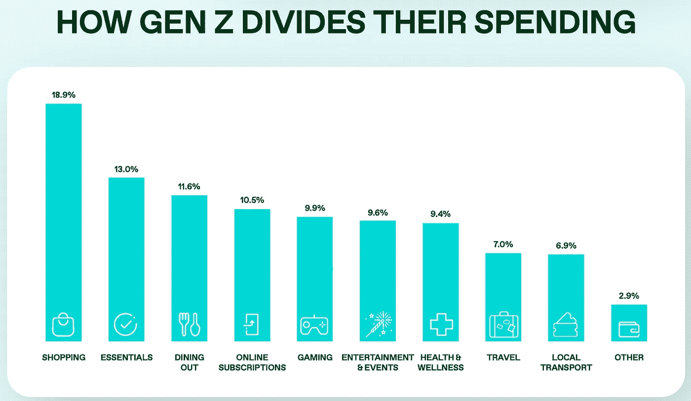

# 比特币基地 NFT 平台终于上线了；加密用户之旅；开放金融有什么好处？；

> 原文：<https://medium.com/coinmonks/coinbase-nft-platform-is-finally-live-the-crypto-user-journey-what-are-the-benefits-of-open-7f0f656a9153?source=collection_archive---------14----------------------->

# 在这个版本中:

1.  万事达卡在元宇宙
2.  比特币基地 NFT 平台终于上线了
3.  开放金融有什么好处？
4.  比特币公司 Crusoe Energy 筹集了 5.05 亿美元来支持火炬气开采业务
5.  投资超个性化生活方式产品
6.  加密用户之旅
7.  尽管玉米产量不断增长，但该行业也不能幸免于宏观趋势
8.  周五，比特币基地股票跌至历史最低点
9.  寻找其他支付方式
10.  蓝天仍然是一家独立的公司
11.  Z 世代拥抱数字技术来管理他们的钱

# 万事达卡在元宇宙

万事达卡已经加入了主要支付公司和银行争夺元宇宙的行列，提交了与非金融交易、虚拟世界等相关的新文件。

万事达卡在 4 月 7 日提交的 15 项申请包括 NFT 支持的多媒体、数字商品市场、支付交易处理和元宇宙的电子商务软件业务交易。

这些申请是以 10 亿英镑为基础提交的，这意味着未来有使用它们的意图，尽管公司计划何时使用它们以及如何使用还不清楚。

与 1a 申请不同，1a 申请是为了“实际使用”，1b 申请不需要向政府证明商标已经被使用。

相反，一家公司必须显示出在未来某个日期使用该商标的“善意意图”。

Visa 进入生态系统已经有一段时间了，在团队中增加了加密人员，并在去年夏天购买了一个加密朋克。

上个月，美国运通在其他领域申请了与万事达类似的商标，用于“促进虚拟支付卡转移到电子移动钱包的可下载计算机软件”。

虽然术语“元宇宙”没有统一的定义，但该术语出现在美国运通的应用程序中，描述“元宇宙和其他虚拟世界中的交易认证服务、路由、授权和结算服务以及欺诈检测和控制服务”

对于万事达卡应用程序，术语元宇宙出现在描述“元宇宙和其他虚拟世界中的文化活动、慈善活动、音乐会、体育活动、旅游体验、美食活动、节日和颁奖典礼的财务赞助”时

这个商标并不是万事达卡首次进入区块链和加密领域。

今年早些时候，万事达卡与[比特币基地](https://www.linkedin.com/company/coinbase/)签署了一项协议，以支持其 NFT 市场。

但此举凸显了企业间的一个更大趋势。虽然 2021 年 2 月有大约 13 项元宇宙商标申请，但到 2022 年 2 月这一数字跃升至 257 项。

[来源。](https://www.paymentscardsandmobile.com/mastercard-joins-gold-rush-into-the-metaverse/)

# 比特币基地 NFT 平台终于上线了

[比特币基地](https://www.linkedin.com/company/coinbase/)今天宣布，在正式宣布其长期以来备受争议的计划六个月后，其 NFT 市场正式推出有限访问测试版。

比特币基地 NFT 现在可以选择从等待名单中添加的用户，该名单自 10 月以来已积累了数百万潜在会员。据该交易所称，它将按照注册顺序添加用户，并计划在“未来几周”添加所有人

P2P 市场已经推出，支持以太坊上制作的 NFT，以太坊是 NFT 艺术品和收藏品的领先平台，比特币基地表示，它计划在不久的将来增加对其他未指定的区块链平台的支持。

比特币基地·NFT 将汇集来自各个市场的物品，一名代表告诉 Decrypt，“任何在区块链以太坊出售的 NFT 都可以在这个平台上搜索到”。

比特币基地的平台将首次推出，没有额外的交易费，尽管它仍然有标准的以太坊燃气费。该市场最终将引入自己的费用，比特币基地产品副总裁 [Sanchan S Saxena](https://www.linkedin.com/in/ACoAAADk134BsYRPtu1SL078IHLwbFnvpyLxRtE) 在媒体简报中称之为“低个位数的费用”

在推出时，比特币基地 NFT 只能与比特币基地钱包和 MetaMask 等自保管钱包以及支持 WalletConnect 协议的钱包一起使用。这意味着用户对自己钱包中的资产负全部责任，钱包可以连接到其他市场、交易所和分散的应用程序。

然而，最终，比特币基地 NFTs 计划推出可选的 NFT 托管服务，让用户用比特币基地账户或信用卡购买 NFT。Saxena 将这一计划中的举措描述为“通过这一平台将 NFTs 带给大众”的努力的一部分。

[来源。](https://decrypt.co/98211/coinbases-ethereum-nft-marketplace-launches-in-beta)

# 开放金融有什么好处？

正如我们所知，开放的银行业已经使金融民主化和转型。开放金融是这一旅程的下一步，将鼓励第三方提供商和传统封闭的金融业之间的合作。开放金融对企业和个人都有好处:消费者将更容易获得他们的财务数据，并了解他们的财务状况。获取更多信息有助于做出更好的财务决策。

随着开放金融的透明度，消费者也可以更好地控制自己的财务。开放金融是走向开放数据之旅的一站，每个人都可以选择谁可以访问他们的数据——金融和其他。

开放金融:规则和条例

开放银行和开放金融的最大区别在于，开放银行部分受到法律框架的监管，而开放金融则没有(目前还没有)。

正如你现在可能知道的，欧洲的开放银行业务部分受 PSD2 监管，即修订后的支付服务指令。该指令于 2018 年生效，使开放金融服务业成为可能，希望未来的开放金融监管将继续这一发展。

开放金融，即获取有关您的投资资产、养老金和其他类型的金融服务的信息，不受任何金融法规的约束。但这可能很快会改变。欧盟委员会和英国金融行为监管局(FCA)都在调查是否有必要监管开放金融。目标是通过竞争和市场创新促进金融健康发展。

开放金融——开放银行的下一步

因此，简而言之:开放金融就像是开放银行的延续。这是金融民主化的下一个阶段，它将完成开放银行业开创的事业:创造公平的竞争环境，让消费者获得更好的定制金融之旅。企业可以获得更相关的数据，更顺利地获得新客户，以及可扩展的、经得起未来考验的金融科技解决方案。

[出处。](https://bit.ly/36xtXUo)

# 比特币公司 Crusoe Energy 筹集了 5.05 亿美元来支持火炬气开采业务

不要浪费精力。这就是克鲁索能源系统背后的想法，该系统将原本会被浪费的天然气转化为比特币采矿的动力。

这家美国公司今天宣布，它已经在由 [G2 Venture Partners](https://www.linkedin.com/company/g2vp/) 牵头的 C 轮融资中筹集了 3.5 亿美元。这轮融资还带回了前几轮的投资者，其中有 [Polychain Capital](https://www.linkedin.com/company/polychain-capital/) 、[贝恩资本风险投资](https://www.linkedin.com/company/bain-capital-ventures/)和[文克莱沃斯资本](https://www.linkedin.com/company/winklevoss-capital/)。

除了 Crusoe 已经筹集的 C 轮股权，它还从 [SVB 资本](https://www.linkedin.com/company/svb-capital/)、 [Sparkfund](https://www.linkedin.com/company/sparkfunder/) 获得了高达 1.55 亿美元的信贷，并产生了资本，使其总共有 5.05 亿美元可供使用。

Crusoe 表示，这笔资金将使其能够在 157 名员工的基础上再雇佣近 100 名员工，同时帮助其扩大在美国和海外的比特币挖矿和云计算业务。

Crusoe 战略的关键是其注册商标的数字火炬缓解系统，该公司称该系统“提供了一种消除路线火炬的低成本解决方案。”

燃烧是燃烧不能轻易移动或捕获的天然气的做法。虽然这是一种低效的资源利用，但从天然气公司的角度来看，这比实际利用天然气要经济得多。

克鲁索帮助开创了利用多余的天然气发电的过程，并为现场的比特币挖矿机提供动力。这样，气体就不会燃烧，也不会被转移到其他地方。

然而，减轻耀斑对这一论点不利，因为使用多余的气体开采比特币比燃烧它并向空气中排放更多的碳更清洁——尽管环保主义者可能会认为这只是刺激了对更多比特币的需求。

[出处。](https://decrypt.co/98424/bitcoin-firm-crusoe-energy-raises-505-million-grow-flare-gas-mining-business)

# 投资超个性化生活方式产品

过去几年的一个新兴趋势是超级应用模式。在所有行业，不仅限于银行业，公司都在捆绑服务，从[苹果](https://www.linkedin.com/company/apple/)、[谷歌](https://www.linkedin.com/company/google/)、 [PayPal](https://www.linkedin.com/company/paypal/) 和[亚马逊](https://www.linkedin.com/company/amazon/)，到零售商、电信公司、金融企业和传统参与者，如[高盛](https://www.linkedin.com/company/goldman-sachs/)。所有这些公司都开始围绕客户的生活方式提出建议，将金融、购物、餐饮和旅游服务(仅举几例)捆绑在一起，旨在提高参与度，成为客户的一站式商店。

通俗地说，生活方式银行利用技术和消费者数据来识别新的机会，即全面了解消费者的生活方式，以解决及时的痛点或创造愉快的体验。金融服务内部和外部的合作伙伴正在利用已建立的知名度、信任和及时的利基产品来满足消费者的生活方式需求。数字参与是所有超级应用主张的核心。

一个最好的例子是俄罗斯数字银行 Tinkoff，它已经盈利多年。它在俄罗斯开创了生活方式银行模式，将旅游和娱乐预订等增值服务以及移动网络捆绑到一个超级应用程序中，以满足各种需求。这吸引了更多参与度更高的用户加入该银行，这些用户最初可能出于非财务原因加入，现在 Tinkoff 生活方式客户的月购买量是 Tinkoff 普通(非生活方式)客户的两倍。

Tinkoff 生活方式带来的收入通过返现和促销再投资于客户忠诚度。加深与消费者的关系并赢得忠诚度对银行来说至关重要，因为它可以带来更高的收入、更低的运营成本和更满意的客户，这是吸引更多客户的完美鸡尾酒。

数字银行向生活方式银行产品的融合正在改变客户的旅程，并带来更大的个性化。它确保客户在实际需要时能够获得他们想要的服务，并允许进一步的差异化。这些产品的开发既是收入多元化和收入增加的原因，也是其结果，从而提高了以客户为中心的业务模式的可持续性。

[出处。](https://www.c-innovation.eu/post/evolution-of-successful-digital-banking-models)

# 加密用户之旅

在主流采用方面，Crypto 面临着一个主要障碍:用户的旅程很复杂，而且尚未建成，对于刚接触 crypto 的人来说，即使是做最简单的事情——完全控制自己的数字资产——也一点都不容易或不直观。

当然，投资 crypto 并不要求用户完全控制他们的资产。像比特币基地这样的集中交易所已经证明了交易加密的“托管”模式的有效性，在这种模式下，人们将他们的资产交给一个保管人，该保管人保护并跟踪他们的资产。

这种模式的主要优势是方便:任何人都可以相对容易地使用比特币基地应用或其他交易所购买 crypto，而不必写下“种子短语”，这是一串组成控制资产访问的“私钥”的单词。通过这种方式，用户可以买卖各种加密货币，用它们交换其他加密货币，使用资产进行购买和支付，并很快购买 NFT。

然而，通过托管人很难进一步进入更广泛的 web3 生态系统，即完全分散的可互操作应用和网络——不仅仅是交易所，还包括即玩即赚游戏、令牌化社交网络、粉丝互动社区和其他丰富的用户体验。这种 web3 体验需要将他们的密码发送到一个非托管的钱包中，在这个钱包中，除了用户之外没有人持有私钥，并且可以进行的交易类型没有限制。

事实上，这是 crypto 最令人兴奋的部分，但也是我们看到如此多的第一次用户放弃的地方。Web3 产品不能指望用户立即从熟悉的集中式体验一步到位地飞跃到去中心化的最深处。大众市场加密体验的未来在于应用程序，这些应用程序提供熟悉的托管体验，并有能力升级到非托管体验。

代币和 NFT 对很多人来说已经很陌生了，一般人愿意探索新体验的程度在理论上是有限度的。在一个完全没有监管的环境中，大多数人会看一眼屏幕，屏幕上会提示他们写下一个 24 个词的“种子短语”(随机生成的短语，构成他们的“私钥”，或密码)，然后决定不值得。

如果目标是第一次使用密码的用户，那么体验必须是保管式的——至少在开始时是这样。

[来源。](https://future.a16z.com/missing-link-web2-web3-custody-wallets/)

# 尽管玉米产量不断增长，但该行业也不能幸免于宏观趋势

Crypto 有时似乎是风险投资的宠儿——不受经济放缓的影响，因为融资和估值只会上升。

然而，尽管今年迄今为止，加密领域诞生了 12 只独角兽，但与上一季度和去年第一季度相比，Q1 的风险投资金额有所下降。

根据 Crunchbase 的数据，第一季度风险投资支持的加密公司融资约 51 亿美元，低于去年第四季度流入该行业的 66 亿美元，也低于 2021 年第一季度的 63 亿美元。

然而，市场似乎也没有分崩离析。由于对加息、通胀和地缘政治紧张局势的担忧加剧，第一季度全球风险投资下降。此外，Q1 仍然看到了与任何季度相当的重大交易流，实际上看到了比去年任何一个季度都多的风险投资。

虽然资金数量可能不均衡，但 crypto 的独角兽类别越来越大。今年迄今为止，已有 12 家新公司加入这一行列，包括:

总部位于旧金山的 FTX 美国公司，以 80 亿美元的估值筹集了 4 亿美元。

[币安。美国](https://www.linkedin.com/company/binance-us/)——币安的美国特许经营——在种子期筹集了超过 2 亿美元，投前估值为 45 亿美元。

总部位于迈阿密的[宇迦实验室](https://www.linkedin.com/company/yuga-labs/)以 40 亿美元的估值完成了一轮 4.5 亿美元的种子融资。

去年，总共有超过 30 只独角兽诞生在加密领域。最重要的是，今年超过六家之前被冠以隐密玉米的公司以更高的估值筹集了更多的资金。

变潮？

虽然总体而言，crypto 似乎不受当前融资放缓的影响，但该领域的一些人看到了情况的变化。

Jai Das 是 Sapphire Ventures[的合伙人、总裁和联合创始人，他投资于加密技术，他说他看到加密公司今年试图筹集大量资金，但未能获得所需的所有投资者。](https://www.linkedin.com/company/sapphirevc/)

“他们可以获得领先，但他们无法完成这一轮，”他说。"这是 2 亿美元和 3 亿美元的融资."

Das 说，与 Patel 类似，许多加密公司产生的收入以及许多代币在市场上看到的不断增加的价值证明对投资者具有吸引力。

代币尤其吸引人，因为它们还能让公司筹集现金。

尽管对 crypto、区块链和 Web3 仍持乐观态度，但 Das 表示，他认为该行业在去年第四季度开始出现风险投资下滑，并预计随着市场不确定性的展现，这种情况将持续下去。

“达成交易需要更长的时间，”他说。“当你联系一家公司时，他们不再说，‘对不起，我们已经有三份投资意向书了。’

“加密也不能免受宏观趋势的影响，”他补充道。

[来源。](https://news.crunchbase.com/news/crypto-unicorns-ftx-binance-helium/)

# 周五，比特币基地股票跌至历史最低点

就在加密货币交易所推出期待已久的 NFT 市场两天后。纳斯达克股票在盘后交易中跌至 131.14 美元，自该市场的测试版推出以来下跌了 15%以上。

炒作了一年多的这次发射，未能扭转比特币基地长达数月的股票暴跌。自今年 1 月以来，该股已累计下跌 47.61%。即使在加密交易困难的一年，比特币年初至今 16.39%的亏损和以太坊 21.13%的亏损也相形见绌。

周四，摩根大通分析师肯·沃辛顿将他对硬币的目标价下调了 31%，至 258 美元。他在给客户的一份报告中解释了这一电话，他写道:“加密市场需要一些新产品和/或新用例的刺激，以继续推动加密市场变得更加主流，从而提高活动水平。”

看起来，至少现在，比特币基地的 NFT 市场没有引起太多的兴奋。该平台加入了一个拥挤的生态系统，其中包括 [OpenSea](https://www.linkedin.com/company/opensea-io/) 、 [Rarible](https://www.linkedin.com/company/rarible/) 、Foundation、 [SuperRare Labs](https://www.linkedin.com/company/superrarelabs/) 、LooksRare 和 Nifty Gateway 等。(NFT 是证明数字资产所有权的唯一区块链令牌。)

比特币基地的市场与竞争对手不同，它强调公共体验，鼓励 NFT 艺术家和买家与社交功能互动和联系，类似于 Instagram。这个平台聚集了以太坊区块链市场上所有待售的非功能性食物，但仍然是有限的，并慢慢向其数百万长的等候名单开放。除了以太坊，它还不支持平台内 NFT 铸币或其他区块链平台，但计划在一个未指明的日期。

最初计划于 2021 年底推出，也正值去年火热的 NFT 市场似乎降温之际。尽管比特币基地加入 NFTs 的时间较晚，但交易所对社区参与的押注也正值 NFTs 的实用性稳步增长之际，从地位象征到社区建设工具。

[来源。](https://decrypt.co/98508/coinbase-stock-hits-all-time-low-after-ethereum-nft-marketplace-rollout)

# 寻找其他支付方式

美国商家一直在寻找策略来降低接受信用卡的高成本。寻找和支持更低成本的替代支付方式是抵消信用卡成本的最简单方法。

如今的挑战是，根本没有一种替代支付方式(“APM”)能够提供低成本、稳健的承兑支持、强大的 UX 和可控的风险。许多美国 APM 目前用于一个狭窄的用例集，或者有其他缺陷。

ACH 和电子支票可能成本较低，但缺乏广泛的接受范围。

实时银行轨道尚未转化为对银行支付的大规模接受 [Zelle](https://www.linkedin.com/company/zellepay/) ，它搭乘 RTP 轨道，可用于 C2B，但目前很少或没有推动 C2B 交易量。

[PayPal](https://www.linkedin.com/company/paypal/) 还没有推动与信用卡的价格竞争，比如让 Venmo 与银行支付挂钩，让商家接受。事实上，PayPal 与信用卡计划保持着某种共生关系，包括与 [Visa](https://www.linkedin.com/company/visa/) 和 [Mastercard](https://www.linkedin.com/company/mastercard/) 的战略合作关系。

加密货币支付的接受度仍处于萌芽阶段，成本范围相当广泛(1%-2.5%)，但我们预计加密支付将大幅加速(我们在此展示了 C2B 加密商务的增长)。

BNPL 是商家接受的最昂贵的支付方式之一，但它通过减轻消费者对高价值交易的购买负担来展示其效用。

最后，其他移动钱包和支付方式也主要依赖于卡资金，这使得它们与卡一样昂贵，或者比卡更昂贵。

虽然目前这些 APM 中没有一个对信用卡生态系统构成威胁，但每一个都在蚕食边缘，具有长期破坏的潜力。潜在破坏的核心是实时银行基础设施的发展。正如在世界其他地方看到的那样，实时银行支付系统是发展自动柜员机的理想基础。任意数量的移动应用/钱包(PayPal、Cashapp、Dunkin 等。)可以使用这种轨道来取代卡的成本。

然而，实时支付在美国的可行性仍然具有挑战性。核心基础设施现已基本到位。由清算所运营的 RTP 也使美国 ACH 系统的大部分在五年前进入市场，并在 2021 年处理了超过 18 亿笔交易。由美联储运营的 FedNow 是一个较新的基础设施，将于 2023 年上线。

银行本身通常不愿意用自己基于 RTP 的方案来挑战银行卡生态系统(毕竟我们都知道金鹅寓言)。然而，正如《华尔街日报》的这篇文章所指出的，至少有一场辩论正在进行。

据《华尔街日报》报道，富国银行和美国银行支持将 Zelle 推向 C2B 支付，而摩根大通担心由于支持欺诈管理基础设施的需要，进展太快，其他主要银行尚未决定。

[来源。](https://insights.flagshipadvisorypartners.com/insights/will-u.s.-cost-of-payments-ever-be-disrupted)

# 蓝天仍然是一家独立的公司

Bluesky 是一个 Twitter 支持的项目，旨在“为社交媒体开发一个开放和分散的标准。”说它是一家独立的公司

早在 2019 年底，当杰克·多西仍然是 Twitter 的首席执行官时，他启动了一项计划，旨在“为社交媒体制定一个开放和分散的标准”，该计划将探索 crypto 和 Web3 的元素。

这项后来被称为“蓝天”的努力在 2021 年获得了动力，1 月份对去中心化社交应用进行了“生态系统评估”，8 月份任命 Zcash 资深开发者 Jay Graber 为负责人。

今天，蓝天公司在 Twitter 上澄清，该平台很快将由亿万富翁埃隆·马斯克私人所有，它独立于社交媒体网站，自 2 月以来一直是一家公益有限责任公司。

“我们结构中的‘公共利益’部分让我们可以自由地将资源用于我们的使命，而没有义务向股东返还资金，”它在推特上写道。"该公司归团队所有，Twitter 没有任何控股权."

鉴于对 Twitter 未来的兴趣激增，我们认为这将是澄清 Bluesky 和 Twitter 之间关系的好时机。

据 Dorsey 仍然是董事会成员的 bluesky 说，它有 1300 万美元的资金“以确保我们有开始研发的自由和独立性。”

换句话说，这在某种程度上超出了马斯克的能力范围，尽管特斯拉首席执行官刚刚支付了 440 亿美元收购 Twitter，并计划对其进行改进——从删除垃圾邮件和最大限度地减少内容审核，到可能引入加密支付。

Bluesky 从许多加密项目中获得了灵感，包括 IPFS(一种允许点对点文件共享的协议)，以及激励勇敢的浏览器读者观看广告的基本注意力令牌。

然而，多尔西是比特币的最大主义者。现在只专注于领先的支付公司[区块](https://www.linkedin.com/company/joinblock/)。

相比之下，尽管马斯克在特斯拉以 15 亿美元收购 BTC 的书籍时讨好比特币，但他更迷恋 Dogecoin。他一直在与区块链的兼职开发者合作，以使其成为一个超越比特币的支付网络。

[出处。](https://decrypt.co/98664/decentralized-twitter-project-bluesky-says-unaffected-elon-musk-purchase)

# Z 世代拥抱数字技术来管理他们的钱

无一例外，Zoomers 是完全在互联网时代成长起来的第一代人。Z 世代从早年开始就沉浸在数字技术中，这塑造了他们看待世界的方式——他们如何做出决策，以及如何将这些决策付诸实践。

在本报告确定的每个重要趋势中，数字化的影响都很明显。Zoomers 在网上生活，他们希望与之互动的品牌能适应这一点。虽然生活在新兴市场的 z 世代和他们在发达经济体的同龄人之间的态度和行为有细微的差异，但这两个群体都是数字公民。

动物们尽情购物，尽情狂欢

在新兴市场尤其如此，Zs 一代目前将 19%的钱用于购买服装和电子产品。相比之下，外出就餐或娱乐占购物者支出的比例略低。

由于大部分购物都是在网上进行的，对于希望从这个日益重要的市场中分一杯羹的零售商来说，提供 zoomers 更喜欢的支付方式至关重要。但是，即使是在实体零售环境中，或者是在娱乐场所和餐馆、咖啡馆和咖啡店中，Zs 一代也希望获得广泛的支付选择。

在发达市场，娱乐和外出就餐在钱包中所占的份额确实略高，但购物——尤其是网上购物——仍然是 Z 一代最喜欢的活动之一。在这方面，支付方式也需要变得更加多样化。

[来源。](https://bit.ly/3Lkglei)

> 加入 Coinmonks [电报频道](https://t.me/coincodecap)和 [Youtube 频道](https://www.youtube.com/c/coinmonks/videos)了解加密交易和投资

# 另外，阅读

*   [3 商业评论](/coinmonks/3commas-review-an-excellent-crypto-trading-bot-2020-1313a58bec92) | [Pionex 评论](https://coincodecap.com/pionex-review-exchange-with-crypto-trading-bot) | [Coinrule 评论](/coinmonks/coinrule-review-2021-a-beginner-friendly-crypto-trading-bot-daf0504848ba)
*   [莱杰 vs n rave](/coinmonks/ledger-vs-ngrave-zero-7e40f0c1d694)|[莱杰 nano s vs x](/coinmonks/ledger-nano-s-vs-x-battery-hardware-price-storage-59a6663fe3b0) | [币安评论](/coinmonks/binance-review-ee10d3bf3b6e)
*   [Bybit 交易所评论](/coinmonks/bybit-exchange-review-dbd570019b71) | [Bityard 评论](https://coincodecap.com/bityard-reivew) | [Jet-Bot 评论](https://coincodecap.com/jet-bot-review)
*   [3 commas vs crypto hopper](/coinmonks/3commas-vs-pionex-vs-cryptohopper-best-crypto-bot-6a98d2baa203)|[赚取加密利息](/coinmonks/earn-crypto-interest-b10b810fdda3)
*   最好的比特币[硬件钱包](/coinmonks/hardware-wallets-dfa1211730c6) | [BitBox02 回顾](/coinmonks/bitbox02-review-your-swiss-bitcoin-hardware-wallet-c36c88fff29)
*   [block fi vs Celsius](/coinmonks/blockfi-vs-celsius-vs-hodlnaut-8a1cc8c26630)|[Hodlnaut 审核](/coinmonks/hodlnaut-review-best-way-to-hodl-is-to-earn-interest-on-your-bitcoin-6658a8c19edf) | [KuCoin 审核](https://coincodecap.com/kucoin-review)