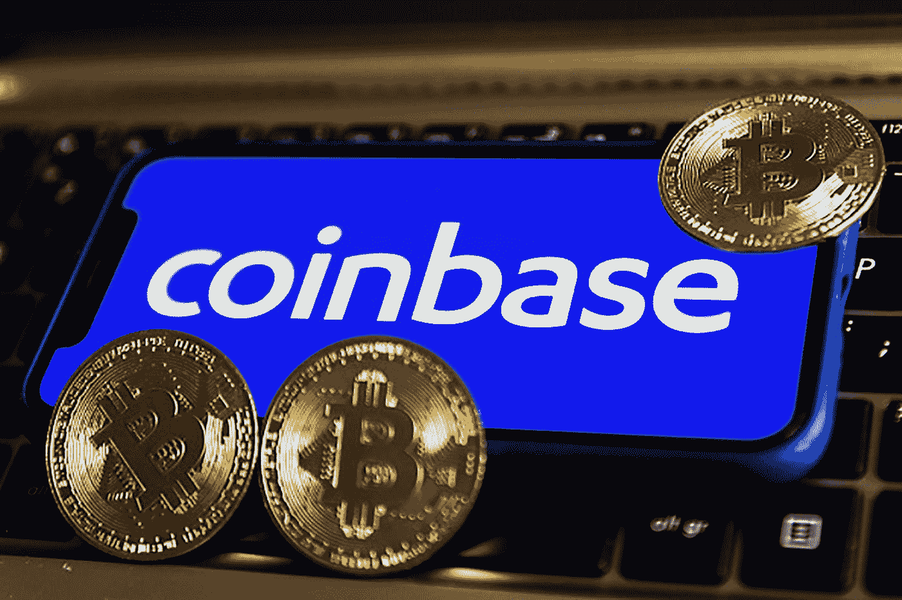

# 比特币基地将停止比特币基地专业合并交易服务

> 原文：<https://medium.com/coinmonks/coinbase-will-discontinue-coinbase-pro-to-merge-trading-services-33062d7359eb?source=collection_archive---------29----------------------->

比特币基地的专业交易平台比特币基地专业版将不复存在，因为加密货币交易所正在重组服务，将它们全部纳入一个平台。

总部位于美国的加密交易公司比特币基地于 6 月 22 日正式宣布，它将开始淘汰比特币基地专业版，将所有高级交易服务迁移到一个统一的比特币基地账户。

比特币基地专业版的服务将转移到高级交易，在交易所的主要网站 Coinbase.com 上可以看到比特币基地的新交易部分。该部分最初于 2022 年 3 月推出，为交易员提供深入调查和直接在比特币基地进行实际交易。

据消息称，高级交易将提供与比特币基地专业版相同的基于交易量的费用。根据撰写本文时比特币基地官方网站的数据，根据订单量和订单接受者或制造者的不同，比特币基地专业版的费用从 0%到 0.6%不等。

即将到来的比特币基地 Pro 向高级交易的迁移将在未来几个月内逐步进行，因为交易所将继续推出高级交易的新改进。

比特币基地指出，它将通知其客户关于比特币基地专业日落的确切日期，并补充说:

“对于在比特币基地专业版上持有资金的客户，不需要采取任何措施，资金将在比特币基地保持安全。同时，欢迎客户开始在比特币基地手机应用程序和 Coinbase.com 上使用高级交易。”

根据公告，此次迁移旨在简化比特币基地的交易流程，使专业交易者能够使用先进的交易工具，并在一个地方使用一台天平使用比特币基地的一般功能。“过去，高级交易员使用比特币基地专业版进行更深入的交易和分析。但要使用比特币基地的其他功能，你必须将资金转移到你的主要比特币基地账户，”该公司表示。

比特币基地成立于 2012 年，是一家上市公司，也是世界上最大的加密交易平台之一。该公司于 2018 年推出了比特币基地 Pro，目标是专业投资者，专注于扩大交易服务，提供更多加密货币。

点击这里关注我们了解更多故事[。](http://t.me/etellworld)

> 加入 Coinmonks [电报频道](https://t.me/coincodecap)和 [Youtube 频道](https://www.youtube.com/c/coinmonks/videos)了解加密交易和投资

# 另外，阅读

*   [WazirX vs coin dcx vs bit bns](/coinmonks/wazirx-vs-coindcx-vs-bitbns-149f4f19a2f1)|[block fi vs coin loan vs Nexo](/coinmonks/blockfi-vs-coinloan-vs-nexo-cb624635230d)
*   [本地比特币审核](/coinmonks/localbitcoins-review-6cc001c6ed56) | [加密货币储蓄账户](https://coincodecap.com/cryptocurrency-savings-accounts)
*   [什么是保证金交易](https://coincodecap.com/margin-trading) | [美元成本平均法](https://coincodecap.com/dca)
*   [支持卡审核](https://coincodecap.com/uphold-card-review) | [信任钱包 vs 元掩码](https://coincodecap.com/trust-wallet-vs-metamask)
*   [Exness 回顾](https://coincodecap.com/exness-review)|[moon xbt Vs bit get Vs Bingbon](https://coincodecap.com/bingbon-vs-bitget-vs-moonxbt)
*   [如何开始通过加密贷款赚取被动收入](https://coincodecap.com/passive-income-crypto-lending)