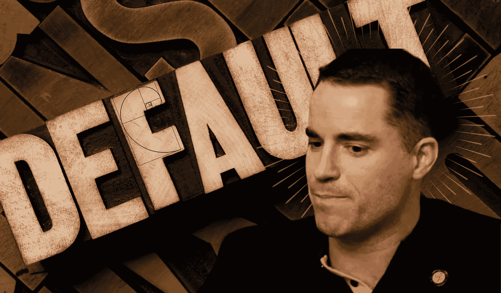

# CoinFLEX 向 Bitcoin.com 创始人 Roger Ver 发送违约通知

> 原文：<https://medium.com/coinmonks/coinflex-sends-default-notice-to-bitcoin-com-founder-roger-ver-948ade451882?source=collection_archive---------5----------------------->

## [Bitcoin.com](https://www.bitcoin.com/)创始人罗杰·维尔欠加密货币衍生品平台[coin flex](https://coinflex.com/)4700 万美元。首席执行官马克·兰姆说，后者向比特币耶稣发出了违约通知。

This preview will be included in the NFT collection called “[Uncle Fibonacci News](https://opensea.io/collection/uncle-fibonacci-news)”

此前，平台公布了回收价值 USD ( [rvUSD](https://www.rvusd.org/) ) token。该公司表示，预计将利用它筹集 4700 万美元，以偿还一个“富裕”私人客户的债务，并恢复资金的提取。

6 月 27 日，兰姆表示，该公司遇到了麻烦，因为一个“长期”客户以独特的条款获得了贷款。他的头寸没有清算价格——作为回报，他为平台提供流动性。然而，在危机的背景下，他的头寸变得无利可图。

显然，那个人已经死了。后者否认参与债务头寸。

> “他否认债务与他有关，所以我们认为有必要向公众澄清，是的，这个职位 100%与他的账户有关。罗杰·弗是欧盟公民，我们认为他在美国、英国和其他相关司法管辖区拥有大量资产，”兰姆说。

CoinFLEX 的负责人也强调，该平台没有债务义务，他的声明是“公然的谎言”。

兰姆发表声明前不久，Bitcoin.com 的创始人发布了一条推文，称他对交易对手没有债务。

📰 ***订阅*** [***斐波那契***](/@unclefibonacci) ***我来保持最新***

☕️eth:0x40a 8443813 e 8 fa 4a 9 f 88 f 18 b 77442 aa 4ed 91 fd4c

☕️BTC:1kkekcmdrghajztfxjoq 5 otg bv 1 mgucwdj

> 加入 Coinmonks [电报频道](https://t.me/coincodecap)和 [Youtube 频道](https://www.youtube.com/c/coinmonks/videos)了解加密交易和投资

# 另外，阅读

*   [OKEx vs KuCoin](https://coincodecap.com/okex-kucoin) | [摄氏替代品](https://coincodecap.com/celsius-alternatives) | [如何购买 VeChain](https://coincodecap.com/buy-vechain)
*   [ProfitFarmers 回顾](https://coincodecap.com/profitfarmers-review) | [如何使用 Cornix Trading Bot](https://coincodecap.com/cornix-trading-bot)
*   [如何匿名购买比特币](https://coincodecap.com/buy-bitcoin-anonymously) | [比特币现金钱包](https://coincodecap.com/bitcoin-cash-wallets)
*   [瓦济里克斯 NFT 评论](https://coincodecap.com/wazirx-nft-review)|[Bitsgap vs Pionex](https://coincodecap.com/bitsgap-vs-pionex)|[Tangem 评论](https://coincodecap.com/tangem-wallet-review)
*   [如何使用 Solidity 在以太坊上创建 DApp？](https://coincodecap.com/create-a-dapp-on-ethereum-using-solidity)
*   [加密交易机器人](/coinmonks/crypto-trading-bot-c2ffce8acb2a) | [OKEx vs 币安](https://coincodecap.com/okex-vs-binance)