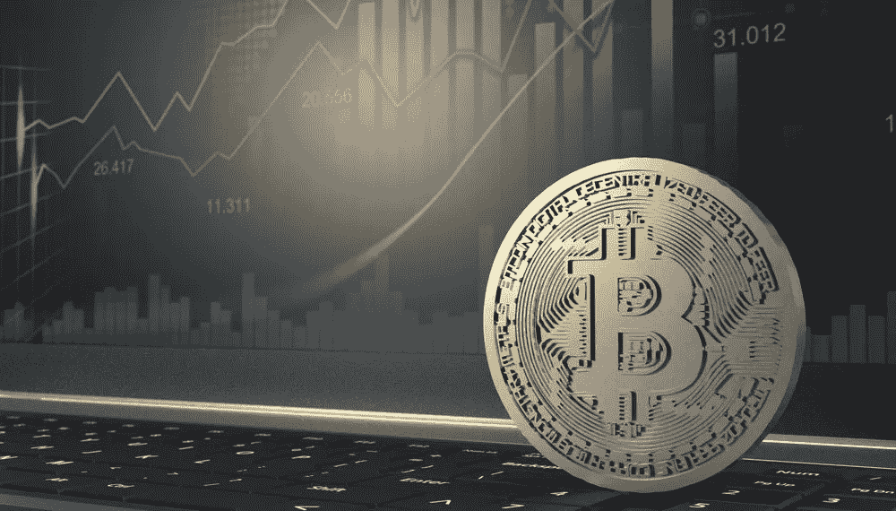

# 硬币是股票

> 原文：<https://medium.com/coinmonks/coins-are-stocks-d2981e3a5e00?source=collection_archive---------70----------------------->

2008 年股市怎么了？嗯，经济学家称之为“全球经济衰退”，但对于像我这样的门外汉来说，这个名称并不重要。我只知道它的表现——抵押贷款危机、信贷危机、政府救助……以及股市崩盘。没有比 Investopedia 的标签更好的方式来解释这种崩溃了——“2008 年秋季市场的下跌”。如果你画一条线，你可以把这种情况比作目前正在蹂躏加密市场的螺旋式下降。

让我们暂时忘记围绕加密货币的刻板印象。让我们从一个不同的角度来看它。也许我们可以开始把点连接起来，然后画一条线；也许我们可以开始看到加密硬币和传统股票之间存在的不可否认的相似性和相同的协同作用。

然而，我们不需要回避这样一个现实，即股票已经证明了其数百年的血统，并已成为愿意做出长期有利可图投资选择的投资者的稳定选择。加密货币相对较新，许多人仍然怀疑其作为替代投资和资产类别的可靠性。

建立了这个基础，现在是我们开始认真考虑我们对加密货币硬币的概念和认知的时候了。在很多方面，这种蓬勃发展的另类投资选择与股票有着不可否认的相似之处。本文的目的不是说服你将所有的资产和投资组合转移到加密货币，而是启发你，并可能改变你的方向，也许你也可以开始建立一个加密投资组合。

不要再浪费时间了，让我们深入挖掘传统股票中模拟加密硬币的联系。

# 对股票有点看法

股票被认为是与债券和现金并列的传统资产和投资选择之一。股票已经存在了几个世纪，经受住了经济崩溃、经济繁荣、世界大战、灾难和你能想到的各种各样的事件。由于这个原因，这种资产类别已经赢得了全世界投资者的信任。像伦敦证券交易所、纽约证券交易所、东京证券交易所等受欢迎的证券交易所已经存在了足够长的时间，它们已经是股票交易的同义词。

这个机构已经存在了很长时间，仍然得到各国政府的支持，并在协调良好的中央当局的监管框架下运作，我们或许应该为它脱帽致敬。

好了，足够的股票，如果你想知道更多关于股票的信息，这里有一篇关于 Investopedia 的文章，你可以看看。现在，让我们来解开相对较新的加密空间和硬币是如何掌握股票的诀窍的。

# 种子在化妆中

在你发现硬币和股票的第一个真相之前，你不需要绞尽脑汁，尽管有一点点不同。这两种投资选择的第一个相似之处是，它们都代表了各自资产类别的“部分所有权”。

如果你要购买一枚加密硬币，你已经知道你是在购买目前供应的硬币总量，你的目标是持有你的资金可以持有的部分，有效地赋予你和你的投资组合对基础资产的部分持有权。

股票也是如此。投资者有机会获得可供公众购买的股票的部分所有权。通常，投资者只有在首次公开发行(IPO)阶段完成后才能购买公开交易的股票。对于硬币来说，IPO 是不存在的，但初始硬币发行(ICO)、初始 DEX 发行(IDO)和初始交易所发行等不同的众筹选项相当常见。这段时间过后，硬币可以交易。

那么，你在哪里买卖硬币和股票呢？

默认情况下，如果你想交易股票，你需要雇用股票经纪公司的服务。在经纪人的帮助下，你可以很容易地以当前的交易价格购买你的优先股，当你想卖掉你的股票时，同样的原则也适用。对于硬币来说，如果你不在像 [Uniswap](https://uniswap.org/) 或 [Pancakeswap](https://pancakeswap.finance/) 这样的分散交易所交易，那么你将会在像[币安](https://www.binance.com/)或[北海巨妖](https://www.kraken.com/)这样的集中交易所交易你的硬币。硬币的优势在于，你不需要中间人来代表你出售你的资产。这无疑指向了区块链和加密货币最初出现的原因之一——资金/资产控制。

# 以不可预测和波动为特点

你能自信地说出股票期权下个月的价格吗？我敢打赌，如果你长期持有股票(无论如何这都是可取的)，你不会想麻烦自己；对于加密硬币来说，情况完全相同。不确定性创造的这个小空间为一种被称为衍生品交易的新企业形式铺平了道路——这种交易形式是交易员根据自己的计算押注基础资产的未来价格。

我们无法回避这样一个事实，即股票经受住了时间的考验，在很大程度上可能比硬币更可靠，但事实仍然非常清楚，这两种形式的资产都可能在价格上波动，因为仅仅一个事件或现象就可能极大地影响价格或使整个股票市场暴跌。黑客攻击、海啸、房地产市场崩盘、政府政策，等等。

也许我们确实需要承认，波动和不可预测性是传统股票期权和加密货币作为替代资产类别的调味品。然而，如果说这种很大程度上不可预测的空间有什么积极的一面，那就是随着时间的推移，这两种资产类别的回报率都有可能大幅上升。只要看看特斯拉、微软、Alphabet 之类的，加上比特币、以太坊、Arbitrum 之类的就行了。

不言而喻，如果你长期想要一些现金，股票和硬币肯定是赌注。

# 价值表示

可以肯定地说，没有人会把钱投入一场徒劳的冒险。通常说服投资者买入股票或硬币的是对未来获利的预期。通常情况下，投资者在购买一个项目之前，会对其潜力进行尽职调查。评估流程通常包括项目潜力的评估、其价值主张和独特的产品、路线图和开发人员(对于 crypto)。

这表明，投资者押注于发行股票的公司或项目可能提供的价值(内在价值和未来价值)。事实上，一个项目能够提供的价值和创新越多，其股票/硬币上涨的机会就越大。如果一个公司或项目能够重复这一壮举，那么它会赢得投资者的信任，并随着其立足点变得更加稳固而吸引更多投资者。

可以肯定地说，股票和硬币都代表着价值，需要公司管理层和项目开发人员不断创新。

# 然而被许多人理解

你可以说加密货币是新生事物，因此仍有很多需要学习的地方，但股票市场呢？我们能说一个已经存在了一个多世纪的全球性机构仍然是新的吗？当然不是。但是我们在这里，许多人仍然不明白交易市场是如何运作的(密码和股票交易)。

从没完没了的股票买卖过程，到难以理解的图表和不那么有用的术语，许多人在进入这个领域之前就放弃了。

甚至有一种观点认为，股票和加密货币都只在某一类人的范围内。也许股票是为富人准备的；也许股票是为那些有能力一次买一大块的超级富豪保留的；也许加密硬币是为精通技术的人准备的；也许加密是个骗局。在所有这些流传的观念中显而易见的是，在股票和加密货币的问题上，许多人仍然被蒙在鼓里。

# 监管问题

也许这是硬币和股票之间唯一值得注意的分歧点。经受了时间考验、适应力强的证券交易所及其运作已经得到了各国政府的全力支持，并根据既定的原则和规则受到监管。在美国，这一职责属于证券交易委员会的职权范围。

加密货币还不能这么说。目前，显而易见的是，如果加密货币想要找到一种将国家政府整合到大计划中的方法，它还有很长的路要走。首先，整个加密领域的出现是出于将金融控制权交还给投资者的需要；及时提醒人们 2008 年 T2 金融危机给许多人带来的毁灭性经济损失。

然而，我们不应该排除这种可能性。毕竟，尽管在区块链执行，资产支持证券现在主要由交易委员会监管。

# 那我们该说什么？

很明显，加密货币和传统股票有很多共同点。从购买股票和硬币的操作方式到持有这些资产的潜在动机，甚至到它们固有的波动性。这还不包括他们是如何被许多人理解的，以及他们长期投资的事实。

我们可以得出这样的结论，硬币和股票有着相同的基本原理，它们的目标都指向同一个点。如果你在做投资决定的时候陷入其中，我给你的建议简单明了——拥抱两者的优点，并找到一种方法将它们的优点结合起来。也许，没有什么比将陈年老酒的味道与现代酒庄的精致工艺融合在一起更甜美的了。

持有这两种资产类别将是一个不错的选择，只有在这一点上，你才会真正理解硬币是股票。

> 加入 Coinmonks [电报频道](https://t.me/coincodecap)和 [Youtube 频道](https://www.youtube.com/c/coinmonks/videos)了解加密交易和投资

# 另外，阅读

*   [印度最佳 P2P 加密交易所](https://coincodecap.com/p2p-crypto-exchanges-in-india) | [柴犬钱包](https://coincodecap.com/baby-shiba-inu-wallets)
*   [8 大加密附属计划](https://coincodecap.com/crypto-affiliate-programs) | [eToro vs 比特币基地](https://coincodecap.com/etoro-vs-coinbase)
*   [最佳以太坊钱包](https://coincodecap.com/best-ethereum-wallets) | [电报上的加密货币机器人](https://coincodecap.com/telegram-crypto-bots)
*   [交易杠杆代币的最佳交易所](https://coincodecap.com/leveraged-token-exchanges) | [购买 Floki](https://coincodecap.com/buy-floki-inu-token)
*   [3Commas 对 Pionex 对 Cryptohopper](https://coincodecap.com/3commas-vs-pionex-vs-cryptohopper) | [Bingbon 评论](https://coincodecap.com/bingbon-review)