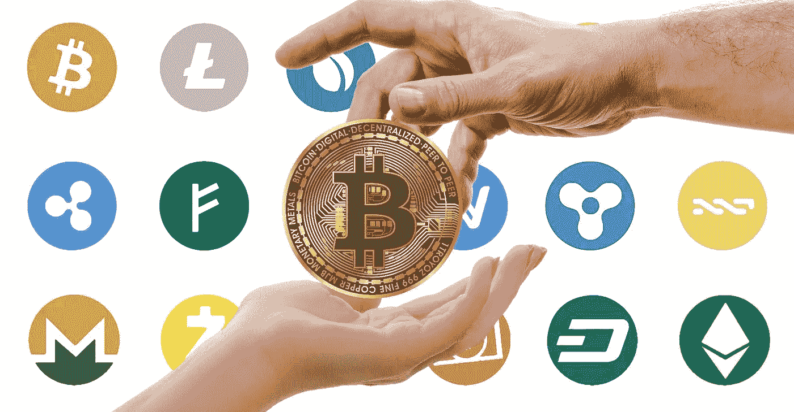

# 硬币、代币和钱包

> 原文：<https://medium.com/coinmonks/coins-tokens-and-wallets-9f3f642a5fdf?source=collection_archive---------50----------------------->

币:是有自己区块链的加密货币。

Token:这些加密货币没有自己的区块链，而是依赖其他人的区块链来完成他们的项目。

让我们打个比方；想象一下，买了一辆车，独自负责它的维护和可用性。硬币就是这样工作的。另一方面，代币可以被看作是汽车不是你的，但你可以租用一段时间，这样你就可以完成你的生意。
创造代币比硬币更容易，因为你不需要担心区块链的编程、编码、加密和数据跟踪。你可以选择在以太坊、索拉纳或币安区块链上运行你的令牌。

比如:基础注意力令牌利用了以太坊区块链。因此，它是 ERC 的象征。

如果硬币已经获得了一定程度的知名度和受欢迎程度，并且如果开发者现在能够负担得起运行自己的区块链所需的基础设施，令牌可以迁移到硬币。

从代币到硬币的转换也不是自动的。实现这一目标的一个方法是，开发者建立一个桥梁，允许用户将代币兑换成硬币。在某些情况下，一些硬币是多个网络上的代币。

在使用硬币和代币时，你需要知道一些硬币是其他硬币的模仿或代表(购买这些硬币可能会很贵，因为它们的汽油费很高)，例如币安-peg 代币就是一种模仿硬币。

**代币种类**

1.平台令牌:创建它们是为了支持区块链上的去中心化应用(DApp)。一个例子是 uni WAP 平台的 uni WAP 令牌，它允许您交换以太坊令牌。这些去中心化的应用程序有自己的令牌，分发给那些投资它们平台的人。

2.安全令牌:这些令牌是为了代表区块链上另一项资产的所有权而铸造的，即 BTCB(币安盯住比特币)。从技术上讲，它们是一种更廉价的持有有价值资产的方式，使用的是该资产的一种表现形式。只要它们是支持它的真实资产，这就行得通。听着，一个你不拥有的支持黄金的代币基本上是一个骗局，而且是非法的。

3.交易代币:这是一种快速简便的转账方式。例如相当于美元的 USDT。与正常的银行交易费相比，他们的费用非常低。

4.实用令牌:这些令牌具有真实世界的用途，它们在真实生活应用中具有价值。例子包括勇敢浏览器的基本注意力令牌、用于存储文件的 Filecoin、假人、Siacoin、公民令牌等。

5.治理令牌:它们通常用于实现区块链中的变化。持有人有权就区块链的运营和治理进行投票。

**密码中的常用术语**

**Memecoins** :一种源于互联网迷因的加密货币。一个例子是起源于互联网上的一个笑话。柴犬最初是为了取笑狗狗而创造的。Memecoins 作为长期投资是明智的。他们属于高风险高回报的投资类别。

**钱包**:加密钱包帮助你保存你的私人密钥。这些密钥是让您访问加密货币的密码。有不同形式的加密钱包。它们包括:

-硬件钱包
-账本钱包
-移动应用钱包

从技术上讲，加密钱包不会存储你的加密货币，但会让你访问它们(因为它们实际上存储在区块链上)。私钥是您的钱包和存储加密货币的区块链之间的桥梁/入口。把你的私人钥匙放在一个非常安全的地方是明智的。如果您丢失了您的私钥，您将永远无法访问您的密码。

**加密钱包的类型**

1.纸钱包-这是当钥匙写在一张纸上，并存放在一个安全的地方。
2。硬件钱包-密钥存储在一个硬件设备中，如拇指驱动器，当你想使用它时可以连接到互联网。
3。在线钱包——在这里，密钥存储在应用程序或软件中。选择钱包时，请确保您的钱包受到两步加密的保护，以获得额外的安全性。一个好处是你所有的资产可以在同一个地方。
附注:纸质钱包和硬件容易被放错地方，但它们比在线钱包更安全。

如果你觉得这篇文章有帮助，请随意分享，也别忘了关注😊。

> 加入 Coinmonks [电报频道](https://t.me/coincodecap)和 [Youtube 频道](https://www.youtube.com/c/coinmonks/videos)了解加密交易和投资

# 另外，阅读

*   [分散交易所](https://coincodecap.com/what-are-decentralized-exchanges) | [比特 FIP](https://coincodecap.com/bitbns-fip) | [宾邦评论](https://coincodecap.com/bingbon-review)
*   [用信用卡购买密码的 10 个最佳地点](https://coincodecap.com/buy-crypto-with-credit-card)
*   [加拿大最佳加密交易机器人](https://coincodecap.com/5-best-crypto-trading-bots-in-canada) | [Bybit vs 币安](https://coincodecap.com/bybit-binance-moonxbt)
*   [阿联酋 5 大最佳加密交易所](https://coincodecap.com/best-crypto-exchanges-in-uae) | [SimpleSwap 评论](https://coincodecap.com/simpleswap-review)
*   [购买 Dogecoin 的 7 种最佳方式](https://coincodecap.com/ways-to-buy-dogecoin) | [ZebPay 评论](https://coincodecap.com/zebpay-review)
*   [最佳期货交易信号](https://coincodecap.com/futures-trading-signals) | [流动性交易所评论](https://coincodecap.com/liquid-exchange-review)