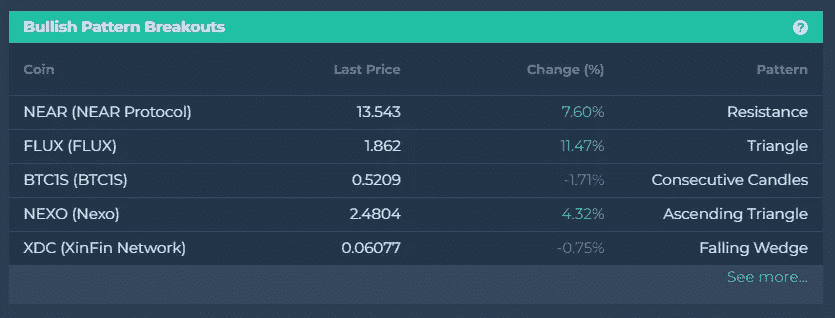

# 突破看涨的硬币

> 原文：<https://medium.com/coinmonks/coins-with-bullish-breakouts-ea6e5cbebf93?source=collection_archive---------52----------------------->

自从我们发表了我们的博客“crypto 准备好再次重整旗鼓了吗？”3 月 18 日。

我们看到许多硬币从下降的楔形、下降的三角形或横向通道中突破，价格不断创出新高和新低，这些都是趋势反转的迹象。

在[今天的视频](http://r.email.altfins.com/mk/cl/f/Kc69AwAFSAlfglhg94A2DUE4DCDOIgLGn6iOx1-ngTOfDiuQ6iHuwQqS5ynsbkCQQ3B1Gu9dJdONo2VkAYpvU7H3ZRHci7jLMeQ-qrgcXOVFMkmB_AJ8JrEdlvxQOOiBFN7o-1fn_Nu7qSPoLrV3O9MtLUcDkzZUoo0XozF9AgTcYI60pBj3jEQuWDWQxMO6-a8FmdxP0VrnQz3IfIKCj-Gr1_pkV4_YbhG6qWmn7H9MK0H_Zuj21gURfBa78cIVn773jXoYBgrr0T_kC5Yobi3itcUu7we3JFGBpTbOvEIKXYjVQkpYVi1Xk_qTnxN5LsNIayT1W_jq)中，我们回顾了多头[形态突破](http://r.email.altfins.com/mk/cl/f/Gea0jM0f4u5CN9Mm6Jqv5FKw-R8e5sAB_tXXZLqlUSnmPp0ptU-kFD-DvMRPuB_0VkPO1p8HQ_cBD_mLxtutUkhlDCwbaL_CAKJjFD1c21uRfyBQgB0B_VMRGedR4yBA5LczFeg3SqIlyI7WyBUJ4hSGkPujnfC8R2fdk7TA_Ex1g1TcHFHI3DlXTvdYCYVe2OqXR_bz-NAJOyOgEjvaNP9DLjLs504EmoKOMsh6bzauiT47QkaP47ymhS7qqalZ9hdnw3XZuC4OeMUh67H982D5KpiFDEjb3PwzbJAeMy7DECcb_px7OQ580WC_FEB2cprBr2xZBdaojnibn0-mDfEyEw) (NEXO，FTT)以及我们 [EMA 12/50 交易策略的结果](http://r.email.altfins.com/mk/cl/f/9VXkxezq4ehwZRLoA1S8DTZJg3zgNuE55aX-NfqHAOWpDyQnMJa3EenGKkaFfn3d4wr2DC3Fc2FDAY4MJd52i6EJJRIkPFfTaDatTBGIBvXM3_fRVmdxeBHuXUsd99_GlO0vOPcDdvOCf9_yCu2W4BSL8G1HQkssfa7yEAfCGp-awk85pYadcs5SI5laGX-K6X1siw440Nax4cbqt-uyZKdYKzp34gpEHHiiPQsKqWDsqc7yHSnRwKLqO2Lz8pysjH-feGiBtdM6djBheDCIoGanA5lL0PZo9ih5L2-2r8YShgP_T4l4cNnsjmh9EYj0EqUwCtVnJdeBcjYjzTp5C1pvTORG7M2QHr2-UgsV4eQk9hc66Qe1JYWqqVI4GK9luWWUfkGNAc6UPhayJYqqsqxrPQ3CIsehgF7O4rP6EnGgxVekgWozzCeJ_SjG337fa8Pz43NYTdCMfnBQt6I3zAiWC_TCf1WmsiCJF8-_NNW9WRQ6URiSHBwBY8B2L-9gKvJajMEc3wtC0vk8R4cwvPnK5BoKyiE9HfLeParjgG1nZDtbV0jo_ZwCBb6HBLjpOMSpW1H7xoF05oSn32VqjzcgdBFDA6pskt_L14f9pW5CyZL2jAQsV99jFZqPHg9FblFetseO3iVnQJeG61u1pCo0F8KgKanhTg)上周[的图片](http://r.email.altfins.com/mk/cl/f/YqI2X89pF17nbeWJ_WydUezzlBl5kJufM2N_e-RSizZLnmeXFozO27KvGqLrlpStHZVbpvBaXEPfqdcvK7E2EgDrUi3e3M-_OmRX_1Qxvnxkk4WI-jyHKS64vsC08QowOvEnR-S3YsI3RDhnG3BCiNvS6ZVto3JMEbIWSCPITdUzrHBo7qhRbIBupjppYBdUkPOve7Fc0RHxrL9zrJZ20-ijaKV3KaJW7oTMCKUI4J-lS0yiqfK62594wGkACNtfzqcH4WZw6KSdz20hmV79--00-_Kf4oBUhiZekUlt3MS8zp3-NPb1cTRJyBSvTHe6JeZfQgymnid_XE0A-t77-QWFqlPi-h6lt-Kw4ToRVg) (AVAX，DASH，SNX)，这些都表现得非常好。

**在 altFINS** [**行情集锦**](http://r.email.altfins.com/mk/cl/f/mbZH-AM3C_Nl2JX5LUb3_cBvOASDozXUobFJlakc1wCil5LgDIE6-z4oPvHmD1ZNbslWuu5YI12mzTBMjaa1wsFNC29GTHjMgHep0HAoPvzWFkjGUKCXMpU6kRM2Zjo0999GynZx5FdkZvDoqMIA4OxxK16boLr0JZ2LgrePPgHpqiiX1Hc6KiPrKaPv3Aq59q2OMOsYRWl9f6Z-kfcRoj1rPLUjBBQnUJdpis4A4lqveuqOLTI03cno3EFymWkKYEgCke2eBKJVlaW4HknJ64ac5moT4wdk7HZMYgM2CajUhuBKVJGGkMzYxAC6Pd2EJLVRXbgtCMRfiQ) **仪表盘上寻找有看涨形态突破的币。**

Source: altFINS

加入密码交易员社区，在 altFINS 平台上寻找交易思路！

> 加入 Coinmonks [电报频道](https://t.me/coincodecap)和 [Youtube 频道](https://www.youtube.com/c/coinmonks/videos)了解加密交易和投资

# 另外，阅读

*   [密码本交易平台](/coinmonks/top-10-crypto-copy-trading-platforms-for-beginners-d0c37c7d698c) | [Coinmama 审核](/coinmonks/coinmama-review-ace5641bde6e)
*   [印度的加密交易所](/coinmonks/bitcoin-exchange-in-india-7f1fe79715c9) | [比特币储蓄账户](/coinmonks/bitcoin-savings-account-e65b13f92451)
*   [OKEx vs KuCoin](https://coincodecap.com/okex-kucoin) | [摄氏替代品](https://coincodecap.com/celsius-alternatives) | [如何购买 VeChain](https://coincodecap.com/buy-vechain)
*   [币安期货交易](https://coincodecap.com/binance-futures-trading)|[3 comas vs Mudrex vs eToro](https://coincodecap.com/mudrex-3commas-etoro)
*   [如何购买 Monero](https://coincodecap.com/buy-monero) | [IDEX 评论](https://coincodecap.com/idex-review) | [BitKan 交易机器人](https://coincodecap.com/bitkan-trading-bot)
*   [CoinDCX 评论](/coinmonks/coindcx-review-8444db3621a2) | [加密保证金交易交易所](https://coincodecap.com/crypto-margin-trading-exchanges)