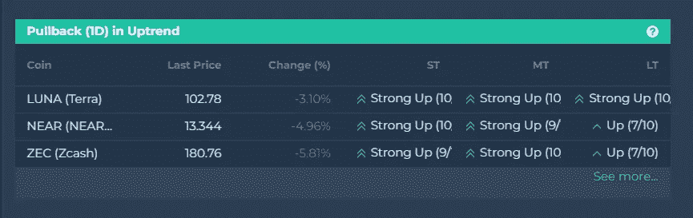
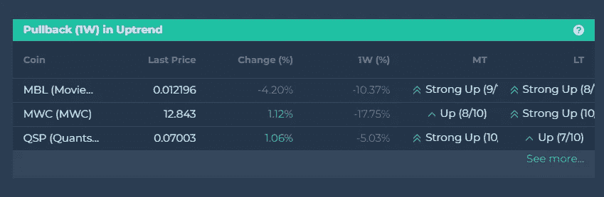
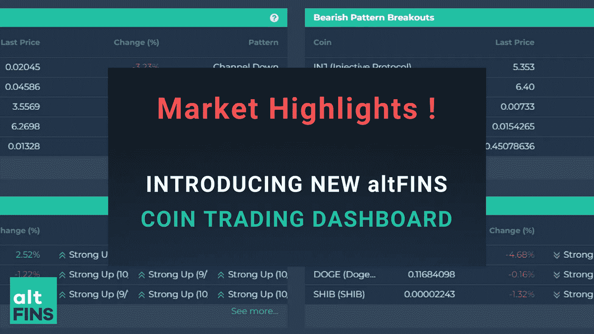

# 上升趋势中有回调的硬币(逢低买入)

> 原文：<https://medium.com/coinmonks/coins-with-pullback-in-uptrend-buying-dips-3fe43addafe2?source=collection_archive---------48----------------------->

[**上升趋势中的回调(1D)**](https://platform.altfins.com/screener?tab=COINS&column=MARKET_CAP&filters=C%253CA%253Cmdi%252CPRICE_CHANGE_1D%252C%252C-0.05%253E%253BA%253Cmdi%252CRSI14%252C%252C70.0%253E%253BA%253Cmdi%252CshortTermScoreString%252CUP%252C%253E%253BA%253Cmdi%252CmediumTermScoreString%252CUP%252C%253E%253BA%253Cmdi%252ClongTermScoreString%252CUP%252C%253E%253BA%253Cmdi%252CMARKET_CAP%252C5000000.0%252C%253E%253E&desc=true&utm_source=sendinblue&utm_campaign=Coins%20with%20pullback%20in%20uptrend%20buying%20dips&utm_medium=email)

这个市场屏幕发现了在过去 24 小时内有回调的上升趋势的硬币(1D)。

Source: altFINS

[**上升趋势中的回调(1W)**](https://platform.altfins.com/screener?tab=COINS&column=MARKET_CAP&filters=C%253CA%253Cmdi%252CPRICE_CHANGE_1W%252C%252C-0.05%253E%253BA%253Cmdi%252CRSI14%252C%252C70.0%253E%253BA%253Cmdi%252CmediumTermScoreString%252CUP%252C%253E%253BA%253Cmdi%252ClongTermScoreString%252CUP%252C%253E%253BA%253Cmdi%252CMARKET_CAP%252C5000000.0%252C%253E%253E&desc=true&utm_source=sendinblue&utm_campaign=Coins%20with%20pullback%20in%20uptrend%20buying%20dips&utm_medium=email)

这个市场屏幕发现了在过去 7 天(1W)有回调的上升趋势的硬币。

Source: altFINS

**上升趋势中的回调是一种趋势跟随策略。**

回调通常能提供抓住既定趋势的机会。

在早期很难抓住趋势，一旦趋势确立，保守的交易者更喜欢中途跳。

即使在上涨趋势中，价格也不会日复一日地直线上升。有时候，价格会盘整、回调，然后恢复上升趋势。这些修正是加入趋势的机会。

**交易规则:**

*   寻找在过去 24 小时内回调的上涨趋势中的硬币(1D)
*   目视检查图表以确定最近的[支撑水平](https://altfins.com/knowledge-base/support-and-resistance-lines/?utm_source=sendinblue&utm_campaign=Coins%20with%20pullback%20in%20uptrend%20buying%20dips&utm_medium=email)
*   在支撑位附近买入

了解更多交易策略 [**上升趋势回调**](https://altfins.com/knowledge-base/how-to-trade-cryptocurrencies/#link6)

观看教育视频 [**上升趋势中的回调**](https://youtu.be/SFxy4T3P5hM)

观看教程视频[**硬币在上升趋势和回调**](https://youtu.be/Uw0Zwerusv8)

访问 altFINS 平台[寻找具有特定交易策略的硬币](https://platform.altfins.com/dashboard)！

> 加入 Coinmonks [电报频道](https://t.me/coincodecap)和 [Youtube 频道](https://www.youtube.com/c/coinmonks/videos)了解加密交易和投资

# 另外，阅读

*   [如何在 FTX 交易所交易期货](https://coincodecap.com/ftx-futures-trading) | [OKEx vs 币安](https://coincodecap.com/okex-vs-binance)
*   [CoinLoan 评论](https://coincodecap.com/coinloan-review) | [YouHodler 评论](/coinmonks/youhodler-4-easy-ways-to-make-money-98969b9689f2) | [BlockFi 评论](https://coincodecap.com/blockfi-review)
*   《XT.COM 评论》的[《币安评论》的](https://coincodecap.com/profittradingapp-for-binance)|
*   [SmithBot 评论](https://coincodecap.com/smithbot-review) | [4 款最佳免费开源交易机器人](https://coincodecap.com/free-open-source-trading-bots)
*   [比特币基地僵尸程序](/coinmonks/coinbase-bots-ac6359e897f3) | [AscendEX 审查](/coinmonks/ascendex-review-53e829cf75fa) | [OKEx 交易僵尸程序](/coinmonks/okex-trading-bots-234920f61e60)