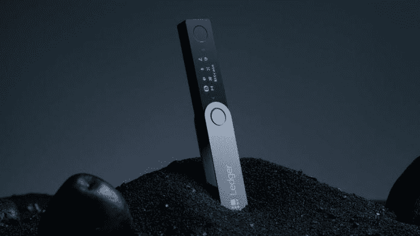
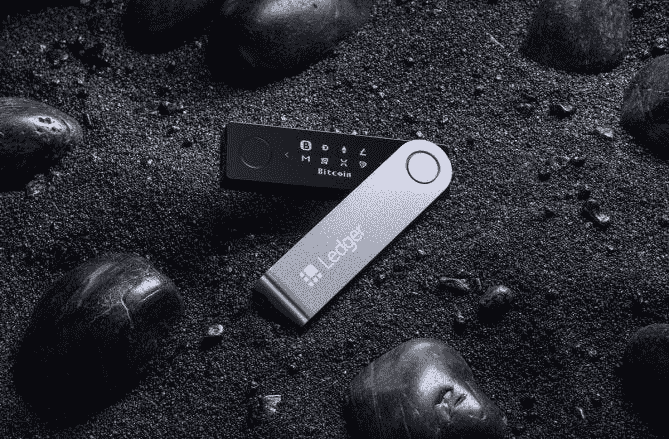
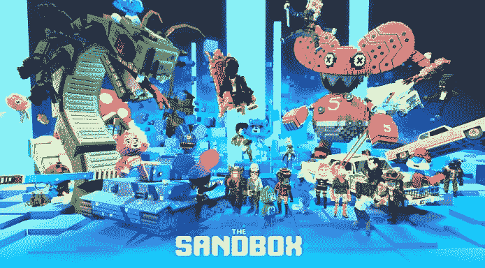

# 冷存储硬件钱包分类帐与沙盒元宇宙合作伙伴

> 原文：<https://medium.com/coinmonks/cold-storage-hardware-wallet-ledger-partners-with-the-sandbox-metaverse-8798f2d13e38?source=collection_archive---------33----------------------->

最受欢迎的冷存储加密硬件钱包“账本”最近与沙盒元宇宙合作，以促进加密货币教育。

沙盒已经成为元宇宙的行业领导者，许多跨国公司和名人与沙盒合作，并通过 NFTs 购买虚拟土地。一些品牌包括行尸走肉、史努比狗狗、帕丽斯希尔顿、阿迪达斯、[古驰](http://gucci.com/)和[汇丰](https://bumblebeecrypto.com/2022/03/16/hsbc-has-jumped-into-the-metaverse-and-partners-with-the-sandbox/)。最新的合作是与 Ledger，一家专注于加密安全的法国加密钱包公司。

莱杰的首席体验官伊恩·罗杰斯在今天的“不可替代会议”上宣布了这一消息。他表示，该合作伙伴关系旨在为沙盒的元宇宙提供安全性，并为莱杰提供一个虚拟位置来教育人们有关加密的知识。Rogers 感谢 Sandbox 的联合创始人 Sebastian Borget 和 Sandbox 平台提供了与他们合作的机会，并表示 Ledger 将为 SAND token 所有者提供定制的[Ledger nano](https://shop.ledger.com/?r=5cc30b16a6f5)以庆祝合作伙伴关系。莱杰今天早些时候在他们的推特账户上宣布了合作关系。

此外，沙盒将为莱杰提供 36 块虚拟土地，莱杰计划在沙盒元宇宙内建立并用作教育和安全中心。

来源:[BumbleBeeCrypto.com](https://bumblebeecrypto.com)

> 加入 Coinmonks [电报频道](https://t.me/coincodecap)和 [Youtube 频道](https://www.youtube.com/c/coinmonks/videos)了解加密交易和投资

# 另外，阅读

*   [3 商业评论](/coinmonks/3commas-review-an-excellent-crypto-trading-bot-2020-1313a58bec92) | [Pionex 评论](https://coincodecap.com/pionex-review-exchange-with-crypto-trading-bot) | [Coinrule 评论](/coinmonks/coinrule-review-2021-a-beginner-friendly-crypto-trading-bot-daf0504848ba)
*   [莱杰 vs Ngrave](/coinmonks/ledger-vs-ngrave-zero-7e40f0c1d694) | [莱杰 nano s vs x](/coinmonks/ledger-nano-s-vs-x-battery-hardware-price-storage-59a6663fe3b0) | [币安评论](/coinmonks/binance-review-ee10d3bf3b6e)
*   [Bybit 交易所评论](/coinmonks/bybit-exchange-review-dbd570019b71) | [Bityard 评论](https://coincodecap.com/bityard-reivew) | [Jet-Bot 评论](https://coincodecap.com/jet-bot-review)
*   [3 commas vs crypto hopper](/coinmonks/3commas-vs-pionex-vs-cryptohopper-best-crypto-bot-6a98d2baa203)|[赚取加密利息](/coinmonks/earn-crypto-interest-b10b810fdda3)
*   最好的比特币[硬件钱包](/coinmonks/hardware-wallets-dfa1211730c6) | [BitBox02 回顾](/coinmonks/bitbox02-review-your-swiss-bitcoin-hardware-wallet-c36c88fff29)