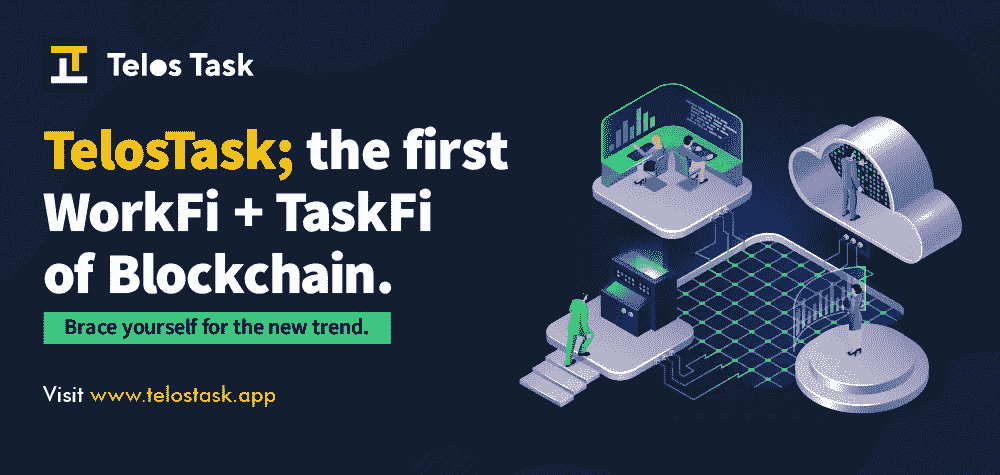
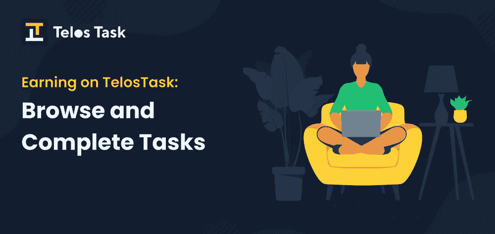
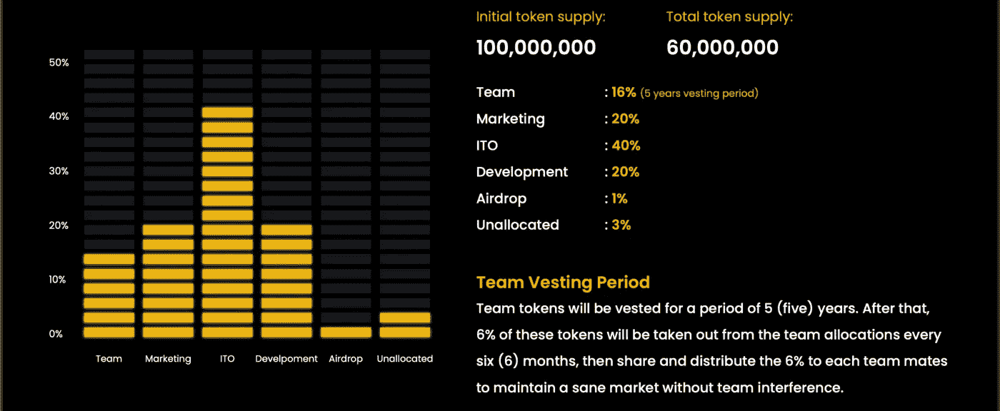

# 将工作与分散财务结合起来——TELOS 任务

> 原文：<https://medium.com/coinmonks/combining-work-with-decentralized-finance-telos-task-3d2f51dc65ed?source=collection_archive---------39----------------------->

继新冠肺炎疫情之后，世界经济停滞不前；大多数人不能工作。

在某个时候无法让事情运转起来意味着可能发生不可恢复的经济危机。

“零工经济”是拯救人类整个金融体系免于崩溃的体系。尽管以前运作不活跃，但疫情为这种经济的全面诞生提供了空间。

零工经济与更灵活的工作联系更紧密。公司雇佣合同制员工或有限时间的员工，而不是全职员工，这些员工被称为自由职业者。

认为零工经济在今天并不成功是绝对错误的。零工经济价值约 3500 亿美元，大约 36%的美国人参与其中。研究发现，与传统工作相比，人们更喜欢零工经济，至少 79%的人喜欢零工经济。

自由职业者可以从事更多的工作，更多的自由职业平台也涌现出来，它们的基本目标都是将自由职业者和客户联系起来。

然而，这些平台中的许多都有一个问题，因为它们未能实现创建它们的一个目标。

因为自由职业者和客户都没有获得预期的满意度，所以出现了更多的问题，促使分析师质疑零工经济的效率。

[Telos 任务](https://Telostask.io)刚进来，别的不说，事情就变得更糟了。

**TELOS 任务有何不同**

Telos 任务团队注意到，几个连接客户和自由职业者的平台正在限制来自一些司法管辖区的人在平台上的活动。这促使人们产生了替代常规平台的想法，并消除了零工经济增长的障碍。

该团队试图回答的问题是，“人们如何做得更少，赚得更多？”

该团队很快意识到，为了创建一个将自由职业者和客户完全联系起来的平台，它必须基于一个去中心化的结构。答案就在不远处。

答案是[区块链！](https://www.euromoney.com/learning/blockchain-explained/what-is-blockchain)

过了一段时间，从头脑风暴时期开始，Telos 任务诞生了。

Telos Task 是一个基于区块链技术的分散式自由职业平台。除了加密货币，区块链还被用于解决与人类相关的问题。

这是第一个建立在 Telos 链上的去中心化自由职业平台。

因为一个分散的系统包容了所有用户，所以 telos 选择思考如何让每个想参与的人都参与进来。唯一的出路是创建一个平台，让非技术工人和专业工人都能轻松找到工作。这就是真正的去中心化的样子:一个每个人都可以使用的系统。

Telos 任务平台的加入过程极其简单，由于平台使用了区块链技术，匿名性可以保持在很高的程度上。自由职业者只需添加一个'就可以获得奖励。task (dot task)'添加到他们在平台上的昵称(这将作为钱包地址/支付帐户，该过程是自动的)。在 Telos 任务平台上，Dammykhudz 的句柄将是 Dammykhudz.task，这将足以为平台上完成的任务接收资金。

无论你需要人们为你完成什么类型的任务，只要它可以数字化完成，欢迎你上传到 Telos Task 上。

**优势**

**区块链零工经济:**是的，零工经济越来越受欢迎，但区块链的零工经济却不是这样，这是 Telos Task 与众不同的事情之一。它鼓励分散的零工经济，这增加了安全性，并完全包括所有用户。

**微观和宏观任务:** Telos 决定尽可能简化上市和申请 gigs 的过程。微观工作是为没有经验的人设计的，而宏观工作需要一定的专业水平。这个平台让任何人都有可能完成任何事情。

**增加加密参与:**无论一个人是否是加密爱好者，使用 Telos 任务平台都需要支付加密或接收加密付款，因为该网站的经济由＄task 令牌管理。另一方面，将$task token 转换为现金的过程非常简单，反之亦然。

没有限制:成为 Telos 工作的一部分是完全不受限制的，入职真的很简单。

**连接自由职业者和客户:**平台的主要目的是连接自由职业者和会满意的客户。

在 Telos 任务平台上，你可以通过做更少的事来获得更多。

**$任务令牌/令牌组学**

如上所述，$task 令牌将运行 Telos 任务经济，使$task 令牌成为一个独特的用例。总共只有 1 亿美元的任务代币，由于代币的通货紧缩性质，预计将降至 6000 万美元。随着时间的推移，一系列的[燃烧](https://www.cnbctv18.com/cryptocurrency/explained--coin-burning-how-is-it-done--why-13245532.htm)预计会减少$任务令牌的最大供应量。

分发:

1%的令牌作为空投分配

3%仍未分配

16%归团队所有(有 5 年的授权期)

20%可用于营销目的

20%将用于开发

40%将进入 ITO(初始任务报价)。第一轮比赛定于 2022 年 6 月 2 日举行。

名词（noun 的缩写）B: Telos Task 目前奖励早期测试者一定数量的 USDT，你应该去看看。

[网站](https://Telostask.io) | [推特](https://Twitter.com/@telostask) | [电报](https://t.me/@telostasks) | [媒体](/@telostask) | [脸书](https://Facebook/@TelosTask) |