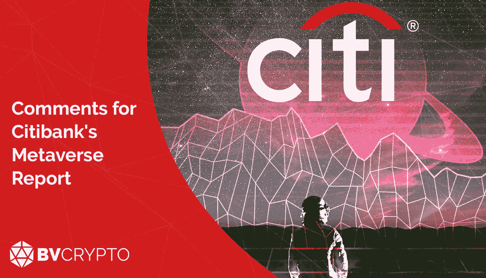
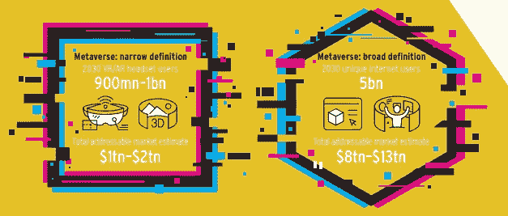
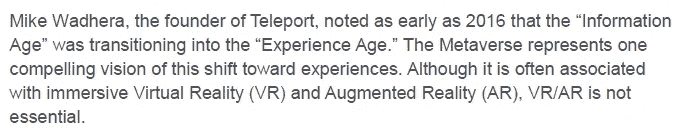
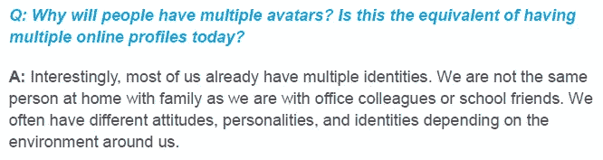
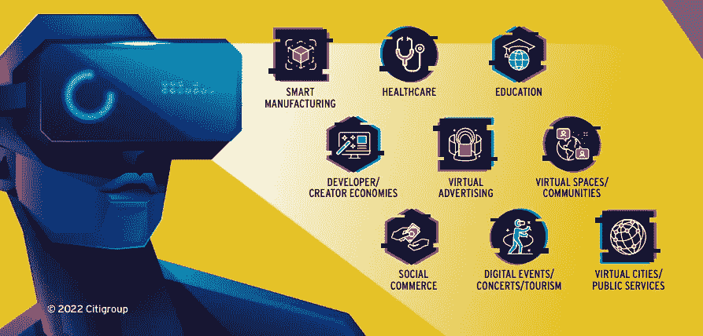
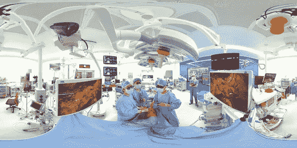
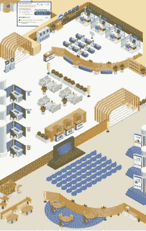
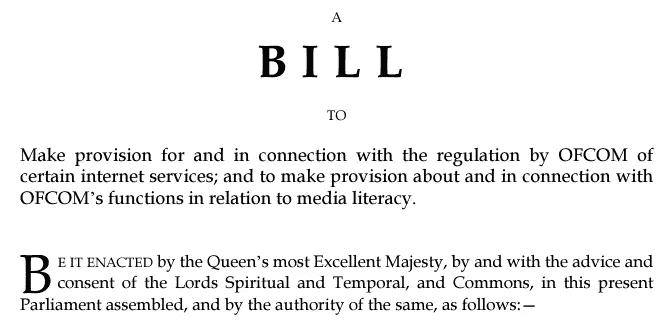

# 对花旗银行元宇宙报告的评论

> 原文：<https://medium.com/coinmonks/comments-for-citibanks-metaverse-report-7d1a3da7cf7b?source=collection_archive---------16----------------------->

金融界最大的参与者之一花旗银行在三月份准备了一份关于元宇宙和 NFT 的相当详细的报告。在报告中，提到了元宇宙在短期和未来可能对我们的生活产生的影响，同时在法律和技术方面采取了现实的做法。因此，可以说报告具有客观的观点。在这篇文章中，在为您提供这份 184 页报告的摘要的同时，我们也没有忽略添加我们自己的评论。可以点击文末链接，阅读原报道。愉快的阅读…

**信息时代到体验时代**

随着脸书将整个公司的主要战略定位在元宇宙，元宇宙的概念已经成为一个几乎每个人都多少知道的普遍话题。这个概念(我们可以用最简单的术语将其定义为虚拟世界)之所以流行，是因为 NFTs 也在虚拟世界中实现了所有权。事实上，每个数字对象都可以被拥有，这使得生活在虚拟世界的想法得以实现，因为它使一切数字化的东西都可以转化为金融价值。这个近乎不可能的梦想，随着 NFTs 变成了现实的期待，无疑引起了大家的关注。

今天，有各种各样的元宇宙平台，我们可以通过浏览器连接到这些平台。我们可以在平台上购买包裹，在这些包裹上创建和设计我们自己的属性，用我们想要的衣服打扮我们的化身。因此，我们迈出了开始生活在元宇宙世界的第一步，我们可以将其定义为 3D 社交媒体。然而，为了生活在虚拟世界中，用户除了拥有虚拟世界中的资产之外，还必须体验虚拟世界。为了让这个体验过程逼真，想到会先用 VR 和 AR 眼镜。除了感知我们的手臂运动之外，预计将开发集成到 VR-AR 眼镜中的各种装置，以便吸引我们的感官，例如身体疼痛和愉悦。

根据花旗银行的报告，随着元宇宙的趋势，到 2030 年，对 VR-AR 眼镜的需求将增加到 9 亿至 10 亿用户，预计该市场的价值将达到 1-2 万亿美元。从更广泛的角度来看，图片右侧的数字表明，2030 年元宇宙平台的用户数量将达到 50 亿，市场规模预计将达到 8-13 万亿美元。由于 VR-AR 眼镜不是与元宇宙平台交互的强制要求，右侧显示的数字还包括通过浏览器连接到平台或出于投资目的买卖包裹但从未连接到平台的用户。从用户数量估计方面给出的高数字来看，很明显花旗银行将元宇宙趋势归类为未来的主导趋势。

特别是，VR 眼镜还没有像电话或 Playstation 游戏机那样受到关注，尽管它们已经上市一段时间了。由于需求不高，自然，专门为 VR 眼镜生产的应用也相当有限，这就导致了这个市场一直保持着恶性循环的状态。花旗银行专门为 VR-AR 眼镜指定了用户和市场预测，这一事实也表明了市场对这些眼镜需求的预期变化。可以预期，在不久的将来，用于开发这种眼镜的特殊应用、易用性和附加设备的资金和劳动力将会增加。

用户体验元宇宙宇宙的需求将会增加，这一预期可能意味着我们所处的“信息时代”也正在进入一个过渡期。Mike Wadhera 在报告中的一句话为新流程的命名提供了一个很好的例子。

有必要不要把瓦德拉的这句话解读为信息时代的终结，他说我们正在从信息时代走向‘经验时代’。体验时代可以被认为是信息时代的一种进化、发展状态，从信息时代获得了经验和基础设施。Wadhera 补充说，与此同时，VR-AR 眼镜对元宇宙来说不是强制性的。作为这种情况的一个例子，我们可以以三星将推出集成到 NFT 产品中的新电视的新闻为例。在未来，我们似乎很有可能从游戏机、手机和电视上访问元宇宙平台。元宇宙平台可能是默认的东西，就像每个 Windows 上的 Internet Explorer 一样。例如，X 品牌的电视可以直接集成到分散式平台，而 Y 品牌的电视可以连接到 CryptoVoxels 平台。

**不同性格，不同头像**

如今，我们通过手机、平板电脑甚至电视与各种社交媒体平台保持联系。因此，不管我们愿不愿意，我们看待世界上发生的事件的方式、我们的目标、期望，甚至我们的行为和判断方式都发生了变化。随着信息时代发展起来的全球价值判断就是最好的例子之一。对种族主义、性别歧视等问题的普遍反应是这个时代积极方面的例子，媒体虚假信息，如冠状病毒出现时向体内注射消毒剂的想法，可以被列为负面例子之一。

至此，我们的交流方式开始主要发生在虚拟世界。然而，在这个过程的最后，已经看到我们的虚拟简档和我们的现实生活简档可能并不总是彼此接近。例如，一个在现实生活中害羞的人可以在社交媒体上写下攻击性的评论。

在报告中，Yonatan Raz-Fridman 对一个关于 avatar NFTs 的问题的回答非常重要，他指出，人们在现实生活中假设不同的角色，在办公室中不同的角色，与朋友和家人不同的角色。基于这一点，元宇宙上还声明，用户将希望拥有反映他们不同个性的多个化身。除此之外，化身也可以用来代表财富的指标，在现实生活中是由豪华汽车或昂贵的衣服，饰品来表示的。因此，无论是作为一种新的地位指标，还是作为一种表达我们个性的方式，虚拟形象 NFT 都有望在未来保持其价值。

**经验年龄对行业的影响**

在上文中，我们重点关注了与社交媒体对人们的影响以及这种影响如何开始转移到元宇宙相关的几点。随着现实生活和虚拟生活之间的界限一条一条消失，我们的学习习惯和商业习惯也必然随之改变。

**教育**

由于冠状病毒，许多大学通过提供在线课程继续开展活动，并将教育转移到虚拟环境中。不过在病毒出现之前，有 Udemy 或者 Edx 等平台提供在线教育。因此，提供在线教育现在几乎是家常便饭。这个部门目前正在加速向虚拟环境发展，它也适应了元宇宙平台，这并不奇怪。很有可能的是，在元宇宙世界中与他们的虚拟角色共度时光的用户也将开始通过这些平台接受 3D 在线教育。因此，可以预期，网络大学将与元宇宙共同发展。

报告说，在这方面采取的第一批措施之一是在卫生部门。韩国首尔国立大学本当医院已经开工

在虚拟环境中提供医疗培训。2021 年 5 月，亚洲心血管与胸外科学会(ASCVTS)通过在线会议，在该校平台上以 3D 方式进行肺癌手术培训。

通过这种方式，学生可以通过在虚拟环境中进行大量实验来快速记忆操作过程。将来，学生能够在元宇宙进行这种培训将是极其重要的一步。在需要实际培训的医学领域以外的部门进行类似的应用，可以节省时间和成本，让学生能够更有效地学习。

**沟通和行为特征**

随着社交媒体平台的出现，我们的生活几乎被分为社交媒体前后两部分。数字广告和社交媒体管理等专业群体可能需要根据与元宇宙一起形成的“3D 社交媒体”可能带来的新行为特征进行更新。因为与只通过写评论、看视频或参加小组聊天的社交媒体相比，预计在元宇宙会议后，这种体验会更加突出。与元宇宙一起，能够跟上人们交流偏好和行为特征的变化并相应更新广告策略的企业有望获得优势。

当然，元宇宙的基本交流结构是由设计 NFT 的设计师创造的。由于用户对元宇宙数字产品的正面和负面反应会影响他们对这些产品的需求，因此在决定元宇宙用户的消费习惯方面起着关键作用。事实上，设计师们正在以虚拟的方式实现他们在现实生活中不可能或昂贵的设计，这可以确保我们在数字空间中的审美趣味比在现实生活中更快地发展或得到满足。

考虑到诸如在 Decentraland 举办的节日和在元宇宙举办的澳大利亚网球公开赛，可以有把握地说，有了新的组织设计，这些赛事可能会比现实生活更有吸引力。在这种情况下，可以预期用户在元宇宙上花费时间的请求将会增加。随着不寻常设计的出现，NFT 产品在虚拟环境中的这种工作获得了经济价值，这一事实可以比预期更快地将我们的生活带入元宇宙的宇宙。

**官方组织**

元宇宙宇宙迅速得到认可的主要原因是，公司希望利用这一领域的兴趣做广告，并迅速采用元宇宙平台。花旗银行的报告也显示了这方面的一个例子，例如，总部设在韩国的 KB Kookmin 银行正在通过其虚拟分行积极提供服务。

除了报道之外，还值得注意的是，巴巴多斯已经通过在分散地开设官方总领事馆开始接受来自这里的签证申请，三星、雅达利等公司已经于 10 月在分散地开设了分公司。

**技术短板**

虽然元宇宙目标已成为现实的期望，但现有的互联网基础设施尚不足以实现这一目标，这是报告中提到的重要一点。特别是，在标题为“带宽”和“等待时间”的区域中，当前带宽(即显示在毫秒内可以发送多少事务的度量)很弱，不足以满足诸如元宇宙之类的事件。这里提到的缺点不是针对我们可以用浏览器访问的当前元宇宙平台，而是针对这些平台达到最终状态。换句话说，不仅加密货币部门或设计者的发展，而且各国对互联网基础设施的投资对于该部门的发展也非常关键。报告提到，尽管 5G 和 Starlink 等研究在这一领域取得了进展，但仍需要很长时间才能达到所需水平。

**法规**

我们知道，针对加密货币的法律法规已经得到讨论，并开始在一定程度上得到应用。然而，非常重要的是，通过报告中提交给联合王国议会的一项法律草案来审查这一领域，该法律草案明确指出，它也涵盖元宇宙平台。

报告显示，这一提议基于三个主要条款。

1.内容控制

2.使用权

3.调整者

就其解释而言，这些条款是一个非常方便的例子，因为它们是其他国家通常也谈论的话题。

在内容控制方面，这是第一个问题，它似乎旨在阻止平台上可能构成犯罪的内容。可以预计，这可能是三篇文章中讨论最多的一篇。因为元宇宙平台也会有集中式和分散式的，比如加密货币。为了控制分散平台上的内容，需要在平台所属的 DAO 中进行投票。人们还知道，各国正在通过在这个方向上滥用权力来制作政治印刷材料，无论谁也不愿意看到含有犯罪成分的内容。因此，投票结果有可能是负面的。可以预期，各国会试图阻止其他国家，同时允许本应集中的元宇宙平台，如 Meta(前脸书)。

第二条中的使用权问题是一个极其积极的发展，特别是在保护 NFT 产品及其制造商方面。尽管制造商已经受到当前版权法的保护，但行业很可能会接受一种通过专门针对 NFTs 的法律来处理更全面和特定行业动态的基础架构。

在第三条中，澄清了授权组织在这一领域进行检查的规定。在这方面，与第一篇文章一样，出现了集中式和分散式平台特有的问题。

正如文章开头提到的，报告包含了现实的批评和非常积极的期望，并提供了一个客观的视角。可以说，该报告相当全面，包括了该部门主要人物的贡献。

请[点击](https://www.citivelocity.com/citigps/metaverse-and-money/)阅读报告原文

**编制人:贝尔凯·艾比**

*这里表达的观点和评论是 BV Crypto 的观点和评论。BV Crypto 不能对根据本文进行的任何金融交易负责。由于每个投资和交易都有风险，我们建议您在做出此类决定时做好自己的研究。*

> 加入 Coinmonks [电报频道](https://t.me/coincodecap)和 [Youtube 频道](https://www.youtube.com/c/coinmonks/videos)了解加密交易和投资

# 另外，阅读

*   [Bookmap 评论](https://coincodecap.com/bookmap-review-2021-best-trading-software) | [美国 5 大最佳加密交易所](https://coincodecap.com/crypto-exchange-usa)
*   最佳加密[硬件钱包](/coinmonks/hardware-wallets-dfa1211730c6) | [Bitbns 评论](/coinmonks/bitbns-review-38256a07e161)
*   [新加坡十大最佳密码交易所](https://coincodecap.com/crypto-exchange-in-singapore) | [收购 AXS](https://coincodecap.com/buy-axs-token)
*   [红狗赌场评论](https://coincodecap.com/red-dog-casino-review) | [Swyftx 评论](https://coincodecap.com/swyftx-review) | [CoinGate 评论](https://coincodecap.com/coingate-review)
*   [投资印度的最佳加密软件](https://coincodecap.com/best-crypto-to-invest-in-india-in-2021)|[WazirX P2P](https://coincodecap.com/wazirx-p2p)|[Hi Dollar Review](https://coincodecap.com/hi-dollar-review)