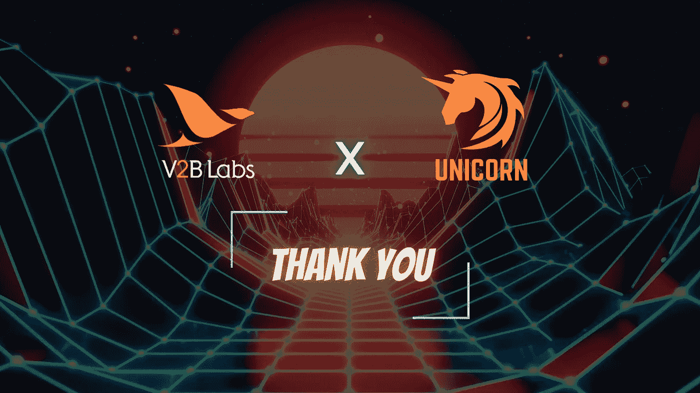
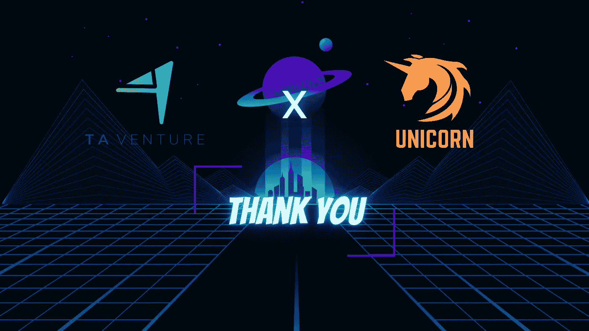
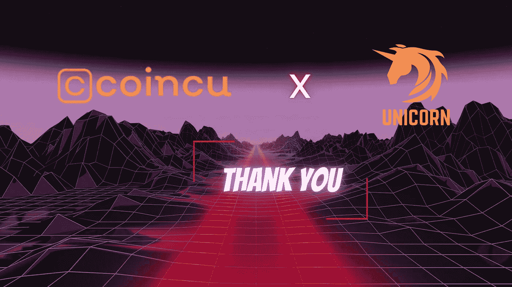
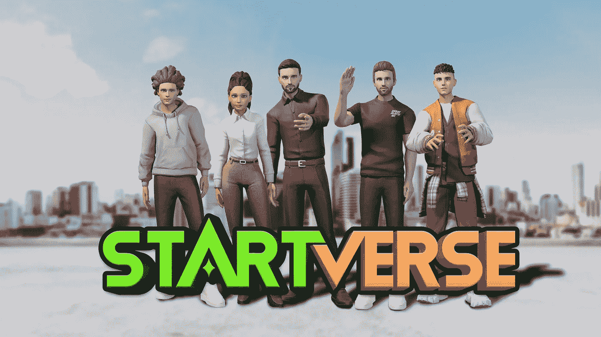

# 社区公告:Startverse ft。V2B 实验室，TA 风投，Coincu 风投！

> 原文：<https://medium.com/coinmonks/community-announcement-the-startverse-ft-v2b-labs-ta-venture-coincu-venture-3c780d330394?source=collection_archive---------41----------------------->

## 支持者公告

Startverse 非常高兴 V2B 实验室、TA Venture、Coincu Venture 成为我们的一部分！Startverse 的目标是建立一个友好、紧密、全球化的社区。TA Venture、Coincu、V2B Labs 参与连接我们的用户网络是帮助我们在可预见的未来继续开发完美产品的驱动力。

我们非常荣幸有你作为我们的支持者。通过这种方式，Startverse 团队将获得强大的资金支持，以进一步开发我们的游戏。此外，我们承诺让 Startverse 在全球范围内扩大规模，成为这个市场的领导者之一。

**关于 V2B 实验室**

**V2B Labs and Unicorn Partnership**

V2B 实验室是一家从事区块链服务的有远见的 R&D 公司，由拥有 10 多年经验的领先 IT 公司 VMO 控股集团提供支持。V2B 实验室是一家领先的实验室，致力于研究、投资、开发与区块链相关的解决方案、技术、产品和服务，旨在推动全球范围内的区块链转型。此外，凭借这些专业知识，V2B 实验室将确保 Startverse 的战略发展。这种合作不仅给我们带来了资金支持，也增强了我们取得重大成就的信心。

[网站](https://www.v2blabs.com/) | [媒体](/@v2blabs)

**关于 TA 创业**

**TA Venture and Unicorn Partnership**

TA Venture 是一家国际风险投资公司，为欧洲和北美雄心勃勃的科技公司创始人提供支持。TA Ventures 在国际上进行了 163 项投资和 10 项多元化投资。TA 与 Startverse 的合作将为我们的行业创造实现商业目标的机会，并为我们带来跨行业、跨边界和跨市场周期的深刻经验。

[网站](https://taventures.vc/) | [媒体](/@TAVentures)

**关于 Coincu Venture**

**Coincu Venture and Unicorn Partnership**

Coincu 是世界领先的加密货币应用程序，全天候提供新闻和投资知识更新。Coincu 金融数据系统有助于实时跟踪价格、数字硬币和区块链代币的市值。Coincu Venture 与 Startverse 的合作将引领我们走向更快的加速器和多样化的体验。

[网站](https://coincu.vc/)

**关于 Startverse**

**Startverse Game**

Startverse 是一个虚拟现实世界，允许用户与世界各地数百万其他玩家联系，这将有助于我们为未来的创业公司建立一个共同的社区。在这个三维空间里，你每天都会通过工作和完成分配的任务来获得收入。

Startverse Network 一直在努力以无入场费、快速区块确认、高可扩展性的最佳方式接触玩家。Startverse 网络现在已经与几个区块链集成，以简化用户和分散生态系统之间的交互。

*在****Startverse****加入来自世界各地的创业公司、老板、地主的社区，同时接收最新的项目消息，享受特别内容:*

[网站](https://startverse.io/) | [脸书](https://www.facebook.com/Startverse-Global-102077955725659/) | [推特](https://twitter.com/StartverseGame) | [不和](https://discord.gg/cfUSrHUvSz) | [电报](https://t.me/StarverseGlobal) | [白皮书](https://whitepaper.startverse.io/)

> 加入 Coinmonks [电报频道](https://t.me/coincodecap)和 [Youtube 频道](https://www.youtube.com/c/coinmonks/videos)了解加密交易和投资

# 另外，阅读

*   [最佳加密交易信号电报](/coinmonks/best-crypto-signals-telegram-5785cdbc4b2b) | [MoonXBT 评论](/coinmonks/moonxbt-review-6e4ab26d037)
*   [OKEx 评论](/coinmonks/okex-review-6b369304110f) | [Coinswitch 俱吠罗评论](/coinmonks/coinswitch-kuber-review-1a8dc5c7a739) | [比特币基地收费](/coinmonks/coinbase-fees-831e77d4f2c5)
*   [AscendEX 审查](/coinmonks/ascendex-review-53e829cf75fa) | [OKEx 交易机器人](/coinmonks/okex-trading-bots-234920f61e60) | [OKEx 交易机器人](/coinmonks/okex-trading-bots-234920f61e60)
*   [火币交易机器人](https://coincodecap.com/huobi-trading-bot) | [如何购买 ADA](https://coincodecap.com/buy-ada-cardano) | [Geco。一次审查](https://coincodecap.com/geco-one-review)
*   [币安 vs Bitstamp](https://coincodecap.com/binance-vs-bitstamp) | [Bitpanda vs 比特币基地 vs Coinsbit](https://coincodecap.com/bitpanda-coinbase-coinsbit)