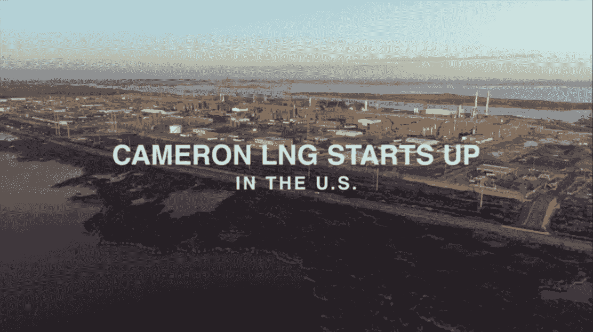
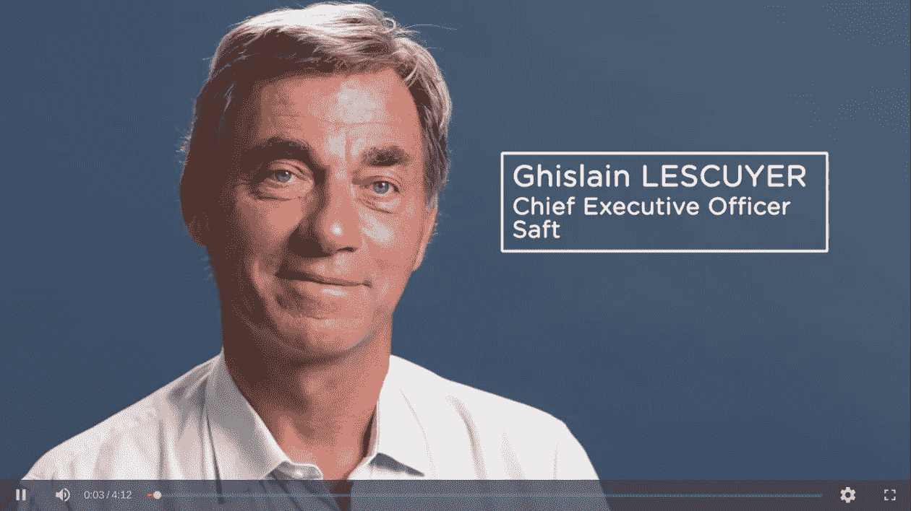
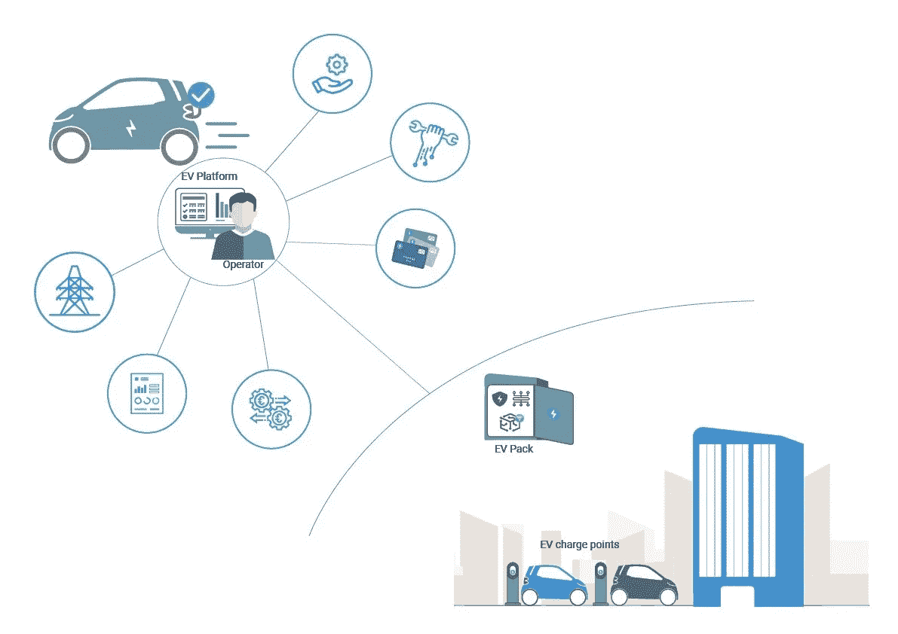
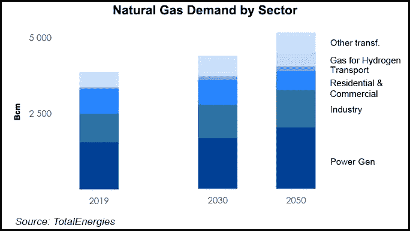

# 推动能源转型的公司——法国道达尔能源公司的液化天然气出口，电动汽车战略

> 原文：<https://medium.com/coinmonks/companies-driving-the-energy-transition-france-totalenergies-lng-exports-e-mobility-strategies-e5ed1a49247b?source=collection_archive---------30----------------------->

# 美国路易斯安那州卡梅伦液化天然气项目

2022 年 4 月 11 日**宣布 TotalEnergies(道达尔)与 Sempra Infrastucture、三井株式会社&和 Japan LNG Investment 签署了“框架协议”(HOA)。Sempra Infrastructure 拥有该项目的 50.2%，而道达尔、三井和日本液化天然气投资公司各拥有 16.6%。**

**TotalEnergies 董事长兼首席执行官 Patrick Pouyanné表示:“Cameron LNG 的扩张将有助于我们的 LNG 增长战略，投资于低成本、长期有竞争力、GHG 排放量较低的 LNG 项目。”首席执行官的这一声明被公开，以证明位于美国路易斯安那州的卡梅伦液化天然气项目的扩张是合理的。**

**这一 HOA 意义重大，因为两家公司同意共同将产能提高到每年 675 万吨以上。他们还同意增加第四列火车来改善工厂的****瓶颈。此外，在最近俄罗斯影响欧洲能源供应的**事件之后，该项目被视为促进美国液化天然气**出口的一种方式。**********

******如果说挪威的 [**Equinor**](https://www.reuters.com/business/energy/equinor-wins-permission-hike-troll-oseberg-gas-exports-dn-reports-2021-09-20/) 率先帮助解决欧洲的能源危机，那么法国的 TotalEnergies 似乎也在努力带头推动欧洲的能源转型。HOA 是一个指标，表明该公司对推动欧洲能源转型的雄心有多认真。******

****根据 OilPrice.com 的说法，法国超级大国是美国液化天然气的全球最大出口国和第二大液化天然气交易商。****

****卡梅伦液化天然气项目的最终投资决定将于 2023 年做出，俄罗斯入侵乌克兰引发了人们对目前如何出口更多美国液化天然气的担忧。[**2022 年 3 月 25 日，**](https://oilprice.com/Energy/Natural-Gas/EU-Inks-LNG-Deal-With-US-To-Replace-Russian-Gas.html) 美国与欧盟(EU)达成协议，美国将向欧盟市场增加交付 150 亿立方米的液化天然气。这种情况揭示了美国液化天然气对欧盟能源供应组合的重要性。****

****自 2016 年 9 月****公司 [**从位于俄克拉荷马城的切萨皮克能源公司(Chesapeake Energy)手中收购了北德克萨斯 Barnett 页岩资产的**](https://www.reuters.com/article/us-total-barnett-shale/total-sees-bargain-buy-in-chesapeakes-barnett-shale-assets-idUSKCN11F1AU) 75%以来，TotalEnergies 一直与美国液化天然气公司保持业务往来。由于产量下降，巴尼特页岩资产将在 [**2028**](https://www.offshore-technology.com/marketdata/barnett-shale-total-s-a-tx-unconventional-gas-field-us/) 左右触底。重要的是，道达尔巴尼特页岩气田的产能将允许该公司在卡梅伦将其天然气储备再气化为液化天然气，以便将天然气从美国运输和出口到欧洲、亚洲和非洲市场。********

****值得注意的是，TotalEnergies 正在朴树碳封存(HCS)项目中启动北美第一个碳捕获(CCS)项目(T21)。TotalEnergies 公司液化天然气高级副总裁 Thomas Maurisse 表示:****

> ****我们很高兴与我们的合作伙伴联手，大幅减少卡梅伦液化天然气出口终端的二氧化碳排放，从而使我们能够为客户提供低碳液化天然气，这是能源转型的关键燃料，也是欧洲能源供应多元化的宝贵资产****

********

****This is a screenshot of Total Energies’ USA facilities captured from a video on the company’s official website about the Cameron LNG project. Watch the whole video here: [https://totalenergies.com/media/video/cameron-lng-strengthens-totalenergies-lng-presence-in-the-usa](https://totalenergies.com/media/video/cameron-lng-strengthens-totalenergies-lng-presence-in-the-usa)****

# ****电动汽车—汽车电池公司(ACC)****

****2020 年，一种新的合作伙伴关系以合资企业的形式出现，旨在设计和生产电动汽车电池。在 TotalEnergies 和 Stellantis 的领导下，汽车电池公司(ACC)在 2021 年引入了一个新的合作伙伴 [**梅赛德斯-奔驰**](https://www.automotiveworld.com/news-releases/mercedes-benz-becomes-shareholder-in-acc/) ，成为该合资企业的平等股东。为了生产顶级电池和模块，他们同意到 2030 年将工业产能提高到约 120 GWh。****

****据 Saft(道达尔的子公司)的首席执行官称，“ACC 是道达尔能源公司和 Stellantis 的合资企业，旨在设计和生产汽车电池，并成为该领域的欧洲领导者和国际先驱。”****

********

****This screenshot was captured from a video posted on TotalEnergies’ official website about ACC. Saft CEO Ghislain Lescuyer discusses the role of European battery design and prodution and what it means for industrial policy worldwide Watch the full video here: [https://totalenergies.com/media/video/acc](https://totalenergies.com/media/video/acc)****

****在联合建立 ACC 之前，道达尔的电动交通战略已于 [**2019**](https://totalenergies.com/news/strategy-move-electric-mobility-forward) 制定，目标是到 2025 年在整个欧洲城市运营超过 150，000 个电动汽车(EV)充电点，其中阿姆斯特丹 22，000 个，安特卫普 3000 个，伦敦 1700 个，巴黎 2300 个。****

****此外，道达尔还在欧洲大陆之外做出了承诺，与中国最大的清洁能源公司 [**【中国三峡(CTG)】**](https://www.upstreamonline.com/energy-transition/totalenergies-in-electric-mobility-pact-with-china-three-gorges/2-1-1080425?utm_term=upstream)(中国三峡大坝的运营商)建立了合资企业，以拓展亚洲的电动交通计划。****

****ACC 旨在确保电池设计高效，并满足电动汽车以及其他交通方式(如卫星、火车和飞机)的电池需求。研发(R&D)中心已在法国布鲁日成立，旨在设计最新的电池技术，同时，位于法国 Nersac 的一条试点生产线也作为电池生产基地投入使用。****

********

****道达尔推动 ACC 成为电动和可持续交通领域的国际参与者。这始于 2020 年 11 月**道达尔从德国 Viessmann 充电解决方案集团收购了 2000 个电动汽车充电点，使其成为欧洲最重要的电动汽车市场之一。******

******该公司随后于 2021 年 7 月日**与新加坡 Bollore 集团达成协议，收购超过 1500 个电动汽车充电点，使道达尔成为新加坡最大电动汽车充电网络——Blue Charge 的所有者和运营商。交易完成后，total energy 的营销服务总裁表示:“通过此次收购，total energy 正在寻求转型，并在巴黎、阿姆斯特丹、伦敦和布鲁塞尔等全球城市的名单上增加了一个新名字，该公司已经在这些城市开展了电动汽车充电站的安装和运营活动。”********

# ******总结想法******

******必须指出的是，即使最大的公司在全球范围内推动电动和可持续交通，天然气生产和通过液化天然气出口的承诺也将随着时间的推移而继续增长。total Energy 甚至在其 [**2021 年能源展望**](https://totalenergies.com/system/files/documents/2021-09/2021_TotalEnergies_Energy_Outlook.pdf) 中强调，天然气和可再生能源将在实现能源向净零的过渡中发挥互补作用。******

****其中一个担忧是地缘政治和国际事件将如何影响全球能源前景。例如， [**阿尔及利亚**](https://www.reuters.com/business/energy/us-reaches-out-foreign-producers-algeria-gas-options-sources-2022-02-09/) 和 [**摩洛哥**](https://www.reuters.com/business/energy/morocco-considers-onshore-offshore-options-lng-import-facility-2022-04-15/) 都宣布了增加天然气储备的计划，以惠及道达尔能源公司、埃尼集团和美国出口商。但是这两个国家T21 之间潜在的政治和领土问题将不可避免地成为一个主要问题。在摩洛哥宣布将发展液化天然气终端产能后，阿尔及利亚于 2021 年切断了摩洛哥对其天然气管道的访问。****

****最后，虽然许多国家正在转向液化天然气，以减少其对传统化石燃料来源的接触，但也有许多国家根本负担不起液化天然气，或者没有能力再气化、运输或储存液化天然气。 *DownToEarth* 写了关于 [**这个问题**](https://www.downtoearth.org.in/blog/energy/lng-but-not-for-rich-world-82107) 随着 LNG 在全球能源场景中的未来。****

********

****This chart was published in Total Energies’ 2021 Energy Outlook under “Momentum: World Oil & Natural Gas” on page 16\. Access the link in the above paragraph.****

# ******阅读有关推动能源转型的公司的更多信息:******

**** [## John Kerry，自由港液化天然气公司，阿塞拜疆-阿联酋——能源转型夏季更新，自 6 月起

### 聚焦:美国

medium.com](/@44jmonroe91/john-kerry-freeport-lng-azerbaijan-uae-energy-transition-summer-updates-from-june-26f1db628639)  [## 能源转型主题:2022 年 5 月

### 氨——日本贸易公司三井公司和美国商品生产商宣布成立新的合资企业…

medium.com](/@44jmonroe91/energy-transition-topics-may-2022-b59c3c82cec6)  [## 为什么世界上最大的金属矿商必和必拓集团正在推动面向未来的商品…

### 全球经济时代的标志。不仅 ESG 是 2019 年底所有行业的驱动话题，而且…

medium.com](/@44jmonroe91/why-is-the-worlds-largest-metal-miner-bhp-group-pushing-for-future-facing-commodities-on-the-1c6dd34ce681)  [## 世界上最大的化肥公司 Nutrien Ltd .发生了什么事？

### 我决定写这个故事，以回应全球商业新闻中关于迪士尼首席执行官过渡的一个热门话题。的…

medium.com](/@44jmonroe91/what-went-down-at-the-worlds-largest-potash-producer-nutrien-ltd-c174d19e403d) 

> 加入 Coinmonks [电报频道](https://t.me/coincodecap)和 [Youtube 频道](https://www.youtube.com/c/coinmonks/videos)了解加密交易和投资

# 另外，阅读

*   [Bookmap 评论](https://coincodecap.com/bookmap-review-2021-best-trading-software) | [美国 5 大最佳加密交易所](https://coincodecap.com/crypto-exchange-usa)
*   最佳加密[硬件钱包](/coinmonks/hardware-wallets-dfa1211730c6) | [Bitbns 评论](/coinmonks/bitbns-review-38256a07e161)
*   [新加坡十大最佳加密交易所](https://coincodecap.com/crypto-exchange-in-singapore) | [购买 AXS](https://coincodecap.com/buy-axs-token)
*   [红狗赌场评论](https://coincodecap.com/red-dog-casino-review) | [Swyftx 评论](https://coincodecap.com/swyftx-review) | [CoinGate 评论](https://coincodecap.com/coingate-review)
*   [投资印度的最佳密码](https://coincodecap.com/best-crypto-to-invest-in-india-in-2021)|[WazirX P2P](https://coincodecap.com/wazirx-p2p)|[Hi Dollar Review](https://coincodecap.com/hi-dollar-review)
*   [加拿大最佳加密交易机器人](https://coincodecap.com/5-best-crypto-trading-bots-in-canada) | [KuCoin 评论](https://coincodecap.com/kucoin-review)****