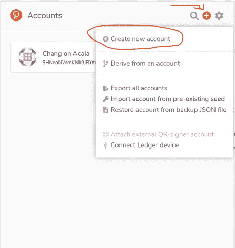
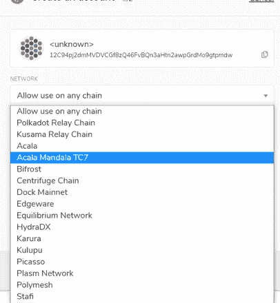
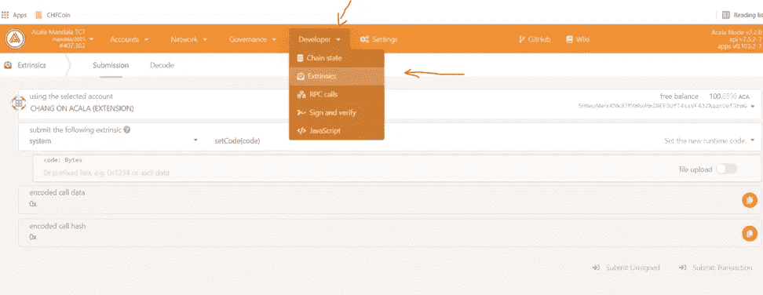
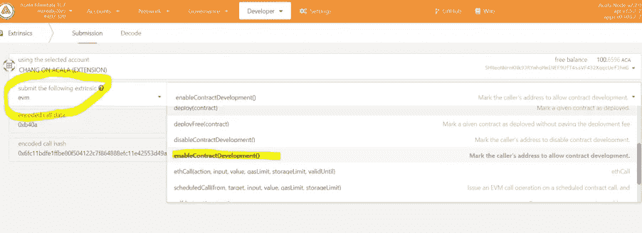
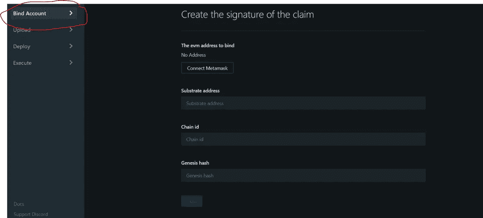
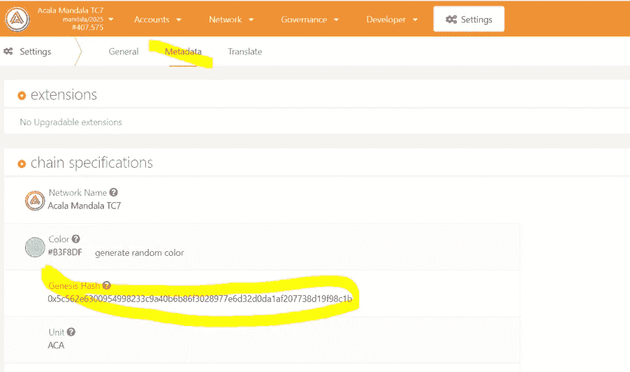
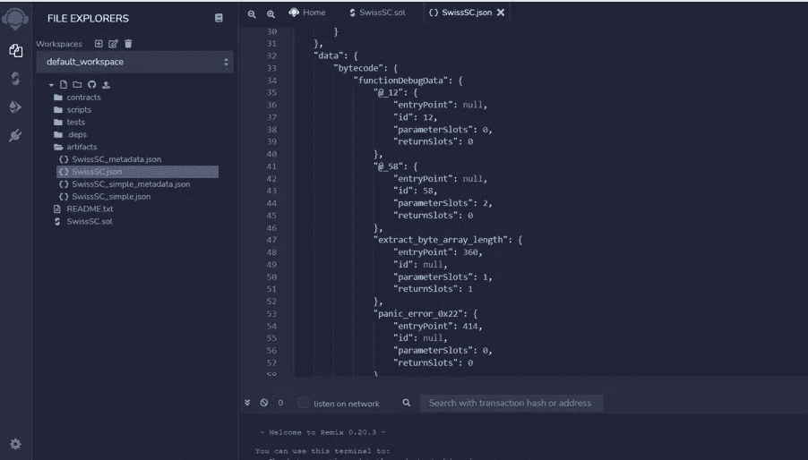

# 配套指南:如何将智能合约从 Remix 部署到 Acala test net

> 原文：<https://medium.com/coinmonks/companion-guide-how-to-deploy-smart-contract-to-acala-test-net-from-remix-4dd4f00e5be3?source=collection_archive---------25----------------------->

通过本教程，您将了解如何将 Solidity smart contract 从 Remix 部署到 Acala testnet

# 流程概述

开始之前，请确保您已经:

现有以太坊账户

已安装元掩码扩展

一个经过测试的以太坊智能合约源代码

在 Acala 网络上部署以太坊智能合约包括以下步骤:

1.创建基底(Polkadot)账户

2.AKA 令牌的获取

3.启用衬底帐户的开发模式

4.基质和以太坊账户的绑定

5.在基底帐户上部署合同代码

# 创建基底帐户

1.安装 polkadot。js}扩展名。谷歌为您的浏览器的扩展。

2.创建一个帐户，并将其分配到阿卡拉曼陀罗 TC7 测试网络:

在第一步中，做任何需要做的事情，然后进入“下一步”。

第二步，从“网络”列表中选择阿卡拉曼陀罗 TC7 网络。您也可以在以后创建，所以如果您在创建帐户时忘记了也没有问题。

# 获取代币

为了完成下面的步骤，您需要在您的 Substrate 帐户上使用几个 AKA 令牌。在创建这个指南的时候，几乎需要 7 个 aka 来完成整个过程。

你可以创建一个 Discord 账号，进入 Acala 频道([https://Discord . com/channels/709208197549785148/709239718289735700](https://discord.com/channels/709208197549785148/709239718289735700))使用 Acala-testnet-水龙头主题。你得发布一个命令:！滴<你的基质号>来获得 2 个阿卡和一些额外的资产。不幸的是，您每天只能提出一个这样的请求…

你也可以问别人，谁有更多的水龙头与你或直接去一些从阿卡拉问他们。

# 启用衬底客户的合同开发

1.去 https://polkadot.js.org/apps 的[下的波尔卡多特 exporer](https://polkadot.js.org/apps)

2.选择开发者-> extrinsic

3.选择 **evm** 和**enableContractDevelopment()**

4.点击**提交交易** & **签字并提交**

# 绑定基质和以太坊账户

1.去阿卡拉游乐场[https://EVM . Acala . network/](https://evm.acala.network/)

2.选择绑定帐户，连接到元掩码，输入减去帐户地址，设置链 ID = 595。Genesis hash 留空—在下一步中找到它。

3.返回波尔卡多特浏览器

4.从设置->元数据复制创世纪哈希并粘贴到 EVM 游乐场

5.在 EVM 游乐场点击**标志**

6.出现在签名按钮下方的签名将用于程序的下一步

7.进入 Polkadot Explorer，像之前一样选择 Developer-> external

8.从下拉列表中选择 evmAccounts，claimAccount([…])(如下图所示)，输入以太坊地址和签名，这是您在前面的步骤中在 EVM 游乐场生成的

9.提交交易

# 绑定验证

1.在 Polkadot 浏览器中，转到开发人员->链状态

2.选择 **evmAccounts** 、 **evmAddresses([…])** (如下图所示)，点击右边的 **+** 符号

3.验证下面显示的地址是正确的以太坊帐户地址

# 在 Acala 上部署合同

1.转到包含要在 Acala 上部署的智能合约的 Remix 项目

2.编制合同

3.在 artifacts 文件夹中，找到您编译的契约的 JSON 版本，将 righjt 面板中的内容复制到一个本地文件中，并向其中添加扩展名。abi(在下面的例子中，本地文件的名称是 SwiccSC.abi)

4.进入 EVM 游乐场，从左边的菜单中选择上传，然后上传。abi 文件

5.转到部署部分，您可以在 abi 捆绑包列表中看到您的 Abi

6.单击 Deploy，在下一个表单中将 ValidUntil 的值更改为更高的值(例如 900000)。

注:该参数的含义在本程序准备阶段未知，将由 Acala 澄清。实验注意到，如果这个值太小，部署会失败(出现一条错误消息，但没有说明任何问题)

7.单击部署。将出现元掩码窗口。点击确认按钮，等待交易执行完毕。

8.要验证该流程，请转到执行部分，找到您的协定并调用其方法的

> 加入 Coinmonks [电报频道](https://t.me/coincodecap)和 [Youtube 频道](https://www.youtube.com/c/coinmonks/videos)了解加密交易和投资

# 另外，阅读

*   [红狗赌场评论](https://coincodecap.com/red-dog-casino-review) | [Swyftx 评论](https://coincodecap.com/swyftx-review) | [CoinGate 评论](https://coincodecap.com/coingate-review)
*   [Bookmap 评论](https://coincodecap.com/bookmap-review-2021-best-trading-software) | [美国 5 大最佳加密交易所](https://coincodecap.com/crypto-exchange-usa)
*   [如何在 FTX 交易所交易期货](https://coincodecap.com/ftx-futures-trading) | [OKEx vs 币安](https://coincodecap.com/okex-vs-binance)
*   [CoinLoan 评论](https://coincodecap.com/coinloan-review) | [YouHodler 评论](/coinmonks/youhodler-4-easy-ways-to-make-money-98969b9689f2) | [BlockFi 评论](https://coincodecap.com/blockfi-review)
*   [XT.COM 评论](https://coincodecap.com/profittradingapp-for-binance) | [币安评论](https://coincodecap.com/xt-com-review)
*   [SmithBot 评论](https://coincodecap.com/smithbot-review) | [4 款最佳免费开源交易机器人](https://coincodecap.com/free-open-source-trading-bots)
*   [比特币基地僵尸工具](/coinmonks/coinbase-bots-ac6359e897f3) | [AscendEX 审查](/coinmonks/ascendex-review-53e829cf75fa) | [OKEx 交易僵尸工具](/coinmonks/okex-trading-bots-234920f61e60)