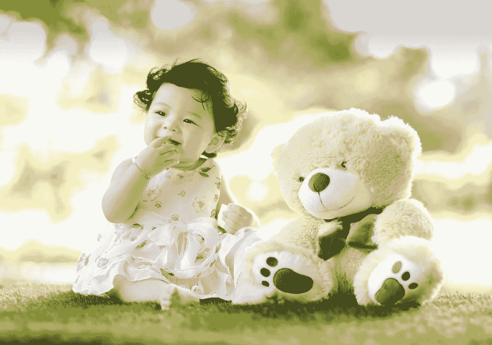

# 将比特币比作郁金香就像将房地产比作豆豆娃

> 原文：<https://medium.com/coinmonks/comparing-bitcoin-to-tulips-is-like-comparing-real-estate-to-beanie-babies-7161ca323ca?source=collection_archive---------9----------------------->

Picture by Singkham on Pexels

作为人类，我们喜欢理解事物的简单方式。这个世界，我们的生活，我们的关系，等等。都极其复杂，而我们的大脑解释这一切的能力有限，所以我们只能找到捷径。这些隐喻和叙事让我们能够运作和理解事物，但这些叙事也可能导致无知、偏见和刻板印象。一…